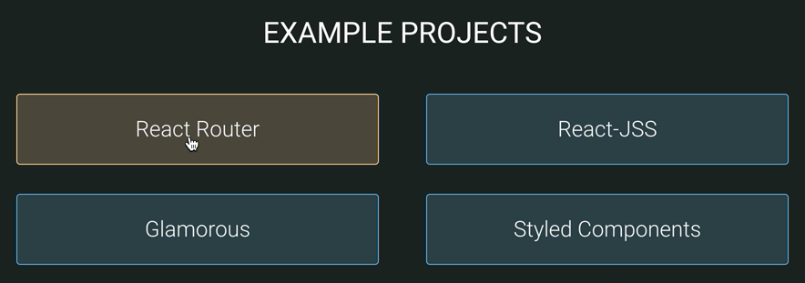
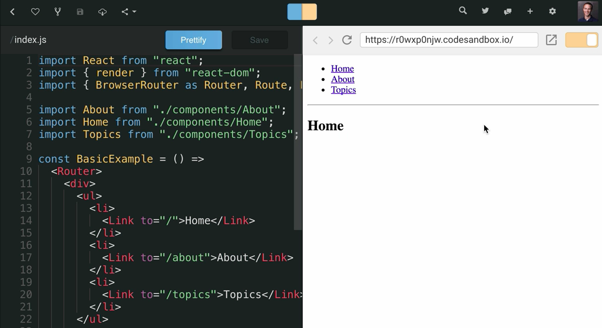
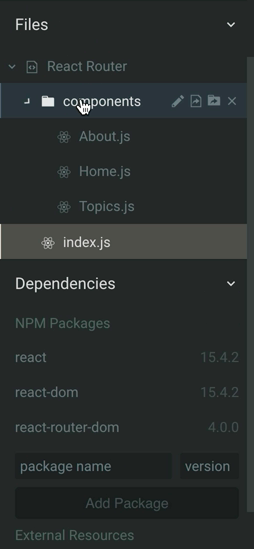
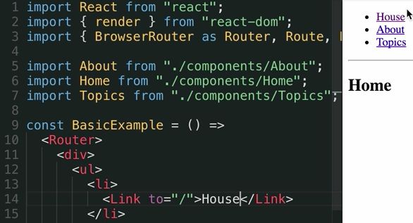
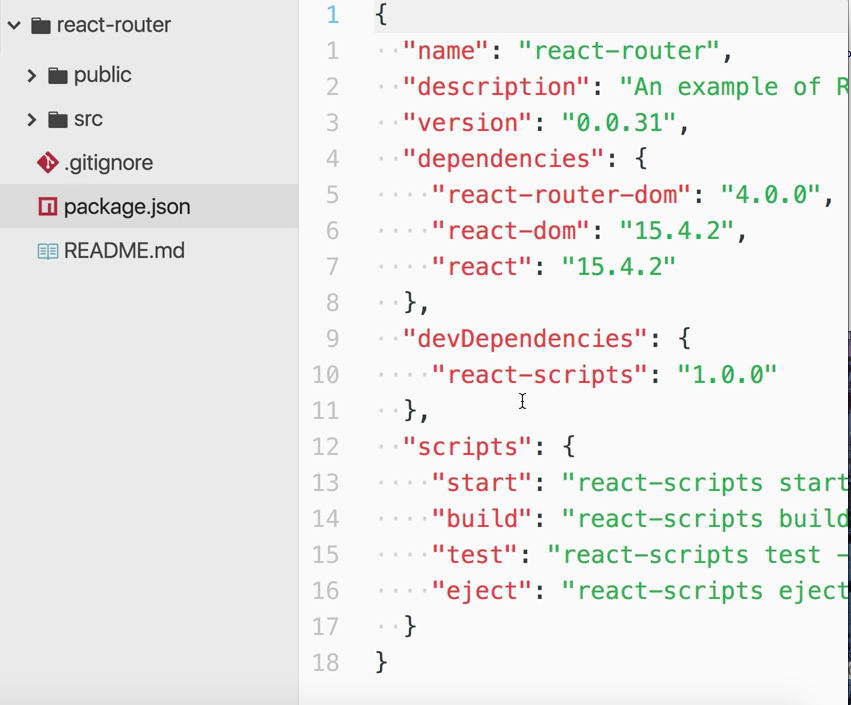
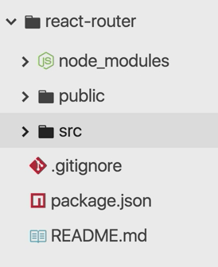
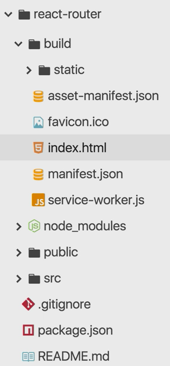

[CodeSandbox](https://codesandbox.io/) is an online web application editor. It's super awesome and it has a template for React, so let's go ahead and take a look at some of the examples for React. We'll pop open the React Router example. 

This is going to load our Sandbox with an editor, and then the rendered version on the right, and that's actually a live URL. 

We can actually pop that open in another browser window, and it's just the full app that we're writing right now, which is pretty cool.

We can get the split view here. We can just look at the preview view, and then just look at our code. On the left side here, we have some metadata. We can look at some of the dependencies we have available to us, and then we can pop open some files that we have.

We can add new files, all of this right in the browser. As we make changes, like house, that gets instantly updated in the viewer.

The way that this works is the index file that you have needs to `import { render } from "react-dom"`, and then `React from "react"`. Then you're able to use JSX, and then the `render` function to render your component to the route element.

From there, it's all JavaScript and React. We can import modules that we have inside of our file system here, and because we have access to third-party libraries like `react-router-dom` through the NPM packages feature, we can build really impressive applications right in the browser.

When we're ready to get serious about deploying this, we can actually download this Sandbox, and it will download a ZIP file to our computer. I'm going to go ahead and unzip that and open it in my editor, and now I have the project locally on my machine.

I can look in the `package.json` and see all the dependencies that I have. I have a couple of `<scripts>` here that I have available to me to `start` the dev server, `build` it and `run` my tests, and then I can look at my source directory with all the components that I had before in the CodeSandbox.

Then I can run `npm install` in the terminal, and when that's finished, I'll have this node modules directory. 

Now I can run my scripts, so let's go ahead and run `npm run start`.

This will start up a dev server that I can go over here to in my browser, go to `localhost:3000`, and I can interact with this locally on my machine, just like I was in CodeSandbox.

Then I can create a production build with `npm run build`. When that's finished, I'll have this build directory with all the static assets that I need, and that index HTML. Everything's been optimized for my app.

If I want to show this to the world, I can go to netlify.com. I'll log in with my GitHub credentials. I can scroll down to the bottom here, and I can click and drag the build directory right into that area, where it will instantly upload and deploy my application.

Now I can go to this URL, https://laboratory-assistant-francis-88371.netlify.com, which is public to the world, and secure it over HTTPS, and use my application.