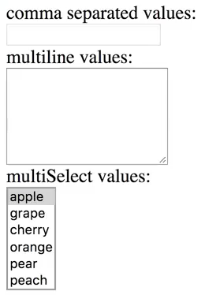
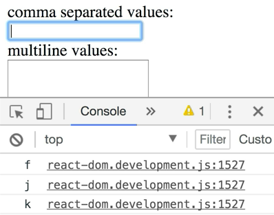
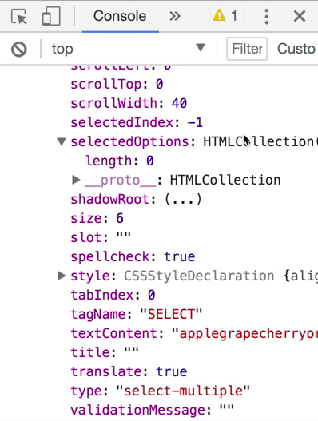
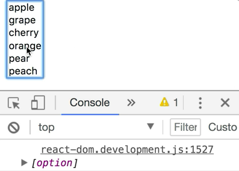

Here, we have `MyFancyForm`, and it renders an input, a text, and a select box that allows us to select multiple values. 



On each one of these, we have an `onChange` handler that's hooked up to its own `onChange` handler.

What we want to do is we want to synchronize the state of all of these things. For example, if I were to type apple, cherry, then the multi-line values would automatically add apple and cherry, and then the multi-select would automatically select apple and cherry.

To be able to do this, we need to control the state of the value of each of these inputs, and then update that state ourselves.

Let's start out by controlling the input and the text area values. To do that, we need to keep that state somewhere ourselves. I'm going to add a `state` property here. That's going to have `multiline` as an empty string, and `commaSeparated` as an empty string also.

```javascript
class MyFancyForm extends React.Component {
    static availableOptions = [
        'apple',
        'grape',
        'cherry',
        'orange',
        'pear',
        'peach',
    ]    
    state = {multline: '', commaSeparated: ''}
    ...
}
```

We need to explicitly set the value on these `<input>` fields. On this first `<input>`, I'm going to say `value={commaSeparated}`, and we'll pull that from state, so `{commaSeparated} = this.state`. We're also going to set the `value` on our text area to be `multiline`. We'll pull that from our state also.

```html
render() {
    const {commaSeparated, multiline} = this.state
    return (
        <form>
            <div>
                <label>
                    comma separated values:
                    <br />
                    <input 
                        type="text" 
                        value={commaSeparated}
                        onChange={this.handleCommaSeparatedChange}
                        }
                    >
                </label>
            </div>
            <div>
                <label>
                    multiline values:
                    <br />
                    <textarea
                        value={multiline}
                        rows={
                            MyFancyForm.avalableOptions
                                .length
                        }
                        onChange{
                            this.handleMultiChange
                        }
                    />
                </label>
            </div>
        </form>
    )
}
```

Let's go ahead and try things out. I am typing, and nothing's happening. What happens is, the moment that you put a `value` prop on an `<input>` or a `<textarea>`, it now becomes impossible for the user to update that value themselves.

You're telling React that I don't really care what the user is doing. I am in control of this value. You have to use this `onChange` prop to handle any time the user is making a change, and then you're in control of taking that change into account, to update the value of the input.

We'll go ahead and go to this `handleCommaSeparatedChange` function here. If we console.log(event.target.value), 

```javascript
...
    state = {multline: '', commaSeparated: ''}
    handleCommaSeparatedChange = event => {
        console.log(event.target.value)
    }
    handleMultilineChange = event => {
        console.log('handleMultilineChanged')
    }
    handleMultiSelectChanged = event => {
        console.log('handleMultiSelectChanged')
    }
...
```

and then look at our developer console, then we can type a bunch of letters, and we're seeing that those letters are being updated, but the value of the input is never being updated, because we're in control of that.



Back in `handleCommaSeparatedChange`, we're going to say `this.setState`, and then for our `commaSeparated` value, that will simply be `event.target.value.`

```javascript
handleCommaSeparatedChange = event => {
    this.setstate({
        commaSeparated: event.target.value,
    })
}
```

Let's go and save that, and see what happens here. Now, I can type.

What's happening is, every single time this change `event` happens, we update the `commaSeparated` state, and when we call `setState`, that's going to force a re-render, and now, we are updating this `commaSeparated` state with whatever value the user typed in, and so we're passing that back into the input value, so React is updating that for us.

Now, we want to update the `multiline` state based on the `commaSeparated` state. Let's go ahead, and I'm going to actually extract the `{value}` from `event.target`, then we can simply do value here.

Then we'll set our `multiline` state to be `value.split` on the `,` then we'll `.map` these values to `value.trim`, to trim any whitespace that we have. Then we'll `.filter` any that are empty strings, and then we'll `.join` them all back together with a new line.

```javascript
handleCommaSeparatedChange = event => {
    const {value} = event.target
    this.setstate({
        commaSeparated: value,
        multiline: value,
            .split(',')
            .map(v => v.trim())
            .filter(Boolean)
            .join('\n'),
    })
}
```

We'll hide our developer tools there, and with that, we can say cherry, and grape, and pear, and peach. Cool.

Now, let's do the opposite. If I type grape, looks like I'm typing in here, and nothing's happening. That's because we're in control of the text area, and we're not doing anything when the text area change event is happening. Let's go ahead and fix that.

We'll say `const {value} = event.target`. Then we'll say `this.setState`, and `commaSeparated` is going to be `value.split` on new lines. We'll `.map` each value to `.trim`, then `.filter` the empty strings, and then `.join` those again with a `,`. For our `multiline` state, we will simply put the `value` that is being typed. Cool.

```javascript
handleMultilineChange = event => {
    const {value} = event.target
    this.setState({
        mulltiline: value,
        commaSeparated: value
            .split('\n')
            .map(v => v.trim())
            .filter(Boolean)
            .join(','),
    })    
}
```

Now, I can say orange, and pear, and grape, and cherry. If I go back in here and I just remove pear, that will remove from the multi-line values. 

Let's go ahead and set the `value` on the `select`.

On `<select>` element, it's a little bit unique, in that we set the `value` here, and the value that you set on a `multiple` select will be an array. If it's not `multiple`, then you can simply put the string value of the option based on the value. For us, we are doing `multiple`, so we will do an array here. Let's store that in state.

```html
...
    <div>
        <label>
            multiSelectValues:
            <br />
            <select
                multiple
                value={multiSelect}
                size={
                    MyFancyForm.availableOptions
                    .length
                }
                onChange={
                    this.handleMultiSelectChange
                }
            >
                ...
            </select>
        </label>
    </div>
...
```

We'll do multi-select, and then in our de-structuring of the state here, we'll paste that there. 

```javascript
render() {
    const {commaSeparated, multiline, multiSelect} = this.state
    return (
        ...
    )
}
```

Then we will initialize that in the `state` with an empty array. 

```javascript
state = {multiline: '', commaSeparated: '', multiSelect: []}
```

Then when we type in the `commaSeparated` input, we can say `multiSelect`. We're basically going to be doing the same thing. We need to turn this into an array.

We're going to pull this out and say `allVals` is equal to `value`. Then we can change it to `multiline: allVals`, and then in `multiselect`, we can say `allVals`, but that value needs to be available in the options.

```javascript
handleCommaSeparatedChange = event => {
    const {value} = event.target
    const allVals = value
        .split(',')
        .map(v => v.trim())
        .filter(Boolean)
    this.setstate({
        commaSeparated: value,
        multiline: allVals,
            .join('\n'),
        multiSelect: allVals
    })
}
```

We're going to say `.filter` each `value` to be one that is contained in our available options. We'll say `MyFncyForm.availableOptions.includes` that `value`. 

```javascript
handleCommaSeparatedChange = event => {
    const {value} = event.target
    const allVals = value
        .split(',')
        .map(v => v.trim())
        .filter(Boolean)
    this.setstate({
        commaSeparated: value,
        multiline: allVals,
            .join('\n'),
        multiSelect: allVals.filter(v => 
            MyFancyForm.availableOptions.includes(v),
        )
    })
}
```

If I save that, we can type in cherry, and then orange, peach, and apple. Then I can go ahead and remove this. That doesn't work, because when the `multiline` values change, we're not updating the state of the `multisSelect`. 

Let's go ahead and do that.

We're going to do a very similar thing here. I'm going to call this `allVals`, and then in here, we're going to say `multiSelect` is allVals. Let's just copy in from `handleCommaSeparatedChange`. 

```javascript
handleMultilineChange = event => {
    const {value} = event.target
    const allVals = value
        .split(',')
        .map(v => v.trim())
        .filter(Boolean)
    this.setstate({
        multiline: value,
        comaSeparated: allVals,
            .join('\n'),
        multiSelect: allVals.filter(v => 
            MyFancyForm.availableOptions.includes(v),
        )
    })
}
```

Now, we can say grape, and cherry, and pear. Awesome.

One last thing. I cannot change the selection by interacting with the `multiSelect`, and that's because we're not doing anything with the change event on the `multiSelect`. This one is going to be a little bit unique.

I'm going to go ahead and `console.log({target: event.target})`. When I pop open my developer tools here, I'm going to click on a value, and then we see all of our available options. There's also an options array available here, that shows us all the options. Then there's this really handy `selectedOptions` array. That's the one that we're going to be looking at.



Let's go ahead, and we will `console.log(event.target.selectedOptions)`. When I click on an option, we're going to see it actually has that one option in there, but because we're not updating any state, that value of an empty array is going to be re-rendered and continue through this multi-select. That selection doesn't take hold.



We'll say `this.setState({multiSelect})`. We'll just call this `allVals`. To get `allVals`, we're going to say `const allVals = event.target.selectedOptions.map(o => o.value)`. 

```javascript
handleMultipleSelectChange = event => {
    const allVals = event.target.selectedOptions.map(
        o => o.value,
    )
    this.setState({
        multiSelect: allVals,
    })
}
```

If I go ahead and save this and then choose one, I'm going to get an error. That's because `.map` is not a function on an HTML node list.

We can turn it into an array with `array.from`, and then we can call `.map` on it. I can select any of these that I want. We'll say for `multiline`, that's going to be `allVals.join('\n')`. For `commaSeparated`, that will be `allVals.join(',')`. 

```javascript
handleMultipleSelectChange = event => {
    const allVals = event.target.selectedOptions.map(
        o => o.value,
    )
    this.setState({
        multiSelect: allVals,
        multiline: allVals.join('\n'),
        commaSeparated: allVals.join(','),
    })
}
```

Now, I select this, and select that, and we get all those options added.

In review, to control the input values, we have to specify a `value` property on the `<input>`, and on the `<textarea>`, we specify a `value` property also, even though in normal HTML, the `<textarea>` is contents, the children of the `<textarea>` would be the `value`. In React, we use the `value` prop.

On `select`, for the `value`, if it's `{multipleSelect}`, then you can use an array. If it's not, then you simply use the string for the option that's selected.

Then, if you want to respond to when the user is trying to update that value, you're going to need an `onChange` event handler, then you use the event that is passed to your `onChange` event handler to know what the value should be updated to, based off of what the user is selecting.