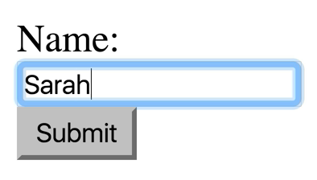
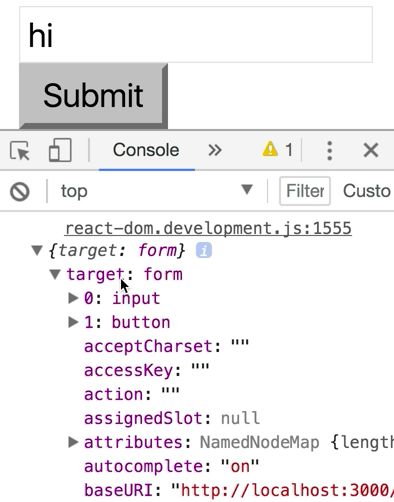
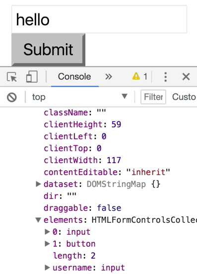
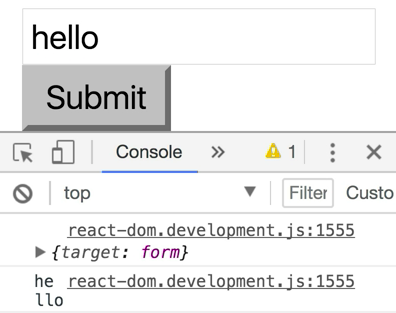
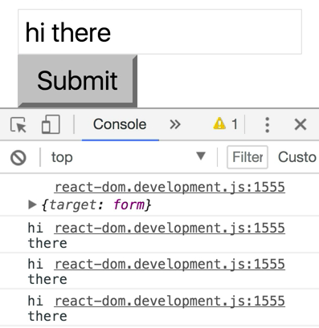

We'll start by making a new class called `NameForm`, and that `extends React.Component`. Then this'll have a `render()` method that will `return` a `<form>` element. Inside of this `<form>`, we'll have a `<label>`. Inside of this `<label>`, we'll have a `Name:` and an `<input />` with a `type="text"`.

```html
class NameForm extends React.Component {
    render() {
        return (
            <form>
                <label>
                    Name: 
                    <input type="text" />
                </label>
            </form>
        )
    }
}
ReactDOM.render(
    <div />,
    document.getElementById('root')
)
```

Then we'll have a `<button>` with a `type="submit"`, and the text `Submit`. We'll go down here, and we'll render that `<NameForm />`. 

```html
class NameForm extends React.Component {
    render() {
        return (
            <form>
                <label>
                    Name: 
                    <input type="text" />
                </label>
                <button type="submit">Submit</button>
            </form>
        )
    }
}
ReactDOM.render(
    <NameForm />,
    document.getElementById('root')
)
```

Now, we can submit a name, Sarah. 



Clicking `Submit` going to do a full page refresh, so to prevent that, we need to prevent the default behavior.

Let's go ahead and add an `onSubmit` event handler to `<form>`. We'll say `this.handleSubmit`, and then we'll add that as a class property here. This is going to get us our `event`. We'll say `event.preventDefault`. 

```html
class NameForm extends React.Component {
    handleSubmit = event => {
        event.preventDefault()
    }
    render() {
        return (
            <form onSubmit={this.handleSubmit}>
                <label>
                    Name: 
                    <input type="text" />
                </label>
                <button type="submit">Submit</button>
            </form>
        )
    }
}
```

Now, if we input hi there and click submit, then we're not going to get that default behavior, and we can do our own behavior.

If we want to get the value that we type in the input to send in an Ajax request or something, there are a couple ways that we can do that. Let's first `console.log({target: event.target})`. If we pop open our developer tools, say hi, and submit, we're going to get the form is the target. We can see a bunch of properties on this form. 



One of those is referencing our `input`. That `input` has a `value` property that we can find way down the line, `value: "hi"`. We can get our value that way. We could say `console.log(event.target[0].value)`.

```javascript
...
handleSubmit = event => {
    event.preventDefault()
    console.log({target: event.target})
    console.log(event.target[0].value)
}
...
```

Then if we type "hello", and we're going to get that hello there. Another thing we could do is add a `name` prop on our `<input>`, and call this `"username"`. 

```html
...
<form onSubmit={this.handleSubmit}>
    <label>
        Name: 
        <input type="text" name="username" />
    </label>
    <button type="submit">Submit</button>
</form>
...
```

With that, we can say `hello`. On our `<form>`, we can look at the `elements` property, and get the `username`. That will be a reference to our `input` as well.



We'll `console.log(event.target.elements.username.value)`. 

```javascript
...
handleSubmit = event => {
    event.preventDefault()
    console.log({target: event.target})
    console.log(event.target[0].value)
    console.log(event.target.elements.username.value)
}
...
```

Now we can get the value of our input in either way, this one being a little bit more direct. 



Then finally, the most direct way that we could do is using the `ref` prop.

Here, we'd say the `{node => this.inputNode = node}`. Then in our handler here, we'll say `console.log(this.inputNode.value)`. 

```html
class NameForm extends React.Component {
    handleSubmit = event => {
        event.preventDefault()
        console.log({target: event.target})
        console.log(event.target[0].value)
        console.log(event.target.elements.username.value)
        console.log(this.inputNode.value)
    }
    render() {
        return (
            <form onSubmit={this.handleSubmit}>
                <label>
                    Name: 
                    <input 
                        type="text" 
                        name="username"
                        ref={node => (this.inputNode = node)} 
                    />
                </label>
                <button type="submit">Submit</button>
            </form>
        )
    }
}
```

Then we can say hi there, and we're going to get hi there for all three of these.



Now, these first two methods of getting the value of the `<input>` are actually just regular HTML. If you have an event handler on a `<form>` using just raw DOM APIs, then you can get the `target` from the `event`, get the first element from this `<form>`, and get the `value` there.

You can also put the `name` attribute on your `<input>`, and then use the elements from the `<form>` to get the item by its `name` and get the `value`. Then this `ref` prop is definitely just a React thing. It makes things a little bit more direct, because here, we see we're assigning the `inputNode`, and then we're referencing that `inputNode` to get the `value`.

However you do it, all three of these work just as well. I like using the `ref`, because it makes things a little bit more explicit, but if you have a really big `<form>`, using something like the `name` attributes works really nicely, too, so you don't have to have a whole bunch of `refs` to keep track of.