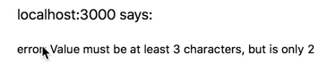
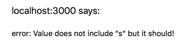
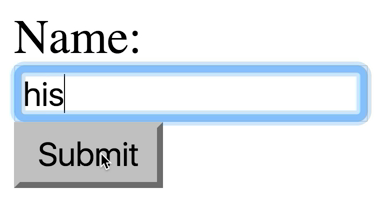
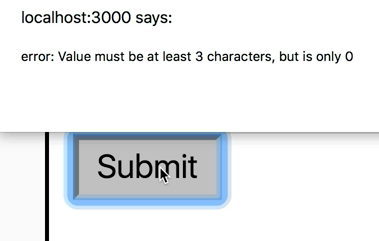
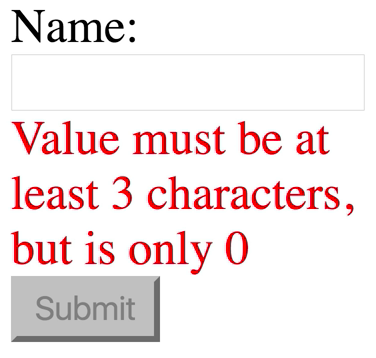
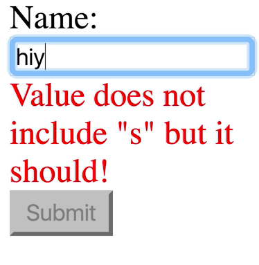

Here, we have a `NameForm`. If I say "hi" in the `input`, I'm going to get an error that the value must be at least three characters, but it's only two. 



Then I say "hey", and then it says it must include "S". 



OK, fine, I'll do "heys", and now I have success.


This kind of experience is not really super awesome, because I have to keep on trying and hitting submit. What would be much better is if the submit button were disabled or something, not even rendered, and I get an error message as I'm typing.

That's the kind of experience we're going to build. The way that this works right now is we have this `<form>` that we're rendering, and `onSubmit`, we go ahead and prevent the default behavior for the `<form>`. We get the value from the `username` element, and then we get the error from our `getErrorMessage` prop. If there is an error, then we alert with the error, otherwise we alert with success. 

```jsx
class NameForm extends React.Component {
    handleSubmit = event => {
        event.preventDefault()
        const value =
            event.target.elements.username.value
        const error = this.props.getErrorMessage(
            value,
        )
        if (error) {
            aler(`error: ${error}`)
        } else {
            alert(`success: ${value}`)
        }
    }

    render() {
        return (
            <form onSubmit={this.handleSubmit>
                <label>
                    Name:
                    <input type="text" name="username" />
                </label>
                <button type="submit">Submit</button>
            </form>
        )
    }
}

```

Our getErrorMessage prop here is a function that accepts a value and validates it. 

```javascript
ReactDOM.render(
    <NameForm
        getErrorMessage={value => {
            if (value.length < 3) {
                return `Value must be at least 3 characters, but is only 2`
            }
            if (!value.includes('s')) {
                return `Value does not include "s" but if should!`
            }
            return null
        }}
    />,
    document.getElementById('root'),
)
```

If we want to validate this thing in real time, then we're going to need to keep some `state` around that tells us whether or not this is valid.

I'm going to go ahead and add a `state` property here that has an error state. We'll just start that as `null`. 

```javascript
class NameForm extends React.Component {
    state = {error: null}
    handleSubmit = event => {
        ...
    }
}
```

Then on our `<input>`, we'll add an `onChange`. Here, we'll say `this.handleChange`. 

```html
render() {
    return (
        <form onSubmit={this.handleSubmit>
            <label>
                Name:
                <input type="text" onChange={this.handleChange} name="username" />
            </label>
            <button type="submit">Submit</button>
        </form>
    )
}
```

Then we'll create a public class field just after `handleSubmit` called `handleChange`, and this `handleChange` is going to accept our `event`.

We can get the target. We'll get the `value` out of the `event.target`, and then we'll call `this.setState` with `error:` being `this.props.getErrorMessage(value)`. 

```javascript
handleChange = (event) => {
    const {value} = event.target
    this.setState({
        error: this.props.getErrorMessage(value),
    })
}
```

Then inside of our `render` method, we can get the `error` out of the state.

Here, we can say the `<button>` is `disabled` if the `error` exists. We'll cast that to a Boolean. 

```html
render() {
    const {error} = this.state
    return (
        <form onSubmit={this.handleSubmit>
            <label>
                Name:
                <input type="text" onChange={this.handleChange} name="username" />
            </label>
            <button disables={Bollean(error)} type="submit">Submit</button>
        </form>
    )
}
```

I say "hi", and I see that it's disabled. 


Then an "s", and it's enabled. 



If I refresh, this is actually going to initialize as enabled, because we haven't actually done the error message check yet.



Let's go ahead and do that when we mount. We'll say `componentDidMount`, and we basically want to do this same behavior as the `handleChange`. We'll just put that right there. Then we don't actually have a value here yet, so we'll just get rid of that, and replace it with an empty string.

```javascript
componenetDidMount() {
    this.setState({
        error: this.props.getErrorMessage(''),
    })
}
```

Now it's initialized with a disabled button, and then we can type `his`, and it gets enabled. Perfect. Now, let's go ahead and render an error message if the `error` does exist. We'll say if there's an `error`, then we'll render a `<div>` with the `error`, otherwise we'll render `null`. Just for fun, we'll add a `style` with the `color` of `red`.

```html
render() {
    const {error} = this.state
    return (
        <form onSubmit={this.handleSubmit>
            <label>
                Name:
                <input 
                    type="text" 
                    onChange={this.handleChange} 
                    name="username" 
                />
            </label>
            {error ? (
                <div style={{color: 'red'}}>
                    {error}
                </div>
                ) : null}
            <button 
                disables={Bollean(error)} 
                type="submit"
            >
                    Submit
            </button>
        </form>
    )
}
```

Now, we have that error message being shown up right now. 



You can say hiy, and we get that new error message. 



Then add the "s" and the error message is gone. In review, to make this work, we didn't actually have to control the value of the input. We just needed to make sure we knew when that input was changing, and we handle that change.

When that happens, we say, "Hey, get me the error message," and that sets our `error` state, which will cause a rerender. If that `error` does exist, then we're going to render the `error` message, and we'll also disable the button.

We also initialize our `state` in `componentDidMount`. Instead of setting `state` in `componentDidMount`, we could also just move `error: this.props.getErrorMessage('')` directly into the initialization of our state, because at the time that this runs, `this.props` will already exist, and we'll be able to get that error message.

```javascript
class NameForm extends React.Component {
    state = {error: this.props.getErrorMessage('')}
    handleSubmit = event => {
        ...
    }
}
```

Let's go ahead and do that instead, and everything will work exactly as it had before. In addition, we've also avoided an unnecessary rerender, because we're not actually setting state, we're just initializing the state properly.