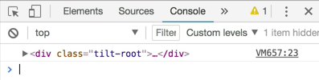

Here is our starting application.

```javascript
const element = (
    <div className="totally-centered">
        vanilla-tilt.js
    </div>
)

ReactDOM.render(
    element,
    document.getElementById('root'),
)
```

We'll start by making a `class` called `Tilt` that `extends React.Component`. That'll have a `render()`. We'll return a `<div>`, another `<div>`, yet another `<div>`, and this one is just going to spread `{...this.props}`. On our root `<div>`, we'll have a `className="tilt-root"`. Then we'll have a `className` on the second one called `"tilt-child"`. 

```javascript
class Tilt extends React.Component {
    render() {
        return (
            <div className="tilt-root">
                <div className="tilt-child">
                    <div {...this.props} />
                </div>
            </div>
        )
    }
}
```

Then we'll go ahead and use that. We'll put `<Tilt>` inside of `element`, put `vanilla-tilt.js` inside of `<Tilt>`, and then we'll add a `<div>` inside of here. That `<div>` will have a `classnName` of `"totally-centered"`.

```html
const element = (
    <div className="totally-centered">
        <Tilt>
            <div className="totally-centered">
                vanilla-tilt.js
            </div>
        </Tilt>
    </div>
)
```
Save that and check it out on the browser.


Next, we'll go ahead and add a `ref` prop. We'll say `{node => (this.rootNode = node)}`. Then in our `componentDidMount`, we can `console.log(this.rootNode)`. 

```javascript
class Tilt extends React.Component {
    componentDidMount() {
        console.log(this.rootNode)
    }
    render() {
        return (
            <div
            ref={node => (this.rootNode = node)} 
            className="tilt-root">
                <div className="tilt-child">
                    <div {...this.props} />
                </div>
            </div>
        )
    }
}
```

Pop over developer tools, and we'll see we get that `rootNode`.



Now, we can use this node with vanilla-tilt. Let's go ahead and bring in the vanilla-tilt library. I'll just paste a `<script>` here for that. Then we can use the vanilla-tilt library with the `VanillaTilt` global. We'll say `.init(this.rootNode)`.

```javascript
<script src="https://unpkg.com/vanilla-tilt@1.4.1/dist/vanilla-tilt.min.js"></script>

class Tilt extends React.Component {
    componentDidMount() {
        VanillaTilt.init(this.rootNode, {

        })
        console.log(this.rootNode)
    }
    ...
}
```

Then we can pass some options. We'll say `max: 25`, `speed: 400`, `glare: true`, and `'max-glare': 05`. We'll get rid of that `console.log`. 

```javascript
class Tilt extends React.Component {
    componentDidMount() {
        VanillaTilt.init(this.rootNode, {
            max: 25
            speed: 400, 
            glare: true, 
            'max-glare': 05
        })
    }
    ...
}
```

Now, if we hover over it, we get that vanilla tilt.

In review, to be able to manipulate the DOM directly, you need to pass a `ref` onto your element that you're rendering. When you pass a `ref` to an element, we're going to get a reference to the DOM node.

If we were to pass a ref to `<Tilt>`, then what we're going to get is a reference to the instance. It would be the same thing as `this`. We'll get `this` as a reference in our `ref` on a composite component, but because we're putting it on the `<div>`, we get access to the DOM node.

We assign that to `this.rootNode`, and once the component's mounted, we have that `node`. We say, "Hey, vanilla-tilt, I want you to initialize on this node with these options." That gives us our really cool effect here.