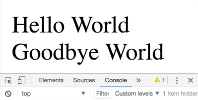
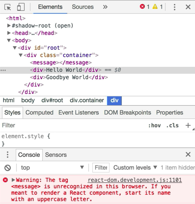
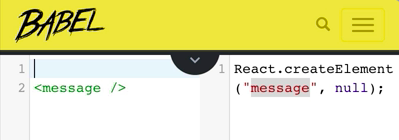
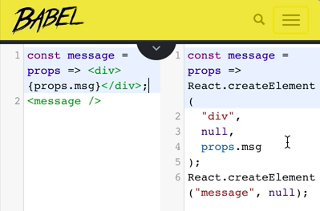
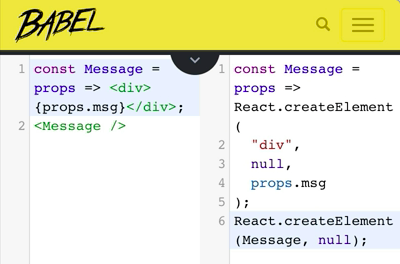
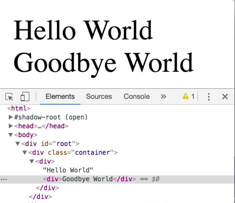

Here, I have a `<div>` with a child that has `Hello World` in it. We're going to go ahead and duplicate that child, and we'll see we have two. I don't want to repeat myself, so I'm going to actually extract this to a variable called `helloWorld`. Then I can just interpolate that directly in my JSX. 

```html
<div id="root"></div>
<script src="https://unpkg.com/react@16.0.0-rc.3/umd/react.development.js"></script>
<script src="https://unpkg.com/react-dom@16.0.0-rc.3/umd/react-dom.production.min.js"></script>
<script type="https://unpkg.com/babel-standalone@6.26.0/babel.js"></script>
<script type="text/babel"></script>
const content = 'Hello World'
const myClassName = 'container'
const helloWorld = <div>Hello World</div>
const element = (
    <div className="container">
        {helloWorld}
        {helloWorld}
    </div>
)
ReactDOM.render(element, rootElement)
```

I refresh. I see exactly the same thing.


Now, let's say that I wanted one of them to say `"Hello World"` and the other to say `"Goodbye World"`. In JavaScript, when we want to reuse code and parameterize that code, we use a function. I'm going to use an arrow function inside of `helloWorld`. This arrow function is going to take an argument. I'm going to call that `props`.

Props is going to be an object that is going to have a `message` property on it, so I'll say `props.msg`, message. I'll go ahead and change this function name to `message`. Then in the place of `helloWorld` in `elements`, I'm going to say `message` with an object with an `msg` prop. That's going to be `'Hello World'`.

We'll do the same for the second one, `message` with `msg`, `'Goodbye world'`. 

```html
const message = () => <div>{props.msg}</div>
const element = (
    <div className="container">
        {message({msg: 'Hello World'})}
        {message({msg: 'Goodbye World'})}
    </div>
)
```

Refresh here. We'll have hello world and goodbye world. 



Sweet. We've been able to take some JSX, wrap it in a function, and make a function call to message.

Unfortunately, function calls don't really compose quite as well as JSX does, so let's see how we can turn this into JSX to make it compose a little bit better. JSX compiles down to `React.createElement` call. Let's start out with `React.createElement` and see how we can convert that to JSX.

```html
const element = (
    <div className="container">
        {React.createElement(message({msg: 'Hello World'}))}
        {message({msg: 'Goodbye World'})}
    </div>
)
```

One neat thing about the `React.createElement` API is that it cannot only take a string indicating what element we want to have rendered, like `<div>` or `<span>`, but it can also take a function. It will pass the `props` to the function, and that function presumably will render some more elements. In our case, the message function is rendering a `<div>`.

With that in mind, the function that we want to create an element out of is this `message` function. The props we're going to pass is this object that has the `msg` property for `'Hello World'`. If I save that and refresh, we see that everything is working just fine. 


Let's go ahead and update the goodbye world as well. Everything's working great with that too.

```html
const element = (
    <div className="container">
        {React.createElement(message({msg: 'Hello World'}))}
        {React.createElement(message({msg: 'Goodbye World'}))}
    </div>
)
```

When we wanted to switch from `React.createElement` with a quotes `<div>` to JSX `<div>`, we simply wrote open caret div. Let's go ahead and do open caret message here and see what happens with that, `<message />`. We're going to see a warning that says that the tag message is unrecognized in the browser. If I go here, I'm going to see that `<message></message>` is actually being rendered.



That's not exactly what I'm really going for here. I want to render my component. I want to have the `message` function called using `React.createElement`. Let's go ahead and take a look at what's happening here. We're going to go to the Babel REPL because, remember, it's Babel that's transpiling this JSX statement into a `React.createElement`.

If I copy this over, then we're going to see it's React create element with quotes message. 



That's why this `<message />` isn't being referenced if I put this up here. The reason is that we have this variable `message`, but it's using the string `message`.



For JSX to differentiate whether you're talking about a variable that's in scope or a raw DOM element, you need to capitalize your component, `Message`. Now it's going to be referencing some variable name that I have available to me. In this case, I'll capitalize the `M`. Now, this message is being referenced in this create element call.



Let's apply that to our scenario. I'm going to take both calls to `message`, do a capital `M`. We'll open a caret. Then we'll do a self-closing element here. Then let's go back. We'll remove some of this JavaScript syntax in favor of JSX. Lastly, capitalize our component.

```html
const Message = props => <div>{props.msg}</div>
const element = (
    <div className="container">
        <Message msg='Hello World' />
        <Message msg='Goodbye World' />
    </div>
)
```

If we save that, we'll refresh. Then we have exactly what we're looking for. 


We have this `'Hello World'` and `Goodbye World` referencing the `Message` component that we created. Now, we can reuse this all over the place. We can compose these things together.

Particularly, if we were to change the `msg` prop to the `children` prop, we'd say `children`, then we can change `msg` to `children` in the `Message` call. 

```html
const Message = props => <div>{props.children}</div>
const element = (
    <div className="container">
        <Message children='Hello World' />
        <Message children='Goodbye World' />
    </div>
)
```

We refresh and we get the exact same thing. 


The nice thing about the `children` prop is we can use it just like we would regular HTML as part of the child of this `Message` component.

```html
const element = (
    <div className="container">
        <Message>Hello World</Message>
        <Message>Goodbye World</Message>
    </div>
)
```

Now we can compose these things together quite nicely. I could even put `<Message />` within a `<Message />`. 

```html
const element = (
    <div className="container">
        <Message>
            Hello World
                <Message>Goodbye World</Message>
        </Message>
    </div>
)
```

If we look at the resulting HTML, we're going to see that we have our container, then we have our first `Message` component, we have that string message, `Hello World`, and then we have another `Message` component with the string `Goodbye World`.



To review, to create a component that is reusable throughout your application and as composable as any other of the JSX that you have available to you is you create a function that has a capital letter as the first character.

Then that will receive `props`. You can use those `props` in whatever it is that you return. Then you're going to return some React elements. Then you can use those just like you do with the div or span or anything that you do with JSX.