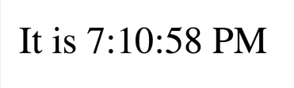
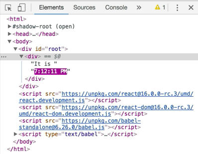
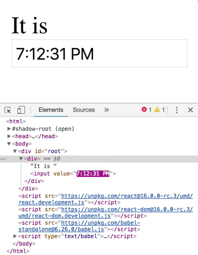
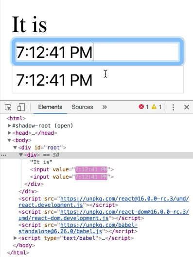
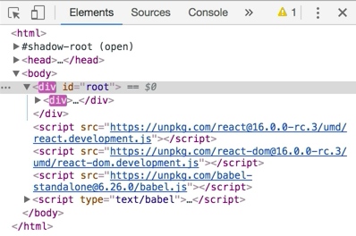

What we have here is a little app that's going to show us the current time. 

```html
<div id="root"></div>
<script src="https://unpkg.com/react@16.0.0-rc.3/umd/react.development.js"></script>
<script src="https://unpkg.com/react-dom@16.0.0-rc.3/umd/react-dom.development.js"></script>
<script src="https://unpkg.com/babel-standalone@6.26.0/babel.js"></script>
<script type="text/babel">
const rootElement = document.getElementById('root')
const time = new Date().toLocalTimeString()
const element = <div>It is {time}</div>
ReactDOM.render(element, rootElement)
</script>
```

Unfortunately, it's only showing us the time since the last refresh. I refresh the page and I'm going to get the new time. I refresh again and I'm going to get the new current time.



I want that to update automatically every second. What we can do here is, I'm going to take everything from `const time` to `ReactDOM`, and create a function out of it. I'm going to call this `tick`.

```
function tick(){
    const time = new Date().toLocalTimeString()
    const element = <div>It is {time}</div>
    ReactDOM.render(element, rootElement)
}
```

Then, I'm going to call `tick()` and I refresh. We're still getting the same thing as we had before. I can refresh and refresh, and I'm going to get the update.


Then, I'm just going to say `setInterval(tick, 1000)` at the bottom of our application. 

```
function tick(){
    const time = new Date().toLocalTimeString()
    const element = <div>It is {time}</div>
    ReactDOM.render(element, rootElement)
}
tick()
setInterval(tick, 1000)
```

Every 1000 milliseconds it's going to update.

```
It is 7:11:33 PM
It is 7:11:34 PM
It is 7:11:35 PM
It is 7:11:36 PM
It is 7:11:37 PM
```

Great, now we have this thing working just perfectly. I right-click on the time then click inspect. The browser is going to highlight the changes in purple, and that's what we're getting right here is the seconds are updating.



This is actually a little bit more important than you might think. To illustrate this, I'm going to change this to be an `<input>` that has the `value={time}`. 

```
function tick(){
    const time = new Date().toLocalTimeString()
    const element = <div>It is <input value={time} /></div>
    ReactDOM.render(element, rootElement)
}
```

If I refresh here, I'm going to get that in an input, and what's neat here is, every single time this is updating, my focus remains in the same input.



If I go ahead and we'll just duplicate this input once here, I'm going to have two inputs here now. 

```
function tick(){
    const time = new Date().toLocalTimeString()
    const element = 
        <div>
            It is 
            <input value={time} />
            <input value={time} />
        </div>
    ReactDOM.render(element, rootElement)
}
```

I can tab between the two and my focus is going to stay on the correct input. 



Let's see why this is kind of neat.

I'm going to change this from JSX to a template string. Instead of `ReactDOM.render`, I'm going to say `rootElement.innerHTML = element`, so that string. Of course I'm going to need to have `${time}` interpolated, because this is a template string.

```
function tick(){
    const time = new Date().toLocalTimeString()
    const element = `
        <div>
            It is 
            <input value=`${time}` />
            <input value=`${time}` />
        </div>
    `
    rootElement.innerHTML = element
    // ReactDOM.render(element, rootElement)
}
```

If I refresh here, I'm going to get the exact same thing that we had before. There's a subtle difference in how things are working here. Now, I'm getting an update of the entire DOM structure every single time this second tics.



When I click on an input, I'm going to lose focus. What's really neat about the way that React is doing this for us is, we have a re-render every single second, re-render our entire application, and it's only updating the parts that actually matter, and it's maintaining focus for us.

It makes sure that when I'm focused on the input and it re-renders, it's going to keep me focused in that input. This has really great implications for accessibility as well as performance, that it's only doing the DOM operations that are absolutely critical and necessary for React to do its updating.

Normally, you're not going to do a full-application re-render every second, or whenever any state in your application changes, there are other ways that React exposes for you to re-render certain parts of your application based off of state changes. I wanted to show you this to illustrate to you that whenever you re-render on the same element or whenever React is doing a re-rendering, it is only going to be updating the part of the DOM that's necessary for it to re-render.