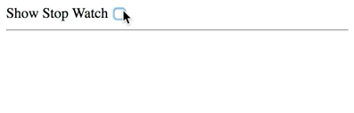
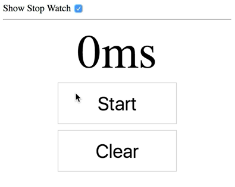
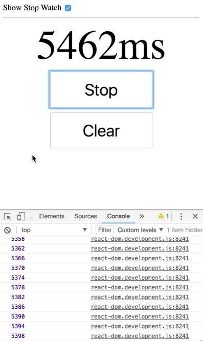
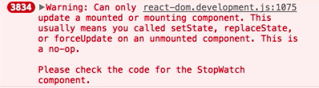

There's actually a pretty serious bug in this implementation:

```javascript
<script type="text/babel">
class StopWatch extends React.Component {
  state = {lapse: 0, running: false}
  handleRunClick = () => {
    this.setState(state => {
      if (state.running) {
        clearInterval(this.timer)
      } else {
        const startTime =
          Date.now() - this.state.lapse
        this.timer = setInterval(() => {
          this.setState({
            lapse: Date.now() - startTime,
          })
        })
      }
      return {running: !state.running}
    })
  }
  handleClearClick = () => {
    clearInterval(this.timer)
    this.setState({lapse: 0, running: false})
  }
  render() {
    const {lapse, running} = this.state
    const buttonStyles = {
      border: '1px solid #ccc',
      background: '#fff',
      fontSize: '2em',
      padding: 15,
      margin: 5,
      width: 200,
    }
    return (
      <div style={{textAlign: 'center'}}>
        <label
          style={{
            fontSize: '5em',
            display: 'block',
          }}
        >
          {lapse}ms
        </label>
        <button
          onClick={this.handleRunClick}
          style={buttonStyles}
        >
          {running ? 'Stop' : 'Start'}
        </button>
        <button
          onClick={this.handleClearClick}
          style={buttonStyles}
        >
          Clear
        </button>
      </div>
    )
  }
}

const element = <StopWatch />
ReactDOM.render(
  element,
  document.getElementById('root'),
)
</script>
</body>
```

I added this checkbox to show and hide our stopwatch so that we can reveal this bug. 

```javascript
class App extends React.Component {
  state = {showStopWatch: true}
  render() {
    const {showStopWatch} = this.state
    return (
      <div>
        <label>
          Show Stop Watch{' '}
          <input
            type="checkbox"
            checked={showStopWatch}
            onChange={() =>
              this.setState(s => ({
                showStopWatch: !s.showStopWatch,
              }))}
          />
        </label>
        <hr />
        {showStopWatch ? <StopWatch /> : null}
      </div>
    )
  }
}
```

When I uncheck it, it actually removes the component from the dom. 



When I check it again, it'll re-add it and create a brand-new instance and re-render that.



If I go ahead and add a callback here inside of `setState` call and I `console.log(this.state.lapse)`, 

```javascript
class StopWatch extends React.Component {
    state = {lapse: 0, running: false}
    handleRunClick = () => {
        this.setState(state => {
        if (this.state.running) {
            clearInterval(this.timer)
        } else {
            const startTime =
                Date.now() - this.state.lapse
            this.timer = setInterval(() => {
                this.setState({
                    lapse: Date.now() - startTime,
                },
                () => {
                    console.log(this.state.lapse)
                }
            )
        })
    }
    ...
}
```

then we pop open our developer console and I hit start, I'm going to see this number being incremented a millions times logged to the console.



Then if I click on `Show Stop Watch to un-show it, we're actually going to get this warning. 



It actually isn't doing anything wrong in our application, but it is indicative of a memory leak. That's exactly what's happening here.

We need to fix this memory leak. The problem is that the `setInterval` is never cleared, so we need to go ahead and clear that. Let's go ahead and do that with `componentWillUnmount`. Right before React removes the component from the page, it's going to call this function.

We'll simply say `clearInterval(this.timer)`. 

```javascript
componentWillUnmount(){
    clearInterval(this.timer)
}
```

Now, we can start, and then remove the stopwatch, and it's totally gone. We don't see the logs anymore and we don't get that warning.