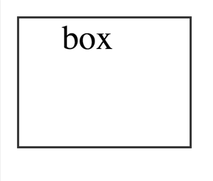
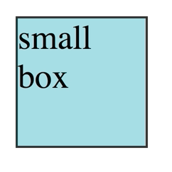
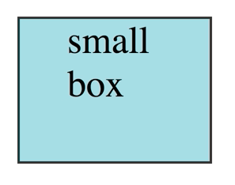
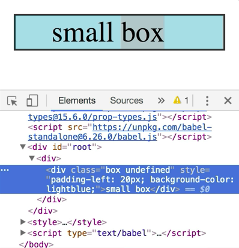
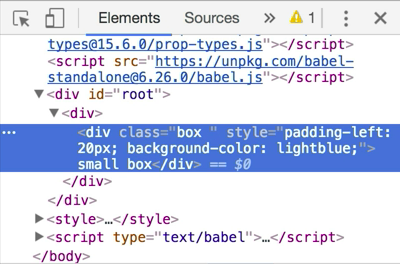
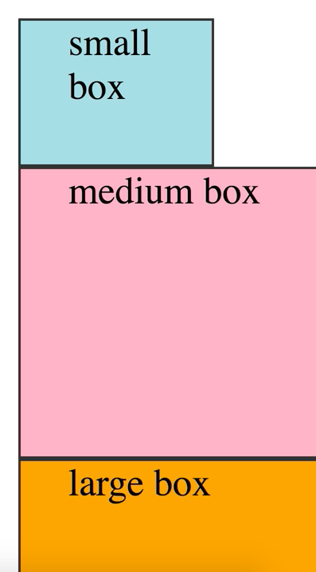

Let's start out by adding a `<div>` with `box` in it. Then we'll say `style` equals an object with `paddingLeft: '20px'`. 

```html
const element = (
    <div>
        <div style={{paddingLeft: '20px'}}>box</div>
    </div>
)
```

This is one of the handful of differences you'll find with JSX and HTML. Rather than a string which you would use in normal HTML, we're using an object here. The property keys are camel-cased rather than cabob-cased as you would have in CSS. The property values are strings.

This is nice because objects are much easier to compose together than strings of CSS. We'll talk more about that in a second. Also, because the `paddingLeft` value is pixels, we can change it to a number of `20` instead of a string. React will treat that as a pixel value.

```html
const element = (
    <div>
        <div style={{paddingLeft: 20}}>box</div>
    </div>
)
```

Next, we'll say `className="box"` to apply the CSS we have on this page. Let's add `box--small` to get a small, square box. 

```html
const element = (
    <div>
        <div 
            className="box box--small" 
            style={{paddingLeft: 20}}
        >
            box
        </div>
    </div>
)
```



You'll notice here that we're using the `className` prop. This is another one of the differences with JSX and HTML.

In HTML, we'd use the attribute `class` whereas here we're using `className`. If we were to extract these props into an object like this, then spread them out on the div, we'd get the same result.

```javascript
const props = { 
    className: 'box box--small',
    style: {paddingLeft: 20},
}
const element = (
    <div>
        <div {...props}>box</div>
    </div>
)
```

Now, let's extract the `className` value into a variable called `className` and use object shorthand to add it to the `props`. 

```javascript
const className = 'box box--small'
const props = { 
    className,
    style: {paddingLeft: 20},
}
```

Cool. It's all still working. If the `className` prop were `class` instead, we wouldn't be able to use the shorthand because you can't have variables called `class`. That's a syntax error.

In addition, if we tried to destructure `class` out of the `props` object here, 

```javascript
const props = { 
    className: 'box box--small',
    style: {paddingLeft: 20},
}
const { class } = props
const element = (
    <div>
        <div {...props}>box</div>
    </div>
)
```

that wouldn't work either. 

The poor ergonomics of using a variable called `class` in JavaScript is one of the reasons React chose `className` over class for this particular prop.

Let's go ahead and turn this into a `function` component called `Box`. We'll accept all the `props` and spread them across the `<div>` we rendered, so you can pass other props to the `Box` component. Let's render that here with `small box`. Now, let's add a `style` prop to the box with `backgroundColor: 'light blue'`.

```html
function Box(props){
    return (
        <div
            className: 'box box--small',
            style: {paddingLeft: 20},
            {...props}
        />
    )
}
const element = (
    <div>
        <Box style={{backgroundColor: 'lightblue'}}>
        small box
        </Box>
    </div>
)
```

Now, we've lost our padding on the box. 



This is because object spread does a shallow merge of the objects given, so the `style` prop given to the `Box` component is overriding its own `style` prop.

Let's destructure the `props`, pull out the `style` prop, and call the rest of the props `rest`. Then we'll spread the `...rest` props onto the `<div>`. Then we'll merge the `style` prop with our own `style`. 

```javascript
function Box({style, ...rest}){
    return (
        <div
            className: 'box box--small',
            style: {paddingLeft: 20, ...style},
            {...rest}
        />
    )
}
```

Awesome, that works. 



These things are composing super well. This would be much more difficult to do if the `style` prop accepted a string of CSS. I'm glad that it's an object instead.

Let's do the same for `className` so we can have different sized boxes. We'll remove the `'box--small'` and instead pass that into where we're rendering the box. We'll say `className="box--small"`. 

```html
function Box({style, ...rest}){
    return (
        <div
            className: "box",
            style: {paddingLeft: 20, ...style},
            {...rest}
        />
    )
}
const element = (
    <div>
        <Box 
            className="box--small" 
            style={{backgroundColor: 'lightblue'}}
        >
            small box
        </Box>
    </div>
)
```

We're going to have the same problem we had before, so we'll need to merge these two props together ourselves.

Let's destructure `className` out and assign the `className` on the `<div>` to a template literal instead. We'll say `box` and then interpolate the `${className}` that we're given. 

```html
function Box({style, className, ...rest}){
    return (
        <div
            className: {`box ${className}`},
            style: {paddingLeft: 20, ...style},
            {...rest}
        />
    )
}
```


Cool, that's working. 


There's one more consideration here. Let's remove the `className` from where we're rendering the `Box` and check out the DOM.

```html
const element = (
    <div>
        <Box style={{backgroundColor: 'lightblue'}}>
            small box
        </Box>
    </div>
)
```

You'll see that we're getting the `className` of undefined. 



That's probably OK, but let's go ahead and clean it up. This is happening because the `className` prop does not exist, so it's undefined. We'll add a default value for the `className` to be an empty string.

```html
function Box({style, className = '', ...rest}){
    return (
        <div
            className: {`box ${className}`},
            style: {paddingLeft: 20, ...style},
            {...rest}
        />
    )
}
```

Now, the `undefined` is gone and there's an empty space there. 



We could add a `.trim` to this template literal like this to get rid of that space, but I don't really think that's necessary.

Now, let's go ahead and render a couple other boxes, each with a different color and size. We'll do `medium`, we'll make that `pink`, and then we'll do `large`, and we'll make that `orange`. 

```html
const element = (
    <div>
        <Box 
            className="box--small" 
            style={{backgroundColor: 'lightblue'}}
        >
            small box
        </Box>
        <Box 
            className="box--medium" 
            style={{backgroundColor: 'pink'}}
        >
            medium box
        </Box>
        <Box 
            className="box--large" 
            style={{backgroundColor: 'orange'}}
        >
            large box
        </Box>
    </div>
)
```

This is composing together really nicely.



One concern I have with this is that the `className` to get these different sizes has to be known by the users of the `Box` component. It'd be much better if the users could tell the `Box` what size it should be and then the `Box` could apply the right `className` itself. That way, all of the styling logic for the box resides in the `Box` component.

Instead of a `className` prop, let's use a `size` prop where we can pass a string for the size like `small`. Let's destructure out the `size` prop and calculate classname based on that value. We'll say `const sizeClassName = size ? box--${size} : ''`. Then we'll interpolate that into our `className` prop.

```javascript
function Box({
    style, 
    size
    className = '', 
    ...rest
}) {
    const sizeClassName = size ? `box--${size}`` : ''
    return (
        <div
            className: {`box ${className} ${sizeClassName`},
            style: {paddingLeft: 20, ...style},
            {...rest}
        />
    )
}
```

Now, this box works exactly as it had before only now the relevant styling information is entirely contained in the `Box` component. We can still pass overrides for the in-line styles and `className`. This makes it really nicely composable. Let's go ahead and do the same thing for the `medium` and `large` boxes just for good measure.

```html
const element = (
    <div>
        <Box 
            size="small" 
            style={{backgroundColor: 'lightblue'}}
        >
            small box
        </Box>
        <Box 
            size="medium" 
            style={{backgroundColor: 'pink'}}
        >
            medium box
        </Box>
        <Box 
            size="large" 
            style={{backgroundColor: 'orange'}}
        >
            large box
        </Box>
    </div>
)
```

In review, to style a React component, you can use the `className` prop to assign classnames used in regular CSS styles, and you can use the `style` prop which accepts an object of CSS. One more important thing to note about the `style` prop is that the values are not vendor prefixed for you, so you'll have to do that yourself.

There are a couple other problems within in-line styles as well. There are a couple libraries to overcome some of these problems. Popular libraries include `styled components`, `emotion`, and `glamorous`. I highly recommend you give these a look if you're planning on building a serious React application.