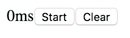
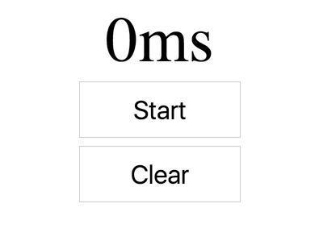
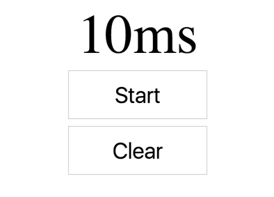
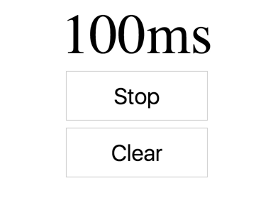
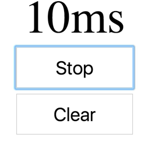
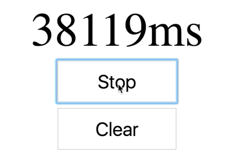

Let's get started by making a function called `StopWatch`. The `StopWatch` function is going to `return` our UI. That UI is just going to be a `<div>` with a `<label>`. That `>label>`, we'll hard code it to `0ms`. We'll update that later.

```javascript
function StopWatch() {
    return (
        <div>
            <label>0ms</label>
        </div>
    )
}
const element = <div />
ReactDOM.render(
    element,
    document.getElementById('root')
)
```

We'll add two `<button>`'s. The first one is going to say, `Start`, and the second will say, `Clear`. Then, we'll go ahead and render that instead of this empty `<div>`.

```html
function StopWatch() {
    return (
        <div>
            <label>0ms</label>
            <button>Start</button>
            <button>Clear</button>
        </div>
    )
}
const element = <StopWatch />
```

Now we get the initial output. 



I'm going to go ahead and copy and paste some styles here, so that it looks nice. 

```html
function StopWatch() {
    const buttonStyles = {
        border: '1px solid #ccc',
        background: '#fff',
        fontSize: '2em',
        padding: 15,
        margin: 5,
        width: 200,
    }
    return (
        <div style={{textAlign: 'center'}}>
            <label
              style={{
                fontSize: '5em',
                display: 'block',
              }}
            >
                0ms
            </label>
            <button style={buttonStyles}>Start</button>
            <button style={buttonStyles}>Clear</button>
        </div>
    )
}
```

All right, that looks a lot better.



Now, I'm going to take away this hard-coded `0ms`, and we're going to change that to `{lapse}`. We'll pull the `{lapse}` from our props. We also need to have this start to be dynamic as well. We'll say, `running`, and if it's running, this will say, `'Stop'`. Otherwise, it'll say, `'Start'`. We'll get `running` from our props as well.

```html
function StopWatch({lapse, running}) {
    const buttonStyles = {
        border: '1px solid #ccc',
        background: '#fff',
        fontSize: '2em',
        padding: 15,
        margin: 5,
        width: 200,
    }
    return (
        <div style={{textAlign: 'center'}}>
            <label
              style={{
                fontSize: '5em',
                display: 'block',
              }}
            >
                {lapse}ms
            </label>
            <button style={buttonStyles}>{running ? 'Stop' : 'Start'}</button>
            <button style={buttonStyles}>Clear</button>
        </div>
    )
}
```

Let's pass those props in `element`. We'll say `running={true}`, and `lapse={0}`. 

```html
const element = <StopWatch running={true} lapse={0} />
```

We'll get stop there. If we change this to `false`, then we get start. If we change the `lapse` to 10, then we get 10 milliseconds. Perfect.



Doing things this way makes it a lot easier to add dynamic capabilities to the existing markup that we've created, because we've been able to extract the specific parts of the state that are in our `render` method. That makes it easier for us to take these things and move them into state.

The next thing we're going to do is we're going to make a `class` called `StopWatch`. That `extends React.Component`. Every component has a `render` method, so I'll put that here. That `render` method is going to have all the same contents that our original function component had.

We'll get rid of the `StopWatch` component, and instead of `props` being passed to our function, we're going to get it from `this.props`. 

```javascript
class StopWatch extends React.Component {
    render() {
        const {lapse, running} = this.props
        const buttonStyles = {
            border: '1px solid #ccc',
            background: '#fff',
            fontSize: '2em',
            padding: 15,
            margin: 5,
            width: 200,
        }
        return (
            <div style={{textAlign: 'center'}}>
                <label
                  style={{
                    fontSize: '5em',
                    display: 'block',
                  }}
                >
                    {lapse}ms
                </label>
                <button style={buttonStyles}>{running ? 'Stop' : 'Start'}</button>
                <button style={buttonStyles}>Clear</button>
            </div>
        )
    }
}
const element = <StopWatch running={true} lapse={10} />
```

Now, everything works exactly the same way as it did before. We're going to change this (`running`) to `true`, and we're going to get stop. We can change this (`lapse`) to `100`. We're going to get 100 milliseconds.

```javascript
const element = <StopWatch running={true} lapse={100} />
```



Next, let's go ahead and move this to `state`. We'll say `state = {lapse: 0, running: false}`. That's our initial state. Instead of pulling these things from `props`, we'll just pull them from `state`. Now, we have our initialization there.

```javascript
class StopWatch extends React.Component {
    state = {lapse: 0, running: false}
    render() {
        const {lapse, running} = this.props
        const buttonStyles = {
       ...
    }
}
```

We can also remove these props off of `element`.

```javascript
const element = <StopWatch />
```

Now, we need to be able to make this dynamic. We need to dynamically update the `state` as we go. Let's go ahead and make these buttons functional. We'll add an `onClick` handler to our `start` and `stop` button. This will be `this.handleRunClick`.

```html
...
    <button onClick={this.handleRunClick} style={buttonStyles}>
        {running ? 'Stop' : 'Start'}
    </button>
...
```

We'll create that member property on our stopwatch instances with `handleRunClick = () => {}`. 

Let's go and update the `state`. We'll say `this.setState`, and we'll set `lapse: 10`, and `running: true`. 

```javascript
class StopWatch extends React.Component {
    state = {lapse: 0, running: false}
    handleRunClick = () => {
        this.setState({lapse: 10, running: true})
    }
    render() {
        const {lapse, running} = this.state
        const buttonStyles = {
           ...
    }
}
```

If I click on `Start`, that sets the state. Perfect.



Let's go ahead and wire up the `handleClearClick` really quick. We'll go back down here on our `clear` button, and we'll say `onclick={this.handleClearClick}`.

```html
...
    <button onClick={this.handleClearClick} style={buttonStyles}>
        {running ? 'Stop' : 'Start'}
    </button>
...
```

We'll take that, and we'll do something similar up here, with `handleClearClick`. We say `this.setState,` where `lapse: 0` and `running: false`.

```javascript
class StopWatch extends React.Component {
    state = {lapse: 0, running: false}
    handleRunClick = () => {
        this.setState({lapse: 10, running: true})
    }
    handleClearClick = () => {
        this.setState({lapse: 0, running: false})
    }    
    render() {
        const {lapse, running} = this.state
        const buttonStyles = {
           ...
    }
}
```

If I click `Start`, and then `Clear`, all those things are wired up together properly. Let's go ahead and start the timer. In `handleRunClick`, we'llempty out the function and say `const startTime = Date.now()`, and we'll subtract that from `this.state.lapse`. Then we'll say `setInterval`, and we'll leave this blank. That's going to be zero.

```javascript
class StopWatch extends React.Component {
    state = {lapse: 0, running: false}
    handleRunClick = () => {
        const startTime = Date.now() - this.state.lapse
        setInterval(() => {

        })
    }
    ...
}
```

Every millisecond, or as soon as it possibly can, we'll call `this.setState` with a new `lapse`, `({lapse: Date.now - startTime})`. Outside of that interval, we'll also say `this.setState({running: true})`.

```javascript
class StopWatch extends React.Component {
    state = {lapse: 0, running: false}
    handleRunClick = () => {
        const startTime = Date.now() - this.state.lapse
        setInterval(() => {
            this.setState({lapse: Date.now - startTime})
        })
        this.setState({running: true})
    }
    ...
}
```

Now, that works, and we can get it to run. 



Actually, every time I click, it's setting a new set interval, which itself will call `setState`. This thing is calling `setState` over and over really, really fast. Let's go ahead and make it not do that.

We actually need to change the behavior based off of the running state. To do this, we're going to say `this.setState`, and provide an updater function, because we need to know what the running state is.

We're going to say give me the `state` for this updater function, and then I can `return` the `running` state, running as not State.running, `!state.running`. Based off of `state.running`, I know whether to set the interval or clear the interval.

```javascript
class StopWatch extends React.Component {
    state = {lapse: 0, running: false}
    handleRunClick = () => {
        const startTime = Date.now() - this.state.lapse
        this.setState(state = {
            if (this.state.running) {

            }
            return {running: !this.state.running}
        })
        setInterval(() => {
            this.setState({lapse: Date.now - startTime})
        })
        this.setState({running: true})
    }
    ...
}
```

Let's go ahead and get rid of `this.setState({running: true})`. We'll move `setInterval` up. `if` it is running, we actually want to do the `setInterval` inside of the `else`. if it is running, we need to clear the existing interval.

```javascript
class StopWatch extends React.Component {
    state = {lapse: 0, running: false}
    handleRunClick = () => {
        const startTime = Date.now() - this.state.lapse
        this.setState(state => {
        if (this.state.running) {

        } else {
            setInterval(() => {
                this.setState({lapse: Date.now - startTime})
            })
        }
        return {running: !this.state.running}
        })
    }
    ...
}
```

We need to keep a handle on the interval identifier. We're going to say `this.timer = setInterval()`. If it already is running, then we're going to say `clearInterval(this.timer)`. Otherwise, we'll go ahead and get the `startTime`, and set the `state`. 

```javascript
class StopWatch extends React.Component {
    state = {lapse: 0, running: false}
    handleRunClick = () => {
        this.setState(state => {
        if (this.state.running) {
            clearInterval(this.timer)
        } else {
            const startTime = Date.now() - this.state.lapse
            this.timer = setInterval(() => {
                this.setState({
                    lapse: Date.now - startTime
                })
            })
        }
        return {running: !this.state.running}
        })
    }
    ...
}
```

Let's save that. We'll start and stop, and start and stop. Then we can clear.

But that `Clear` button isn't working. The problem is that we're not clearing the interval. Let's go ahead and fix that also. When we clear this, we're going to basically do the same thing that we did up in the `if` statement, so we'll just copy and paste that. 

```javascript
handleClearClick = () => {
    clearInterval(this.timer)
    this.setState({lapse: 0, running: false})
}    
```

If I start, and then clear, and start and stop and clear, then everything is working awesomely.

We're going to review the way that we made our `StopWatch` component stateful. We started out by making a static `render` method that just rendered statically the information that we wanted to have rendered.

That made it easier for us to extract the pieces that are stateful, like the `lapse` and `running`. We accepted those as `props` to make sure that those were wired up properly.

We moved those `props` to `state`, and then, instead of pulling those from `props`, we pulled them from `state`. We added some interactivity. We added this `onClick` to each `<button>`,  and added the logic for those things here.

To update the `state`, you use `setState`, and if you need to reference some existing `state` as you're updating the `state`, then you use an updater function that accepts our `state` and returns the new `state`. Otherwise, you can simply call `setState` with an object if your new `state` doesn't depend on some old `state`.

This implementation actually has a memory leak in it, but I'll fix that in another lesson.