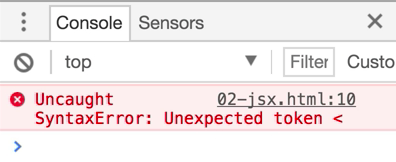
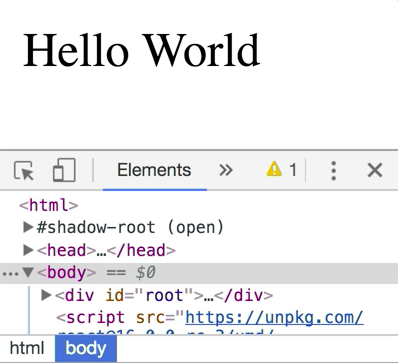
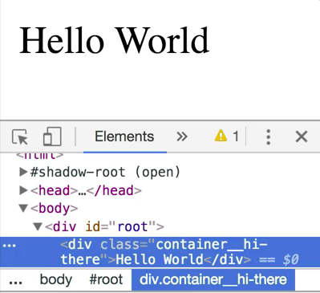
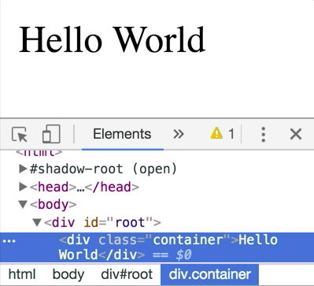

Writing our entire app using `React.createElement` is totally possible, but it's not entirely ergonomic. The React team created **JSX** to allow us to write our UI in a way that's a little bit more familiar to us. This is called JSX, and it looks similar to HTML and behaves in similar ways. We're going to convert this to use JSX.

Let's go ahead and do that. I'm going to just comment this out and we'll say `const element = <div>`. 

```html
<div id="root"></div>
<script src="https://unpkg.com/react@16.0.0-rc.3/umd/react.production.min.js"></script>
<script src="https://unpkg.com/react-dom@16.0.0-rc.3/umd/react-dom.production.min.js"></script>
<script type="text/javascript">
const rootElement = document.getElementById('root')
// const element = React.createElement('div', {
//     className: 'container',
//     children: ['Hello World', 'Goodbye World']
// })
const element = <div>
ReactDOM.render(element, rootElement)
</script>
```

We want the `className` to be `"container"`, and then the children to be `Hello World`. Then we'll close off that `</div>`. 

```html
<div id="root"></div>
<script src="https://unpkg.com/react@16.0.0-rc.3/umd/react.production.min.js"></script>
<script src="https://unpkg.com/react-dom@16.0.0-rc.3/umd/react-dom.production.min.js"></script>
<script type="text/javascript">
const element = <div className="container">Hello World</div>
ReactDOM.render(element, rootElement)
</script>
```

We'll save that. When we refresh, we're going to get a syntax error.



This is actually not JavaScript syntax at all. This JSX, so it needs to be transpiled into this `React.createElement` call. We can use `Babel` to do this. Normally, to do this you would have a build system set in place with Webpack or something like that, but we're just going to use Babel standalone so that we can do this right in the browser without having any sort of build system.

I'll go ahead and paste this script tag there. 

```html
<div id="root"></div>
<script src="https://unpkg.com/react@16.0.0-rc.3/umd/react.production.min.js"></script>
<script src="https://unpkg.com/react-dom@16.0.0-rc.3/umd/react-dom.production.min.js"></script>
<script type="https://unpkg.com/babel-standalone@6.26.0/babel.js"></script>
<script type="text/javascript"></script>
```

That brings in Babel standalone. Then I'm going to change this from `text/javascript` to `text/babel` to make that work. 

```html
<script type="text/babel"></script>
```

Now I refresh, and I get hello world. Perfect.



It all looks exactly the same. The HTML output is exactly the same as we had before with the `class="container"`. Now, with this new syntax, we can do a couple of tricks, and it looks a little bit nicer. It's easier to compose these things together.

Let's learn a couple of things about JSX. There are a couple of things that are different. For example, in HTML, you use `class`, and in JSX, you use `className`. Then we provide our attributes just like we would in HTML with a string. Then our children, and we can provide any number of children, and it doesn't have to be all on one line.

Let's say we wanted to take this `Hello World` and externalize it to variable. How do we do that? We'll make `const content = 'Hello World'`. Then we'll replace this `Hello World` with an interpolation. We'll put `{content}` in here.

```html
const content = 'Hello World'
const element = <div className="container">{content}</div>
```

This interpolation is denoted by these curly braces, `{}`. When you do this, you're exiting JSX land and entering JavaScript land. You can do any JavaScript that you want to as long as it evaluates to an expression. I'll save that, refresh. We'll see that we get exactly what we had before.


Now, inside of these curly braces can literally be anything. I'm going to make an immediately invoked arrow function. 

```html
const content = 'Hello World'
const element = <div className="container">{(() => content)()}</div>
```

We'll refresh and we get exactly the same thing. That's one of the really nice things about JSX is that once you put in these curly braces, you are in JavaScript land and you can do anything that you want to inside of this JSX.

That also counts for the `className` prop or any `props` that you're passing to these components. In `className` I'm going to use curly braces instead of that quote. We'll say `const myClassName = container`. Then inside of these curly braces, I can do any JavaScript that I want. I'll do `myClassName`. 

```html
const content = 'Hello World'
const myClassName = 'container'
const element = <div className={myClassName}>{(() => content)()}</div>
```

I refresh, and here we have the classes container.


This allows me to do any kind of interpolation. We have container `{myClassName + '__hi-there'}`. 



That gives me a lot of power and flexibility to have my view logic as part of my markup.

One other thing that is pretty common to do with JSX is we're going to create a `props` object. We're going to say that `className:` prop we want to be `'container'`, and the `children:` prop will be `'Hello World'`. Then we're going to take this `<div />` and remove all the props and make it a self-closing React element.

Then we'll do this open curly braces, so we'll enter JavaScript land. We'll do `...props`. 

```JSX
const content = 'Hello World'
const myClassName = 'container'
const props = {
    className: 'container',
    children: 'Hello World'
}
const element = (
    <div {...props} />
)
ReactDOM.render(element, rootElement)
```

This is similar to object spread in JavaScript. We are spreading these `props`, `className` and `children`, across this `<div>` here. If I save this and refresh here, we're going to get the exact same thing. We have the `class = "container"` and `Hello World`.



Now, let's say that this `element` object is coming to us from some other place. We're going to want to override it or have the `props` override some of our things. We'd say, if they don't give me a `className`, then I want it to be `my-class`. 

```JSX
const content = 'Hello World'
const myClassName = 'container'
const props = {
    className: 'container',
    children: 'Hello World'
}
const element = (
    <div className="my-class" {...props} />
)
ReactDOM.render(element, rootElement)
```

They do give us a `className`, so the `className` is still going to be `"container"`. Let's say that we want to override whatever `className` they pass in. They can pass us a `className`, but we're going to use our own `className`. What we're going to do is we'll take the `className` prop and we'll move it over on the other side of this `...props` spread here. 

```JSX
const content = 'Hello World'
const myClassName = 'container'
const props = {
    className: 'container',
    children: 'Hello World'
}
const element = (
    <div {...props} className="my-class" />
)
ReactDOM.render(element, rootElement)
```

We'll see `class="my-class"` is my class now.


The same kind of thing happens with the `children` prop. We could pass a `children` prop and have it after the `...props` spread, and it would override whatever's in the `...props` there. Or we can use the regular `children`, and that will also override whatever is in `...props`.

Those are a couple of the tricks that you can do with JSX. The basic idea is you enter JSX land with the `<`. You specify the element that you want to have rendered, and then you specify any props just like you would attributes on HTML.

There are some differences here like I noted with `className`, and there are some others as well. Then you can pass your `children`, and then you close your JSX element. In addition, you can do a self-closing tag as well if you don't want to put any `children` inside of the JSX element.