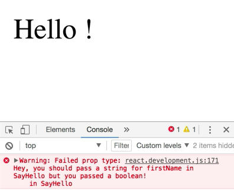
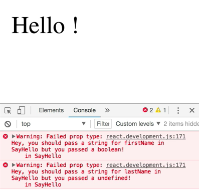
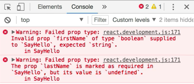
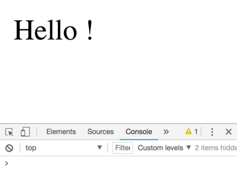

When other people start using your components, sometimes they'll make mistakes when passing `props`. For example, here we're passing the value of `true` for `firstName` which we're expecting to be a string in our component. We're not passing a `lastName` prop at all. What is being rendered is not what we'd expect.

```html
<script type="text/babel">
function SayHello(props) {
    return (
        <div>
            Hello {props.firstName} {props.lastName}!
        </div>
    )
}

reactDOM.render(
    <SayHello firstName={true} />
    document.getElementById('root')
)
</script>
```

To use **PropTypes** on a function component like `SayHello` here, we'll say `SayHello.propTypes` is an object. To validate the `firstName` prop, we'll add a `firstName` key to this object. The value of this is a function which accepts `props`, `propName`, and `componentName`.

```javascript
SayHello.propTypes = {
    firstName(props, propName, componentName)
}
```

Let's go ahead and say, `if(typeof props[propName] !== 'string')`, then we'll `return new Error('Hey, you should pass a string for ${propName} in ${componentName}, but you passed a ${typeof props[propName]}!')`. 

```javascript
SayHello.propTypes = {
    firstName(props, propName, componentName) {
        if (typeof props[propName] !== 'string') {
            return new Error(`Hey, you should pass a string for ${propName} in ${componentName}, but you passed a ${typeof props[propName]}!`
            propName
            )
        }
    }
}
```

With that, we'll see our error message being logged to the console here. Awesome.



We need the same thing for the `lastName`, so we'll pull this function out to an object that we'll call `PropTypes` and put it in a property called `string`. Then, we can set `firstName` to `PropTypes.string`, and `lastName` and set that to `PropTypes.string` as well. 

```javascript
SayHello.propTypes = {
    firstName: PropTypes.string,
    lastName: PropTypes.string,
}
```

Super. Now, we're getting the error message for both of them.



Because this and other `PropTypes` are so common, the react team has built a package called `PropTypes` which we can use just like the one we just built ourselves. I'll go ahead and add a new `<script>` tag up here at the top that pulls in `PropTypes` from unpkg.com.

```html
<script type="https://unpkg.com/prop-types@15.6.0/index.js"></script>
```

That's going to add a `PropTypes` global to our program. We can go ahead and remove our own implementation of `PropTypes`, and everything should work pretty much the same.


There's one difference here now though. We're no longer getting the warning for the `lastName` prop. The issue here is that all of the validators in the `PropTypes` module consider props to be optional by default, so if a prop is not provided, then the validator doesn't run. That's useful in some cases like where we provide a default value, like if were to add `|| 'Unknown'` for the `lastName`.

If we want it to specify a prop as required, we can simply add `.isRequired` for the `firstName` and here for the `lastName`. 

```javascript
SayHello.propTypes = {
    firstName: PropTypes.string.isRequired,
    lastName: PropTypes.string.isRequired,
}
```

That will give us a new error indicating that this prop is required. 



For components declared as classes like this, we can continue to specify our PropTypes the same way, but it's more common to do this by making PropTypes a static property of the class. 

```javascript
class SayHello extends React.Component {
   static propTypes = {
        firstName: PropTypes.string.isRequired,
        lastName: PropTypes.string.isRequired,
    }
    render() {
        const {firstName, lastName} = this.props
        return (
            <div>
                Hello {props.firstName} {props.lastName}!
            </div>
        )
    } 
}
```

It works exactly the same way.

Let's swap the development version of react to the production version. 

```html
<script src="https://unpkg.com/react@16.0.0/umd/react.production.js"></script>

```

You'll notice now that our PropTypes validation is totally gone. 



This is because PropTypes is great for development, but it does slow things down a bit in an unnecessary way for production. The production version of react does not use PropTypes.

This is great. If you want to improve things further, you can use `babel-plugin-transform-react-remove-prop-types` to automatically remove PropTypes from your code when you're building it for production, which will make things even faster for you.

In review, to add `PropTypes` validation to your component, you add a `PropTypes` property to the function component or a static property to call `propTypes` to the class component, like we're doing here.

The keys of that object map to the `props` of your component. You then provide functions to validate the `props`. The PropTypes module has a bunch of validators available to you, and you can learn about those in the PropTypes documentation.