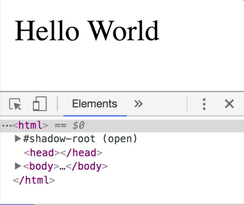
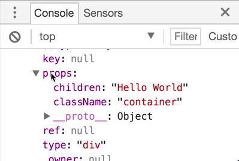
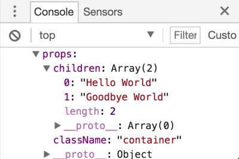

We're going to start by making a `<div>` with `id` of `"root"`, and then we'll have a `<script>`. Inside of the `<script>`, we're going to get the `rootElement` with `document.getElementById()` of `'root'`. Then we're going to create a new element that will append to the root that just says, "Hello World."

We'll say `const element = document.createElement('div')`. Then we'll say `element.textContent = 'Hello World'`, and `element.className = 'container'`, just for fun. Then we'll say `rootElement.appendChild(element)`.

```html
<div id="root"></div>
<script type="text/javascript">
const rootElement = document.getElementById('root')
const element = document.createElement('div')
element.textContent = 'Hello World'
element.className = 'container'
rootElement.appendChild(element)
</script>
```

We'll save that, refresh, and poof, we have our hello world. Most excellent. 



Now, with React, it's actually pretty similar. We're going to have a createElement method that we'll call. We can provide a couple properties onto our element, and then we're going to render it.

We don't use `appendChild`, but we'll use a render method. The first thing that we need to do is get ourselves React onto this page. We'll stick those after our `<div>` in `<script>` tags. 

```html
<div id="root"></div>
<script src="https://unpkg.com/react@16.0.0-rc.3/umd/react.production.min.js"></script>
<script src="https://unpkg.com/react-dom@16.0.0-rc.3/umd/react-dom.production.min.js"></script>
...
```

These are going to expose the `React` global and the `ReactDOM` global, which we'll use to recreate this using React APIs.

I'm going to go ahead and comment everything after `const rootElement` out, and we'll start creating this from React. 

```html
<div id="root"></div>
<script src="https://unpkg.com/react@16.0.0-rc.3/umd/react.production.min.js"></script>
<script src="https://unpkg.com/react-dom@16.0.0-rc.3/umd/react-dom.production.min.js"></script>
<script type="text/javascript">
const rootElement = document.getElementById('root')
// const element = document.createElement('div')
// element.textContent = 'Hello World'
// element.className = 'container'
// rootElement.appendChild(element)
</script>
```

We'll say our `const element = React.createElement()`, and the element is going to be a `<div>`. The `className` is going to be `'container'`. Then the text content is going to be `'Hello World'`.

```html
...
const element = React.createElement(
    'div',
    {className: 'container'},
    'Hello World'
)
</script>
```

Then we're going to say `ReactDOM.render(element,rootElement)`. If we save this, we're going to get exactly the same thing. 


Let's go ahead and take a look at what `element` is, `console.log(element)`. We'll save that, and here we'll see that it's just this object that has this weird type of property, a couple other properties here, and then this `props`.



This one's actually pretty important. It has a `children` prop, and that's our `"Hello World"`. That's our last argument. Then it has a `className` prop, and that's the `"container"`. It looks like we've got a merge of the object with whatever we pass here, `{classname: 'container'}, 'Hello World'`.

We can actually pass any number of arguments for the rest of this API call. `'Goodbye World'`, and I'll save that.

```html
const element = React.createElement(
    'div',
    {className: 'container'},
    'Hello World',
    'Goodbye World'
)
```

Refresh here. If we see in our `props`, we're going to have `children` as an array that has both of those things.



What's interesting here is we could actually remove `'Hello World', 'Goodbye World'`, create a `children` prop instead, and past them into there.  

```html
const element = React.createElement('div', {
    className: 'container',
    children: ['Hello World', 'Goodbye World']
})
```

We'll get exactly the same output. Here, we have the props that has the className and the children.


We can switch this batch to just `'Hello World'` as well, and that's going to give us this back. 


`React.createElement` API is as simple as the element that you want to create `<div>`, and then an object that has all of the props that you want to have applied, `className, children`.

Just as a convenience, you can provide the `children` as any number of arguments after the `props` argument as well.