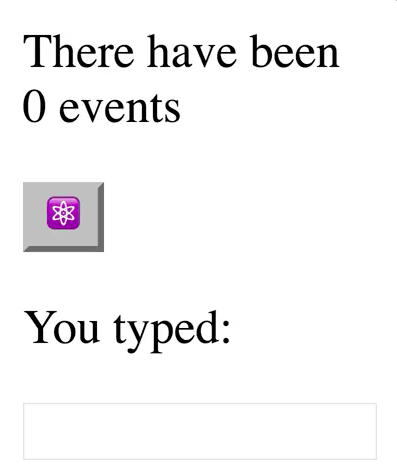
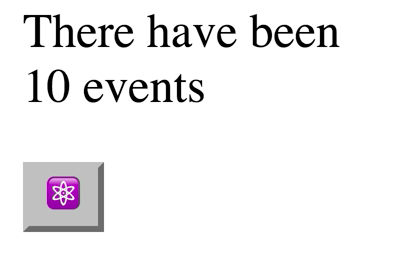
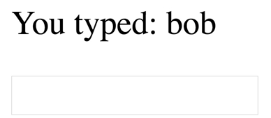
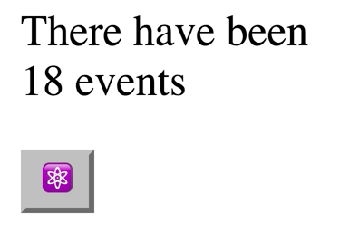
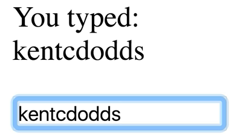
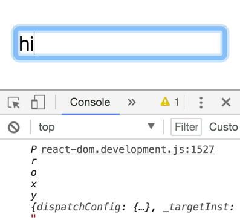
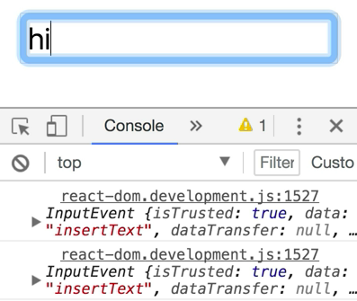

Here, we have this `App` component that's rendering some UI for us. It's rendering some `state` based off of a variable that we have. Then we have this handy function called `setState` that will assign `newState` to this `state` object.

Then we have this `renderApp` function, which will rerender our `App`. Every time we call `setState`, we render the app. 

```javascript
const state = {eventCount: 0, username: ''}

function App() {
  return (
    <div>
      <p>
        There have been {state.eventCount} events
      </p>
      <p>
        <button>⚛️</button>
      </p>
      <p>You typed: {state.username}</p>
      <p>
        <input />
      </p>
    </div>
  )
}
function setState(newState) {
    Object.assign(state, newState)
    renderApp()
}

function renderApp() {
    ReactDOM.render(
        <App />
        document.getElementById('root'),
    )
}
renderApp()
```



If we call `setState` with `{(eventCount: 10)}`, 

```javascript
setState({eventCount: 10})
```

and then save, we're going to get 10 events there.



If we call this with `username: 'bob'`, then we'll see `bob` appearing here.



Great. Now, with that knowledge, let's go ahead and wire up some events. Every time we click on this button, we increment how many events have taken place.

On this button, we're going to add an `onClick` prop. In this `onClick` prop, we're going to pass a function. I'm going to go ahead and just do an inline arrow function here, `() =>`, and in here, I'm going to say `setState` with this object.

We'll say `eventCount: state.eventCount + 1`. 

```html
function App() {
  return (
    <div>
      <p>
        There have been {state.eventCount} events
      </p>
      <p>
        <button onClick={() => 
            setState({
                eventCount: state.eventCount + 1,
            })>
                ⚛
        </button>
      </p>
      <p>You typed: {state.username}</p>
      <p>
        <input />
      </p>
    </div>
  )
}
```

We'll save that, and every time I click on the button, we're going to increment the events. Then we rerender the app. 



Let's go ahead, and I'm just going to pull out the function for the `onClick` just to make things a little more clear.

We'll call this `increment`, and then we'll create that function down here.

```javascript
function increment() {
    setState({
        eventCount: state.eventCount + 1,
    })
}
```

That functionality still works. Now, let's go ahead and look at a couple other events that we could use. There's `onClick`, but there's also a whole bunch of others that we could use here.

We could do `onMouseOver`. We save that, and every time I mouse over the button, we're going to increment that event. There's also even `onFocus`. Every time I focus on the input, it gets incremented. Let's go ahead and take a look at the input now.

Inputs are a little bit unique in that they provide an `onChange` event. Every single time the input changes, immediately we'll get this function called. If we want to update the `state.username`, then we're going to need what the value of the input is.

We're going to say `onChange={event => setState({username: event.target.value})}`. That'll be referencing the inputNode.value. That'll get the value from the input node. 

```html
function App() {
  return (
    <div>
      <p>
        There have been {state.eventCount} events
      </p>
      <p>
        <button onClick={() => 
            setState({
                eventCount: state.eventCount + 1,
            })>
                ⚛
        </button>
      </p>
      <p>You typed: {state.username}</p>
      <p>
        <input onChange={event => 
            setState({
                username: event.target.value
            })}
        />
      </p>
    </div>
  )
}
```

As we type, say, `kentcdodds`, and we get that username state updating.



We could also, instead of `onChange`, we could use `onBlur`. We could type something in here like Sarah, and then tab out, and we'll get that update at that time. Of course, we can pull this out also into `updateUsername`, and create a function called `updateUsername` that'll accept our `event`. We call `setState`. 

```javascript
function updateUsername(event) {
    setState({
        username: event.target.value,
    })
}
```

It works.

Now, let's go ahead and actually, really quick, we'll `console.log(event)` here. Then if we pop over our dev tools and say, "Hi," what we're going to see is a proxy here. What React is doing is it's synthesizing an event system.



We do have access to the original event if we say `console.log(event.nativeEvent)`. Then we save that, we'll say, "Hi." We get the actual native event here. 



Most of the time, you don't actually need the native event.

One nice thing about this is that React is optimizing things for us, so it's using event delegation. There's really only one event handler for each type on the entire document. Then it manages calling your event handlers.

One thing that I really like about the way that React does events is that it's directly on the element that you're rendering, and you're passing is a direct reference to the function that you want to have called. It's pretty easy to follow the code path of the events that you have wired up.