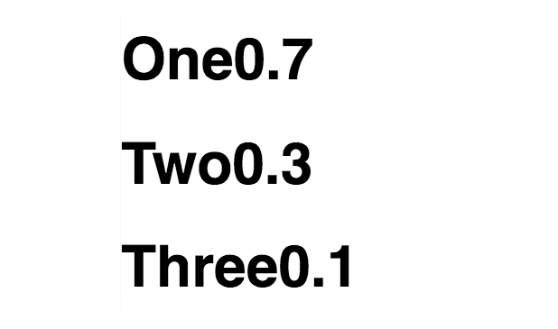

#### app.component.ts
``` javascript
@Directive({
  selector: '[three]'
})
export class ThreeDirective{
  @Input() set three(value){
    this.view.createEmbeddedView(this.template, {
      $implicit:'Awesome'
    })
    this.view.createEmbeddedView(this.template, {
      $implicit:'Amazing'
    })
    this.view.createEmbeddedView(this.template, {
      $implicit:'Sweet'
    })
  }
}
```
Now, you probably don't want to hard code these values into your directive. You'd probably rather pass them in just like **ng4** does. If I say `let message from messages` here, what this is going to expand to now is on the `template`.

``` javascript
@Component({
  selector: 'app',
  template: `
<h1 *three="let message from messages">{{message}}</h1>
`
})
expor class AppComponent{}
```

There's going to be an input called `threeFrom` a combination of the name of the directive, and the separator here which is going to take this as the input. Remember, this was used to declare a variable, and any word you put here is going to be an input which combines this and this. It'd be `[threefrom]="messages"` like so.

``` javascript
@Component({
  selector: 'app',
  template: `
// <template [threeFrom]="messages"></template>
<h1 *three="let message from messages">{{message}}</h1>
`
})
```

What that means is we need to change our input from `three` to `threefrom`. Then `this` value can come from `messages` which we'll create down here. 

``` javascript
export class ThreeDirective{
  @Input() set threeFrom(value){
    
    ...

  }
}
```

We'll say `messages`, `One is awesome`, `Two is better`, `Three is best`.

``` javascript
export class AppComponent{
  messages = {
    one: 'One is awesome',
    two: 'Two is better',
    three: 'Three is best'
  }
}
```

Now, this object is going to be past into my `threeFrom`. In here, I'm going to [destructure](https://egghead.io/lessons/ecmascript-6-destructuring-assignment) this where I have a `one`, `two` and `three`, and take the `one`, and I'll put it here, a `two` here, `three` here. Now when I save, we'll have `One is awesome`, `Two is better`, and `Three is best`.

``` javascript
export class ThreeDirective{
  @Input() set three({one, two, three}){
    this.view.createEmbeddedView(this.template, {
      $implicit:one
    })
    this.view.createEmbeddedView(this.template, {
      $implicit:two
    })
    this.view.createEmbeddedView(this.template, {
      $implicit:three
    })
  }
}
```

This object coming in is this `messages` coming in here. This past into here, past into `three` from which is an input being assigned to this, and rendered here through this destructuring, and then assignment to the implicit.

The one thing you do need to look out for is if the data changes. Say for example in the `constructor`, you have a `setInterval`, and we'll say every one second, change `this.messages` to...Scrub this, and change some of it. I'll just save bad, worse, worst. 

``` javascript
export class AppComponent{
  messages = {
    one: 'One is awesome',
    two: 'Two is better',
    three: 'Three is best'
  }

  constructor(){
    setInterval(() =>{
      messages = {
        one: 'One is bad',
        two: 'Two is worse',
        three: 'Three is worst!'
      }
    })
  }
}
```

Then when I hit save now, you'll see that every second, it's just creating more of them. That's not what I really wanted. I wanted it to replace. The way you replace is just by saying `this.view.clear`. Hit save.

``` javascript
export class ThreeDirective{
  @Input() set three({one, two, three}){
    this.view.clear()

    ...

  }
}
```

Now, each time that data changes, it will clear out, and just replace what's currently there essentially recreating all these views from the templates. Just to really prove that, I just want paste in some `math.random` here.

``` javascript
  constructor(){
    setInterval(() =>{
      messages = {
        one: 'One' + Math.random().toString().slice(0,3),
        two: 'Two'+ Math.random().toString().slice(0,3),
        three: 'Three'+ Math.random().toString().slice(0,3)
      }
    })
  }
```

Here. Clean this up from my pasting skills, hit save, and you should see this update with random values every second. It's no longer creating values underneath it.

