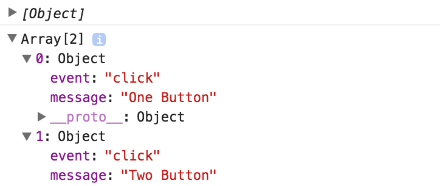

A common scenario is tracking things like button clicks, or other user events on the page so we can actually build a track `@Directive` to handle that for us. I'll make a `@Directive` with a `selector` of `track`. This will be an attribute. Make sure to import this, and export the class `TrackDirective`. 
#### app.component.ts
``` javascript
import { Component, Directive } from '@angular/core'

@Directive({
  selector: '[track]'
})
export class TrackDirective
```

Then make sure to add that to our `declarations`.
#### app.module.ts
``` javascript
const imports = [BrowserModule]
const bootstrap = [AppComponent]
const declarations = [
  AppComponent,
  TrackDirective
]
```

Once that's in there, we can come back to our buttons, and say `track`, and I'll just use a string of `'One Button'`. Then this way, this `track` is an `@Input` on our `track` directive. I'll set that up. `Import input`. Just call it `track`, and then we want to track the clicks. Add the `HostListener` for click, and say `onClick`, `console.log(this.track)`.
#### app.component.ts
``` javascript
import { Component, Directive, Input, HostListener } from '@angular/core'

@Directive({
  selector: '[track]'
})
export class TrackDirective{
  @Input() track
  @HostListener('click')
  onClick(){
    console.log(this.track)
  }
}

@Component({
  selector: 'app',
  template: `
<button [track]="'One Button'">One</button>
<button>Two</button>
<button>Three</button>
`
})
```

Now when we click on button `One`, we should see the `One Button` logged out. We can add this to all three of our buttons, copy paste. Paste two, three. Save that, and click, click, click. One, two, three.

``` javascript
@Component({
  selector: 'app',
  template: `
<button [track]="'One Button'">One</button>
<button [track]="'Two Button'">Two</button>
<button [track]="'Three Button'">Three</button>
`
})
```

Now, the cool thing here is we didn't have to build a new component to handle this. We simply just added a directory which adds this tracking behavior to an already existing element. Now, to keep track and store these different tracking events, I'm going to create a service to handle that. I'll make an `@Injectable`, and say `export class TrackingService`.

``` javascript
import { Component, Directive, Input, HostListener, Injectable } from '@angular/core'

@Injectable()
export class TrackingService
```
Make sure to add this to our providers. `TrackingService`. Then we can actually inject the `TrackingService` into our directive. Some `constructor(private tracking: TrackingService)`, and now this `TrackingService` is available inside of our listener.

``` javascript
export class TrackingDirective{
  @Input() track

  @HostListener('click')
  onClick(){
    console.log(this.track)
  }

  constructor(private tracking:TrackingService){}
}
```
Instead of just logging this out, we can say `this.tracking`, and then we'll need a method on here to actually track. We'll just call this `log`. Then we want to keep track of these. I want to say `logs` is an array, and these can be `trackingEvents` where we just say `this.logs.push(trackingEvents)`. Then we'll just `log` this out to make it visual.

``` javascript
@Injectable()
export class TrackingService{
  logs = []
  log(trackingEvent){
    this.logs.push(trackingEvent)
    console.log(this.logs)
  }
}

@Directive({
  selector: '[track]'
})
export class TrackDirective{
  @Input() track

  @HostListener('click')
  onClick(){
    this.tracking.log({event:'click', message:this.track})
  }
}
```

Now, we can use this log method to say `log`. I'm just going to say the `event` was a `click`, and the `message` was `this.track`. Now, when I save, as I click this button, you'll see we have an array with an object in it with an event of click, and a message of `One Button`. A click again.

Now, we have another array with two tracking events in it. `click` in `Two Button`, and we can keep on clicking, and adding those tracking events. It would be fairly trivial to even hook this up to a backend of some sort.



With this `TrackDirective`, you could continue to track whatever event you wanted. If I wanted to track mouse overs to say `onMouseOver`, call `this.mouseOver`. Now, let's save here, and now we're even tracking all these mouse overs, and clicks.

``` javascript
export class TrackDirective{

  ...

  @HostListener('mouseover')
  onMouseOver(){
    this.tracking.log({event:'mouseover', message:this.mouseOver})
  }
}
```

We're adding more, and more behaviors to our `track` directive without even having to touch the buttons or components that we'd create.