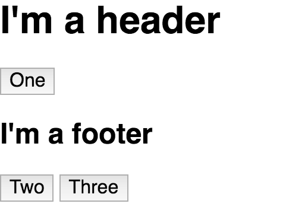
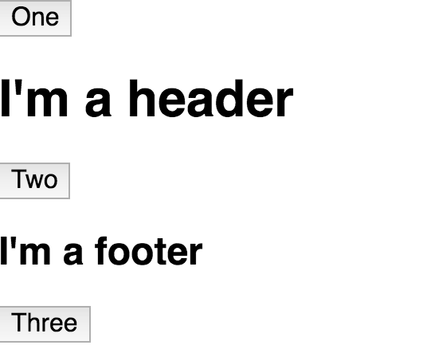

Now, it is possible to create a **service** that can store `<templates>`. Create an `@Injectable`, `export class TemplateService` and this will just have a property of `templates`, which is a `map`. Then to create the templates to store in here we actually have to create a component that basically contains all of our templates.

This will have a selector of `template-storage` and an empty `template` for now. Then just `export class TemplateStorage`. 
#### app.component.ts
``` javascript
@Injectable()
export class TemplateService{
  templates = new Map()
}

@Component({
  selector: 'template-storage',
  template: ``
})
export class TemplateStorage
```

Then make sure that's declared. `TemplateStorage`, and the template service is provided.
#### app.module.ts
``` javascript
const imports = [BrowserModule]
const boostrap = [AppComponent]
const declarations = [
  AppComponent,
  TemplateSorage
]
const providers = [
  TemplateService
]
```
Then any template we put in here...so I'll create a template and give this a ref of `header`. I'll put an `<h1>` in here saying `I'm a header`. Then in our class we'd need to look that up, so `@ViewChild`, look up the `header`. This will be the `headerTemplate`. Then in `ngAfterViewInit`, we can store the template.
#### app.component.ts
``` javascript
@Component({
  selector: 'template-storage',
  template: `
<template #header><h1>I'm a header</h1></template>  
`
})
export class TemplateStorage{
  @ViewChild('header') headerTemplate

  constructor(){}

  ngAfterViewInit(){
    // store the template
  }
}
```
To do that, we need to inject the `TemplateService` first and then we can say `this.service.templates.set`. The key can be `header`. The value will be `this.headerTemplate`. Now we've looked up this template and stored it in here.

``` javascript
export class TemplateStorage{
  @ViewChild('header') headerTemplate

  constructor(private service:TemplateService){}

  ngAfterViewInit(){
    this.service.templates.set('header', this.headerTemplate)
  }
}
```

What we need to do now is actually put that `template-storage` component in our main component or on the `DOM` somewhere so that those templates are created and can actually look them up. Even though nothing appears here those templates are still hidden away.

``` javascript
@Component({
  selector: 'app',
  template: `
<template-storage></template-storage>

<button>One</button>
<button>Two</button>
<button>Three</button>
`
})
```

Now, if I'd want to create a directive on here, I will just call this `surround` and I'll create a directive. The selector of `surround`, make sure and import that, `exportClass SurroundDirective`, make sure and declare that.

``` javascript
@Directive({
  selector: '[surround]'
})
export class SurroundDirective

@Component({
  selector: 'app',
  template: `
<template-storage></template-storage>

<button *surround>One</button>
<button>Two</button>
<button>Three</button>
`
})
```

Fix a typo and inject the `TemplateService` as well as the `ViewContainerRef` and the `template`, so the `TemplateRef`.

``` javascript
export class SurroundDirective{
  constructor(
    private service:TemplateService,
    private view:ViewContainerRef,
    private template:TemplateRef<any>
  ){}
}
```

Now in `ngAfterViewInit`, we can take our view, say `this.view`, `createEmbeddedView`, and use the service and get the `templates` and get the `header`. 

``` javascript
ngAfterViewInit(){
  this.view.createEmbeddedView(this.service.templates.get('header'))
}
```

It looks like **TypeScript** here really wants me to type my `map`, so I'll go ahead and add that. Then my `map` knows that it has a string mapped to a `TemplateRef`.

``` javascript
export class TemplatService{
  templates = new Map<string, TemplateRef<any>>()
}
```

Now, when I hit Save we'll have `I'm a header` rendered out instead of the original 1 button. I can also render out in my `surround` directive the original template or the template ref that came in from the structural directive. Hit Save.

``` javascript
ngAfterViewInit(){
  this.view.createEmbeddedView(this.service.templates.get('header'))
  this.view.createEmbeddedView(this.template)
}
```

Now, I'll have `I'm a header` with a 1 button beneath it and I could come and create another template in my `TemplateStorage`. We'll call this one `footer` and say `I'm a footer`. We'll make this an `<h2>`. We'll look up the `footer`, call this `footerTemplate`, store my `footer` template. 

``` javascript
@Component({
  selector: 'template-storage',
  template: `
<template #header><h1>I'm a header</h1></template>
<template #footer><h2>I'm a footer</h2></template>  
`
})
export class TemplateStorage{
  @ViewChild('header') headerTemplate
  @ViewChild('footer') footerTemplate

  constructor(private service:TemplateService){}

  ngAfterViewInit(){
    this.service.templates.set('header', this.headerTemplate)
    this.service.templates.set('footer', this.footerTemplate)
  }
}
```

Then in my directive I could copy this, paste it here, and now look up the `footer`.

``` javascript
ngAfterViewInit(){
  this.view.createEmbeddedView(this.service.templates.get('header'))
  this.view.createEmbeddedView(this.template)
  this.view.createEmbeddedView(this.service.templates.get('footer'))
}
```

Hit Save, and you'll see `I'm a header`, 1, `I'm a footer`, and that simply happens by dropping this structural directive on whatever element you want. 



Let's save here. Now, that stuff will be surrounding 2. We have 1, my Surround directive creating new stuff around the 2 button, and then 3.



The key takeaway is that if you want template refs so you can create fancy things this way, you'll need to actually store them somewhere and create them somewhere. The majority of the time your template refs will be coming from either a structural directive or an inline template that you wouldn't be sharing around your entire application.