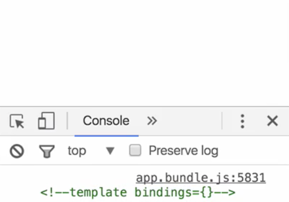

A **structural directive** deals heavily with templates, let's create one from scratch just to show what's going on. We'll have a selector of an attribute of `three`, export a class called `ThreeDirective`.  
#### app.component.ts
``` javascript
import { Component, Directive } from '@angular/core'

@Directive({
  selector: '[three]'
})
export class ThreeDirective

@Component({
  selector: 'app',
  template: `
<h1 three>Hello, Angular</h1>
`
})
export class AppComponent{}
```

Add that to our declarations. Add the `ThreeDirective` to our `<h1>` here, I'll say `three`.
#### app.module.ts
``` javascript
const imports = [BrowserModule]
const bootstrap = [AppComponent]
const declarations = [
  AppComponent,
  ThreeDirective
]
```

Then, we'll get a bit of info off of it by saying `constructor`. We want to inject the `ElementRef` so we can see what element this is on. We actually, instead of just the `ElementRef`, we want to see the `nativeElement` itself, the actual element on the DOM.
#### app.component.ts
``` javascript
export class ThreeDirective{
  constructor(el:ElementRef){
    console.log(el.nativeElement)
  }
}
```
When I render this out and do this, you see it logs out this actual element just as if you'd selected it and added it to the console. The `nativeElement` itself is this rendered out element from the template.


For a structural directive, we're going to add in an `*`. 

``` javascript
@Component({
  selector: 'app',
  template: `
<h1 *three>Hello, Angular</h1>
`
})
```

When I hit "Save," you'll see something much different, because you'll see nothing on the DOM now. You'll see `template bindings` is what's logged out as the native element.



Essentially, what's happened is that instead of `three` like this, adding the asterisk wraps you element in a `<template>`. I'll bring this up, and then adds `three` here. If I hit "Save," now, this will accomplish the exact same thing.

``` javascript
@Component({
  selector: 'app',
  template: `
<template three>
<h1>Hello, Angular</h1>
</template>
`
})
```

You'll see we'll get the template bindings comment. But the asterisk version of a directive is essentially the shorthand for wrapping something in a template element, which will allow us to use this as a template inside of our directive.

To use that element, I'm going to inject a couple things, point to inject the `ViewContainerRef`. Because it's on a template, remember what this looked like when we wrapped it with the template so this is actually a directive on a template, we can inject the template, as well. This just requires a generic of `any`.

``` javascript
export class ThreeDirective{
  constructor(
    el:ElementRef,
    private view:ViewContainerRef,
    private template:TemplateRef<any>
  ){
    console.log(el.nativeElement)
  }
}
```

From here with these two pieces with the view container and a template, if I just use a lifecycle hook like `ngAfterViewInit` to say `this.view.createEmbeddedView(this.template)`. Then do that three times.

``` javascript
export class ThreeDirective{
  constructor(
    el:ElementRef,
    private view:ViewContainerRef,
    private template:TemplateRef<any>
  ){
    console.log(el.nativeElement)
  }

  ngAfterViewInit(){
    this.view.createEmbeddedView(this.template)
    this.view.createEmbeddedView(this.template)
    this.view.createEmbeddedView(this.template)
  }
}
```

When I hit "Save," I'll now have three "Hello, Angulars" on the page, because I used my `*three` directive.


Remember, that surrounded this with the template. Now, I have this template to pass around where it's been passed into my directive. I can just use my ViewContainerRef to create those embedded views using my template and stamp out as many as I need.