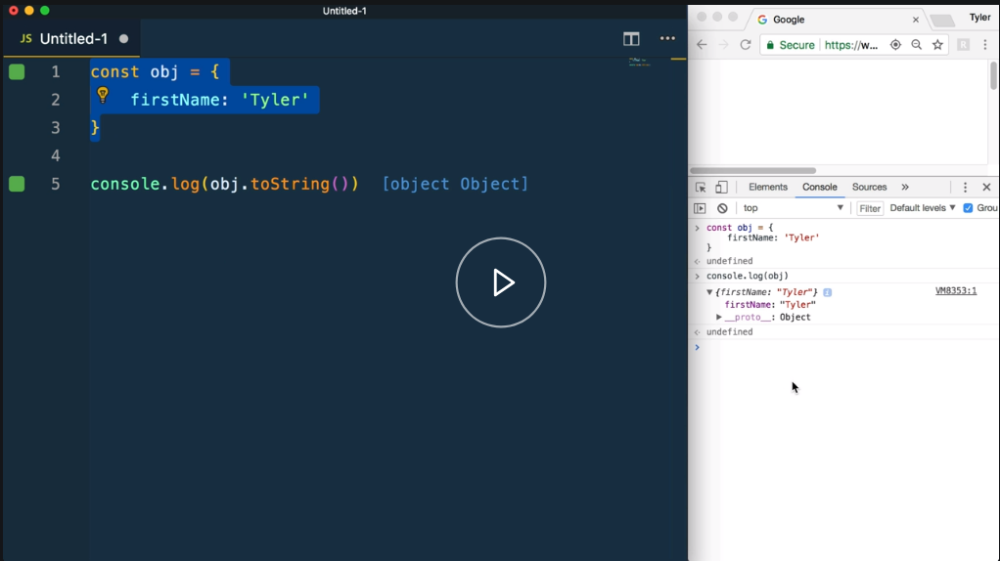

This course is designed to teach you the mechanics behind inheritance in JavaScript. You might initially think, "Why do I care?" or "I don't even use this." You might not realize it, but if you work with objects, functions, arrays, to name a few, you probably are.

It is through the prototype chain that methods such as `filter`, `map`, `reduce` can be used in arrays, or the `bind` and `apply` methods used on functions even perform any functionality at all.

We will also explore the `new` keyword, what it does, and how it's different than what you will see in classical languages. We'll explore the constructor or parent to child relationship used with functions and objects.

Also, if you work in React or other component-based frameworks, you're probably using the `class` keyword to create your components. Do you know what is happening behind the scenes?

Have you ever wondered where those special methods that just magically exist for you to use come from? This course gives you the knowledge about how prototypes work inside of JavaScript.

Finally, we'll also talk about factory functions, which gives us the ability to create reusable and flexible objects with functions.