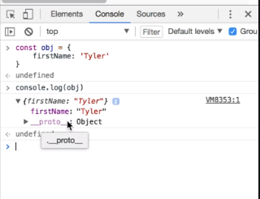
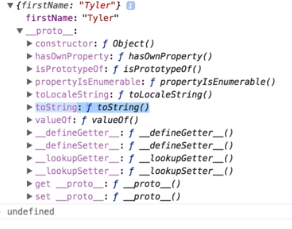
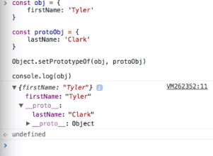
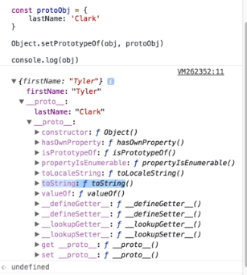

Objects in JavaScript give us the ability to create key and value pairs. In this example, we've got an object here called `obj` with the `firstName` property. We console.log `firstName`. We see that we get `Tyler`.

#### Code

```javascript
const obj = {
    firstName: 'Tyler'
}

console.log(obj.firstName) // Tyler
```

As you probably expect, if we were to look up a property that did not exist on our object, we'll get an `undefined` back, which is true for all cases where the property is not on the object, unless that property lives somewhere on the prototype chain.

```javascript
const obj = {
    firstName: 'Tyler'
}

console.log(obj.lastName) // undefined
```

For example, if we remove `lastName` and replace it with a `toString` method, you can see that we no longer get `undefined`, but an actual return value. 

```javascript
const obj = {
    firstName: 'Tyler'
}

console.log(obj.toString()) // [object Object]
```

This is because the property of `toString()` lives in an object that is connected to this object somewhere through the prototype chain.

We can use the Google DevTools to see this relationship a little bit clearer. If we `console.log` in here, we can see our object but then there is also this link to another object. This is what is considered the prototype chain.



In JavaScript, when the object's literal form is used -- as we did in this case -- the prototype chain is linked to the global object's prototype object. It is here where we are able to get the `toString` method. Use it inside of our code without it returning undefined or throwing an error.



Now, let's create a new object called `protoObj`. We'll give it the property of `lastName`, with the value of string of `Clark`, then we'll say `Object.setPrototypeOf(obj, protoObj)`

As the name suggests, we are setting the prototype or the next inline chain object of object to be proto object. 

```javascript
const obj = {
    firstName: 'Tyler'
}
const protoObj = {
    lastName: 'Clark'
}

Object.setPrototypeOf(obj, protoObj)

console.log(obj.toString()) // [object Object]
```

Now, if we remove the `toString` property and change it to `lastName`, we'll see that we get `Clark`.

```javascript
const obj = {
    firstName: 'Tyler'
}
const protoObj = {
    lastName: 'Clark'
}

Object.setPrototypeOf(obj, protoObj)

console.log(obj.lastName) // Clark
```

Again, the only reason why we get `lastName` on the `obj` here is because `protoObj` has been set as the prototype of `obj`. We can see this relationship better by pasting this into our browser.

Now, if we open up `obj`, we see that this next inline object is our `protoObj` that we created. 



Keep in mind that when we go back to the `toString` method, we still have access to it. Our JS engine will continue on through object-after-object until it reaches the end of the chain.

So for the `toString` method, when we look it up on our object, our engine will go through object-by-object and find it here at the end.

