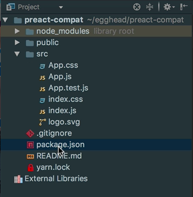
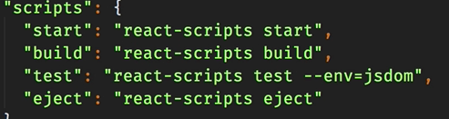
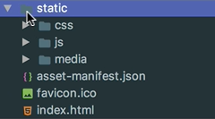
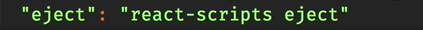
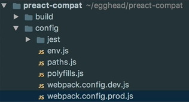
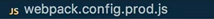
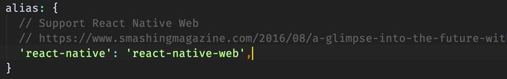
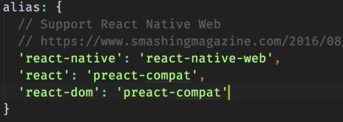
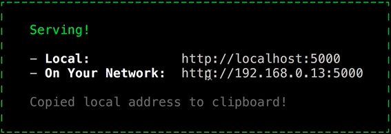

Let's create a default React application using that CLI tool. We'll type `create React app`. We'll call this `preact-compat`. That command has created this directory, `preact-compat`, for us and placed a default React application inside it. Let's look at what that's given us.

You can see here we have a source directory with our application inside of it. 

In package.json, we have these scripts for starting the development server, producing a production build, testing, and for ejecting the configuration.

The first thing we'll do, just run the production build immediately to see what size we're starting with. Back on the command line, we run `yarn run build`. We can see that, by default, we get about a 46KB of JavaScript. This is the size as it will be served in the browser after Gzip compression.

When you look in this directory, this actual file, it will appear larger. When it comes over into the browser, it will be about 46KB. This is not exactly a large application by any stretch of the imagination. What's interesting is that the bulk of this code is the React library itself. It's not really your application.

Let's see how much we can reduce this with preact-compat, and just how much configuration is needed to do that. We head back to the editor, and now see this build directory contains our production-ready application. 

We want to run this eject command because we want to fiddle around with the webpack configuration.

We run `yarn run eject` in the terminal. This will install all of the tools and scripts needed to produce this production build, the dev server, etc. You can see it's created this config directory. Inside here, we can find the webpack configuration. This is where we're going to add the alias for preact-compat.

We'll do it to the production one for now. Before we actually do that, let's install Preact and preact-compat as dependencies to this project. `yarn add preact preact-compat`. Once we have both of those, we can open up the webpack configuration for the production build, 

scroll down to find the `alias` key under `resolve`.

Here, we can just add one for `react` itself, one for `react-dom`. For both of those, we'll just provide preact-compat. The way that aliases work in webpack is you're essentially saying that in any of our source files, if I try and import a module called `react` or `react-dom`, don't actually give me those modules, but instead give me what I provide here on the right-hand side.

This is the beauty of `preact-compat`, because we haven't had to edit any of our source files. We haven't even opened up the application in any way. We can just `alias` `react` and `react-dom` for the production build, and get a reduced file size. Let's look at that reduced file size.

Now we have the aliases in place, we can run the build command again in the terminal. `yarn run build`. There, you can see we've got a 32KB reduction on this app, all for two lines of webpack configuration. Let's test everything's still working.

Luckily, this CLI tool is so good, it's given us the diff of these file sizes before and after. It also suggests that we can test our production build by installing a lightweight server. We'll do that. `yarn global add serve` in the terminal.

That's finished. We'll copy this command, `serve -s build`, paste it in the terminal. I can see we have this address. 

We can visit that in the browser. Paste that in there, and you can see the application is running as it should.