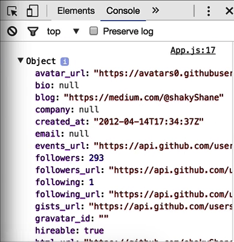

Here we have a component that renders a `div` onto the screen, and inside it, it places this user card. 


The `User` component receives both the image and the name through props.

####App.js
```javascript
export function App() {
	return (
		<div class="app">
			<User image="https://avatras0.githubusercontent.com/u/1643522?v=3"
				  name="Shane Osbourne" />
		</div>
	);
}
```

Now let's say we want to retrieve this data from an API instead of hard coding it like this, and we want all of that to be managed by this `App` component. To do that, we'll need to convert this into what is known as a stateful component.

Right now it's just a function, but we're going to use ES6 classes instead. So the first thing we need to do is bring in `Component` from preact. 

```javascript
import { h, Component } from 'preact';
```

Then we can change this from being a function to being a `class`, and we'll extend `Component`.

```javascript
export class App extends Component {
	...
}
```

Components have a `render` method, so we can keep this code here. We just need to wrap it in that method. If we just say `render`, move out there, 

```javascript
export class App extends Component {
	render() {
		return (
			<div class="app">
				<User image="https://avatras0.githubusercontent.com/u/1643522?v=3"
					  name="Shane Osbourne" />
			</div>
		);
	}	
}
```

and this actually will still function exactly as it did before, as you can see.


The main difference, though, is that we can now hook into this component's life cycle events, such as when it mounts to the DOM and when it unmounts, and we can also use it to store some internal state. As we're going to fetch this user data from an API, let's set some initial state on this component. We can do so inside the `constructor`.

```javascript
export class App extends Component {
	constructor()
 ...
}
```

This receives some `props`. We call `super` with `props`, and then we can go ahead and add the `state` that this component will be in before the Ajax request has even happened. We can say `this.state`, and we can set the `user: null`, and `loading: true`.

```javascript
export class App extends Component {
	constructor(props) {
		this.state ={
			user: null,
			loading: true
		}
	}
 ...
}
```

This will allow us to show a loading indicator whilst the Ajax request is happening. The whole point of having this internal state is that we can access it inside the `render` function, so let's first handle this initial loading state before any Ajax has happened.

We can check the value of `this.state.loading`, and if we are in a loading state, we'll just `return` `Please wait...`. If we're no longer loading anything, then we can just `return` the user component. 

```javascript
...
return (
		<div class="app">
			{this.state.loading
				? <p> Please wait...</p>
				: <User image="https://avatras0.githubusercontent.com/u/1643522?v=3"
					    name="Shane Osbourne" />
			}
		</div>
		);
	...
```

As you can see, we are always in a loading state now because we set `loading` to true here, and we're not doing anything to set it back to false.


The next step is to actually fetch the data from the API. To do that at the correct time, we can hook into this component's life cycle events, in particular, `componentDidMount`. We'll add that method to our class, and preact will call this method whenever it has actually inserted this element into the page, so it's a safe time to begin our Ajax request.

```javascript
export class App extends Component {
	...
}
	componentDidMount() {

	}
	render() {
		...
	}
```

We'll use `fetch`, and we'll provide a URL for GitHub's API. If that's successful, we'll convert the output to json, and if that completes without error, we should have our user object. We can log this to the console just to confirm everything's working correctly.

```javascript
export class App extends Component {
	...
}
	componentDidMount() {
	    fetch('https://api.github.com/users/shakyshane')
    	    .then(resp => resp.json())
        	.then(user => { 
        		console.log(user);
	})
}	
	render() {
		...
	}
```

Back to our page, and you can see here we have this data from GitHub's API. 



To use this data within our component, we'll need to set the data on the `user` and set `loading: false`. We'll call `this.setState`, and because we're not really relying on any previous state, we're safe to just provide an object here.

```javascript
componentDidMount() {
	    fetch('https://api.github.com/users/shakyshane')
    	    .then(resp => resp.json())
        	.then(user => { 
        		this.setState({

        		});
	})
}
```

We can say `user`, and `loading: false`. We save that, check the browser. 

```javascript
componentDidMount() {
	    fetch('https://api.github.com/users/shakyshane')
    	    .then(resp => resp.json())
        	.then(user => { 
        		this.setState({
        			user,
        			loading: false
        		});
	})
}
```

We can see that after just a moment, we now get this user card being displayed. Whilst we're here, we'll just add a log for any errors that come out. 

```javascript
componentDidMount() {
	    ...
	})
	.catch(err => console.error(err));
}
```

Now we can update our usage of the user component to use real data from the API. For `name`, we'll change this to `this.state.user.name`, and for the `image`, we'll use `this.state.user.avatar_url`. 

```javascript
<div class="app">
			{this.state.loading
				? <p> Please wait...</p>
				: <User image={this.state.user.avatar_url}
					    name={this.state.user.name} />
			}
</div>
```

Now, you can see that when we reload this page, we get please wait for a moment, and then we get our user card being rendered with real data.


Stateful components also have `props`, just like functional components, so we use `this.state` to access properties that are updated by this component. If a parent component wants to pass anything in to us, then we can access it through `props`.

To give us all an example, let's say we didn't want to hard code this URL here. We could extract this URL, and instead retrieve it from `this.props.urls.user`, and we could set this at the point in which we use this component.

```javascript
componentDidMount() {
	    fetch(this.props.urls.user)
    	    .then(resp => resp.json())
        	.then(user => { 
        		this.setState({
        			user,
        			loading: false
        		});
	})
}
```
For us, it's in the `index.js` file here. So let's create a `config` object. Say `const config =` an object, and then we'll say we have some `urls:`, and the `user:` URL will be that GitHub API. Then we can pass in that configuration under the `config` key.

####index.js
```javascript
const config = {
	urls: {
		user: 'https://api.github.com/users/shakyshane'
	}
}

render(<App config={config} />, document.querySelector('main'));
```

Now, back in our `App` component, we can see that I'm trying to access `props.urls`, when actually we said it was named `config`. 

####App.js
```javascript
componentDidMount() {
	    fetch(this.props.config.urls.user)
	...
```

We save that and reload. You can see it's working again. Often, what you'll see is stateful components using both `props` and their own internal state.

The key takeaway from this lesson is the difference between these stateful components and regular functional components. Stateful components handle things like Ajax, and time, and their own internal state and life cycle events when they're put into the DOM and removed from the DOM, for example.

Whereas functional components like this `User` one here, they just accept some properties and give back some elements, nothing else.