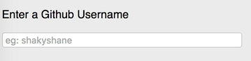

In this example we have an `App` component that renders a `div`, and inside that we have a `User` component that has a `name` and `image` property. Now let's add some routing to this application, so that a user can search for a GitHub user name.

####App.js
```html
import { h, Component } from 'preact';

export class App extends Compoent {
	render() {
		return (
			<div class="app">
				<User name="Shane Osbourne"
					  image="github url"
				/>
			</div>
		);
	}
}
```

If we type shakyShane, for example, which is mine, then we want to navigate to the profiles/shakyShane page. Once there, we'll query the GitHub API using that search term that the user provided. To begin, we need to install preact-router. We'll type `yarn add preact-router`.

####Terminal
```bash
$ yarn add preact-router
```

Then we'll `import` it, we just need the `router` here from `preact-router`. We no longer need this `User` component here. Then we'll add the `router`. We can start adding the components that we want to match for a certain path. When we hit the home page like this, we'll have a `Home` component, we'll say that just matches `path="/"`. 

####App.js
```html
import { h, Component } from 'preact';
import { Router } from 'preact-router';

export class App extends Compoent {
	render() {
		return (
			<div class="app">
				<Router>
					<Home path="/" />
				</Router>
			</div>
		);
	}
}
```

Now we need to create this file. We'll call it `Home.js`, we'll grab this import, place it in there. Now we don't actually need this component here, this is going to be a stateless function, so we'll `export default function`, call this `home`, and then we'll `return` some user interface.

####Home.js
```javascript
import { h } from 'preact';

export default function Home() {
	return (

		);
}
```

We'll use a `<section>` tag as a wrapper for the rest of our elements, then we'll have a title saying `Enter a GitHub User Name`. Then we'll create an `input` with a `type` of `search`, this will allow this `input` to act much like a form.

```html
import { h } from 'preact';

export default function Home() {
	return (
		<section>
		<p>Enter a Github Username</p>
		<input type="search">
		</section>
		);
}
```

Give it a `placeholder`, and then we'll say `onSearch`, we'll grab hold of the event, and then we're going to call a `search` method that we'll write in a moment. We need to pass to it the `search` term, which we can get from the `e.target.value`. 

```html
...
<section>
<p>Enter a Github Username</p>
<input type="search"
	   placeholder="eg: shakyshane"
	   onSearch={e => search(e.target.value)}	    
	   />
</section>
...
```

Now let's close that `<input>`, and now let's get this rendering to the screen. Back in our app file, where we have the `home` component here, we can `import` this now, so `import Home from ./Home`. 

####App.js
```javascript
import Home from './Home';
```

If we hit save, you can see we now have the input field on the screen. 



Now back to that search method. From `preact-router`, we have a function called `route`, which is how we can navigate around our application. We'll `import` that from `preact-router`. 

####Home.js
```javascript
import { Route } from 'preact-router';
```

Then we'll create a `function` here called `search`. This will get the `query`, and then we can just call `route`, pass in `/profile`, this is a path in a component that we haven't written yet, but we'll get to that. Then we'll encode the `query` so that's a valid URL.

```javascript
function search(query) {
	route('profile/${encodeURIComponent(query)}');
}
```

At this point, if I type in the `<input>` shakyShane, hit enter, we're not going to get anything, because we haven't implemented the profile route yet, so let's go and do that. 

Back in the `App` we'll add another component here called `Profile`. This will match the path `profile/:user`. With this, we're instructing the router to match paths that begin with profile, then have a slash, and the next segment in the URL we've chosen to name it user here. This means that inside the profile component, we'll get a property called user, and it will be equal to whatever the string is here.

####App.js
```html
...
<Router>
	<Home path="/"/>
	<Profile path="/profile/:user" />
</Router>
...
```

If we type profile/hello in the search bar, inside the profile component now, we'll have `props.user` available to us, and it will be set to the string `"hello"`. This is how we'll build the profile page, because we'll use this string to query GitHub's API and then display the results. Now let's build this profile component.

We'll create a new file called `Profile.js`, and I've prepared a file in advance here. We import `h` and `component` from preact as we do with all component, and we use the `User` component that we saw at the beginning of the lesson, which is just that user card that has `image` and `name` properties.

####Profile.js
```javascript
import { h, Component } from 'preact';
import User from './User';

export class Profile extends Component {
  constructor(props) {
    super(props);

    this.state = {
      user: null,
      loading: true
    }
  }
  componentDidMount() {
    fetch(`https://api.github.com/users/${this.props.user}`)
        .then(resp => resp.json())
        .then(user => {
          this.setState({
            user,
            loading: false
          });
        })
        .catch(err => console.error(err));
  }
  render({}, {loading, user}) {
    return (
        <div class="app">
          {loading
              ? <p>Fetching...</p>
              : <User image={user.avatar_url}
                      name={user.name} />
          }
        </div>
    );
  }
}

export default Profile;
```

Then we create a class and in the `constructor` we set some initial state. As soon as this route loads, we'll hit the API and this could take a second or two, so we always start with a `loading` state of `true`, and the `user` to be `null`.

Then we use the `componentDidMount` lifecycle event as the trigger for our API call. When preact puts this profile component into the page, the `componentDidMount` method will fire, and we can fetch some data from GitHub's API. This is the static part of the URL that never changes, and you can see here that we're accessing `this.props.user`.

This is the part that's been set by preact's router, and we take the response, convert it to JSON, and if it's successful, we set the `user` on the state, and we set `loading` to `false`. In the `render` method, we're just extracting `loading` and `user` directly from the state, and then we're either showing a loading indicator, or that user card.

Now back in the `App.js` file, we can import the `Profile` component, 

####App.js
```javascript
import Profile from './Profile';
```

and if we go back to the home page, and now type shakyShane, hit enter, and you can see we have the data being fetched from GitHub's API, based on what was provided in the URL.

Now to finish this example off, we can look at how to handle unmatched paths, as well as how to use regular links to navigate with the router. Let's create an `Error` component, and we'll say this is the `default`.

```html
...
<Profile path="/profile/:user" />
<Error default />
...
```

This is how you let preact-router know what to do if none of the other paths match. We'll `import Error from` `./Error`, 

```javascript
import Error from './Error';
```

and we'll create that file. We'll create a `export default`, and we'll just `return` a `div`, we'll say `Error!`, and then we'll provide a link to go back home. We can use a regular anchor, `a`, here, just say home. 

####Error.js
```html
import { h } from 'preact';

export default function Error() {
	return (
		<div>
			<p>Error!</p>
			<p><a href="/">Home</a></p>
		</div>
	)
}
```

Now if we go to a URL that's not matched by the router, it will show this `error` component, and give us a link to go back home. If we click this, you can see we navigate correctly.