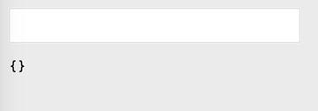
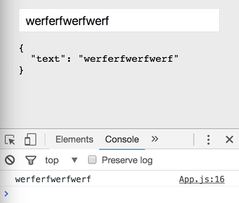

When building components that contain forms, we can use the component's internal state to track the value of those form fields. Let's create an example. First, we'll define a `render` method that returns some JSX.

####App.js
```javascript
import { h, Component } from 'preact';

export class App extends Component {
	render() {
		return(

		)
	}
}
```

We use `<div>` as a wrapper. Then we'll put an `input` field, `type="text"`, and we'll set value to an empty string for now. Then below, let's create a log of this component's internal state. We'll use `JSON.stringify`, pass in `this.state`, `null` as the second parameter, and `2` as the third parameter, which will give us some nice spacing.

```html
export class App extends Component {
	render() {
		return(
			<div>
			<input type="text" value="" />
			<pre><code>{JSON.stringify(this.state, null, 2)}</code></pre>
			</div>
		)
	}
}
```

We run this and see we have an empty object on our state and a form field. 




Now, let's recreate that type of example where you type in the `input`, and the state gets updated. To do that, we'll need to create some initial state. We'll have to put a `constructor`, take some `props`, and call `super` with those `props`.

```javascript
constructor(props) {
	super(props);
}
```

We set the `state` inside the `constructor` to have an empty `text:` property to start with. 

```javascript
constructor(props) {
	super(props);
	this.state = { text: ''};
}
```

Then in the `render` method, we can use that value here. We can say `this.state.text`. Then we need to update this value every time the `<input>` changes, so we'll say `onInput`, and then we'll provide a method from this class. We'll see `setText`. 

```html
...
<input type="text" value={this.state.text} onInput={this.setText} />
...
```

Now, we need to create this, so we can place `setText` between the `constructor` and the `render` methods. This will get the regular DOM event, and then we can update the internal state of the component by calling `setState`, providing the key `text`. Then we'll say `e.target.value`.

```javascript
setText(e) {
	this.setState({
		text: e.target.value
	})
}
```

We'll need to bind this method in the `constructor` to ensure that every time it's called, it has the correct context. With that, we should be good to go. 

```javascript
constructor(props) {
	super(props);
	this.state = { text: ''};
	this.setState = this.setText.bind(this);
}
```

Hit save. Now, you can see that on page load, we have this `text:` property on our state that is currently empty. If we type in here, you can see it's updating.


Now, using the internal state of a component to track the value of a form field is extremely important, as it means the component is the source of truth. When you come to submit a form, for example, you can just ask the component for the value from the text field, and you don't have to try and reach into the DOM and read it manually.

Let's see how that would look. We're going to create another method on this constructor called `submit`. 

```javascript
...
this.submit = this.submit.bind(this);
...
```

We'll add it between `setText` and `render`. For this, we'll just log out the value of `this.state.text`. 

```javascript
submit() {
	console.log(this.state.text);
}
```

Now, we can wrap our `<input>` in a `<form>` that is `action="JavaScript"`, and then add an `onSubmit` event, pass along `this.submit`.

```html
<form onSubmit={this.submit} action="javascript:">
	<input type="text" value={this.state.text} onInput={this.setText} />
</form>
```

Now, when we save that, you can see that the text field is still being updated. Then only when I hit enter, do we get a form submission, and we get that value that was tracked internally. 



Now, for something so common as handling forms and inputs, this is a lot of boilerplate.

We have this method, `setText`, that's sole purpose is just setting a value on the state. We have to set an initial state in the constructor, and we have to bind this extra method. This is where Preact's `linkState` comes in. It can remove much of this boilerplate for us, and handle these kinds of common use cases automatically.

To use it, we'll get rid of this `setText` method altogether. We won't bother setting any initial state. We'll delete all of `setText`, and then we'll come down to the `render` method. Remember, in Preact, we gets `props` and `state` here.

We can just destructure the `text` property from the state, and we can actually set a default value for it here, right in the function signature. We'll change the value on the `<input>` to just use `text`. Then we can change `onInput` to a call to `linkState`.

```javascript 
export class App extends Component {
	constructor(props) {
		super(props);
		this.submit = this.submit.bind(this);
	}
	submit() {
		console.log(this.state.text);
	}
	render(props, { text = ''}) {
		return (
			<div>
				<form onSubmit={this.submit} action="javascript:">
					<input type="text" value={this.state.text} onInput={linkState()} />
				</form>
				<pre><code>{JSON.stringify(this.state, null, 2)}</code></pre>
			</div>
		)
	}
}
```

The first argument is this component itself, because behind the scenes, `linkState` will call `setState` for us. It needs to know on which component it should call that. Then we provide as a string the name of the property on the state object that we want to update. In our case, it's `text`.

```html
...
<input type="text" value={this.state.text} onInput={linkState(this, 'text')} />
...
```

This function is provided as a separate module, so we can install it with Yarn. `yarn add linkState`. 

####Terminal
```bash
$ yarn add linkstate
```

Next, we need to import it, so we'll type `import linkState from "linkstate"`. We have the same result as before, 


but we were able to remove a lot of boilerplate from our code, and we get a performance benefit from `linkState`, as it will only ever create a handler for this combination once.

Now, one final note. If you're building the kind of app where you're not actually submitting a form, but rather you're just accepting some input from the user, you can take this even further. Remove the `form` altogether. Remove the `submit` method. Remove 'this.submit'. All of a sudden, you don't need the constructor anymore, and there we have it.

####App.js
```javascript
export class App extends Component {
  render(props, { text = '' }) {
    return (
      <div>
        <input type="text" value={text} onInput={linkState(this, 'text')}/>
        <pre><code>{JSON.stringify(this.state, null, 2)}</code></pre>
      </div>
    )
  }
}
```
