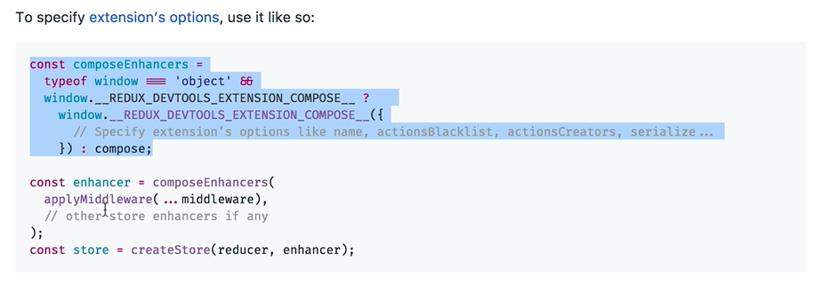
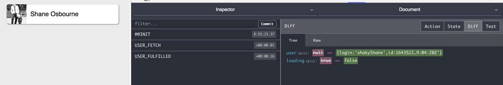

We have this application where on page load, it looks at this part of the URL, constructs an API call to GitHub, and renders this card using the avatar and the user's name. Now there are a couple of things happening as the page loads there. It will be really interesting and useful for debugging if we could see a list of all of these things that have happened.

We are using Redux inside this preact app, so let's add support for Redux dev tools.

First, we'll need to `import` `compose-function` from Redux. To make this more readable, we'll move this object, 

####index.js
```javascript
...
const store = createStore( reducer{
	loading: true,
	user: null
}, applyMiddleware(thunk))
...
```

here to the initial state.

```javascript
const initialState = {
	loading: true,
	user: null
};

const store = createStore(reuder, initialState, applyMiddleware(thunk));
...
```

Now we'll go to the GitHub page of the [Redux dev tools extension](https://github.com/zalmoxisus/redux-devtools-extension#12-advanced-store-setup), and we'll scroll down to the advanced section. We'll copy this piece of code here that is highlighted. 




We need this advanced way of configuring it, because we're using middlewares in our Redux store. Paste that in here, and instead of calling `applyMiddleware` directly here, we'll wrap it in compose enhancers.

```javascript
... 
const initialState
...
const composeEnhancers =
    typeof window === 'object' &&
    window.__REDUX_DEVTOOLS_EXTENSION_COMPOSE__ ?
        window.__REDUX_DEVTOOLS_EXTENSION_COMPOSE__({
          // Specify extension’s options like name, actionsBlacklist, actionsCreators, serialize...
        }) : compose;

const store = createStore(reuder, initialState, comopseEnhancers(applyMiddleware(thunk));
...
```

If we save that, go back to the browser, reload the page, you can see that we've got the Redux dev tools experience, where all actions are logged as well as changes to the state tree, and the diff in between changes. 



That's it, there's nothing else special you need.

If you're already using Redux with preact, you add this block of code here, 

```javascript
const composeEnhancers =
    typeof window === 'object' &&
    window.__REDUX_DEVTOOLS_EXTENSION_COMPOSE__ ?
        window.__REDUX_DEVTOOLS_EXTENSION_COMPOSE__({
          // Specify extension’s options like name, actionsBlacklist, actionsCreators, serialize...
        }) : compose;
```

which is checking for the existence of the dev tools. If they don't exist, it just falls back to the regular compose from Redux, wrap it around the `applyMiddleware` call, and you're ready to go.