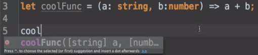

**TypeScript** is JavaScript with **static typing**. Basically the compiler knows what the variable's type is during compilation. To put it another way, types are associated with variables, not values. This is a type annotation for a `string`, and when I run the compiler, I get no errors.

**eggheadTypes/demo.ts**
``` javascript
let someString: string = "cool";
```
Now let's see how static typing is useful by updating the `someString` variable to a different type than it's expecting. Let's run a compiler. 

**eggheadTypes/demo.ts**
``` javascript
let someString: string = "cool";

someString = 243233;  // error TS2322: Type 'number is 
                      // not assignable to type 'string'.
```
The compiler is mad because I tried to assign a number to a variable that I already said was a string. `someString` is a `string`. I gave it a `number`.

Please note that even though the compiler is mad, it doesn't prevent compilation in most cases. This is because TypeScript is still JavaScript, and JavaScript types are dynamic. Basically, JavaScript doesn't care what type your variable is, but you will if it's the wrong one.

Another useful aspect of TypeScript is exploring APIs with an IDE is way easier. The `coolFunc` function accepts a `string` and a `number`. When we begin typing the function, the IDE helps with auto-complete, but also shows us what type of arguments the function is expecting. 



You can see the first one is a `string`, and the second one is a `number`. When I run the compiler, no errors.

If we pass an argument that the function is not expecting, the IDE will warn us. You can see there's a little red line right here, and there's also one on the side over here. The error that it's pointing out will also show up when you compile. I tried to pass an `{}` to the function that's supposed to be a `number`.

**eggheadTypes/demo.ts**
``` javascript
let someString: string = "cool";

let coolFunc = (a: string, b: number) => a + b;

coolFunc(someString, {})  // error TS2345 of type '{}' is not 
                          // assignable to parameter of type 'number'.
```