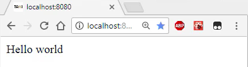

Instructor: [00:01] We start off with a barebones `package.json` file. We will go ahead and `install` all the modules we need in one go. General React modules like `react`, `react-dom`, `webpack`, `webpack-dev-server`, along with `typescript` and TypeScript-specific modules, like the `@types/react` and `@types/react-dom`, along with `ts-loader` for webpack.

#### Terminal
```bash
$ npm install react react-dom webpack webpack-dev-server typescript @types/react @types/react-dom ts-loader
```

[00:29] Next, we go ahead and open some IDE that supports TypeScript, like VS Code, Atom, WebStorm, or ALM. Let's kick off by wrapping up all the modifications needed for `package.json`, by simply adding two script targets. We will go ahead and add a `build` script which just invokes `webpack` against a given `./webpack.config.js`.

[00:57] We also add a `start` script, which runs a `webpack-dev-server` for live application development, and serves up the `./public` folder. 

#### package.json
```javascript
"scripts": {
    "build": "webpack ./webpack.config.js",
    "start": "webpack-dev-server ./webpack.config.js --content-base ./public"
}
```

Next, we can go ahead and add this `webpack.config.js` file.

[01:14] Within the file, we specify `'inline-source-maps'` so we can debug TypeScript files within the browser. Then we specify an application entry point, `'./src/app.tsx'`. Up next is the `output` location for our built bundle.

[01:34] Then we tell webpack to support `'.ts'` and `'.tsx'` files, along with original `'.js'` file extensions. Finally, we tell webpack that for `.ts` and `.tsx` files, it should use `'ts-loader'`.

#### wepback.config.js
```javascript
module.exports = {
    devtool: 'inline-source-map',
    entry: './src/app.tsx',
    output: {
        patch __dirname + '/public',
        filename: 'build/app.js'
    },
    resolve: {
        extensions: ['.ts', '.tsx', '.js']
    },
    module: {
        rules: [
        { test: /\.tsx?$/, loader: 'ts-loader' }
        ]
    }
}
```

[01:48] Next, we will go ahead and create a basic `HTML` file, `index.html`, within the `public` folder. The file simply contains a root `<div>`, where we will render our React application, and then loads the bundle generated from webpack.

#### index.html
```html
<html>
    <body>
        <div id="root"></div>
        <script src="./build/app.js"></script>
    </body>
</html>
```

[02:07] Next up, our TypeScript configuration. We will go ahead and create a `tsconfig.json` file for that. We enable `sourceMaps` so we can debug TypeScript files within the browser. You will be using `commonjs` for the module format targeting `es5`. We want `"jsx":` to transpile to React.createElement.

[02:36] Our source code will be present in the `"src"` folder, and we disable TypeScript's `compileOnSave`, as that will be done by webpack. 

#### tsconfig.json
```javascript
{
    "compilerOptions": {
        "sourceMap": true,
        "module": "commonjs",
        "target": "es5",
        "jsx": "react"
    },
    "include": [
    "src"
    ],
    "compileOnSave": false
}
```

That's it for the configuration. Now, let's write some demo code.

[02:48] I'll create a source, `app.tsx` file. We will simply `import React`, along with `ReactDOM`, and finally use `ReactDOM.render` the `"Hello, World"` to our root `<div>`.

#### app.tsx
```javascript
import * as React from 'react';
import * as ReactDOM from 'react-dom';

ReactDOM.render(<div>Hello world</div>, document.getElementById('root'));
```

[03:15] If we run `npm start` in the terminal, it will start up the webpack dev server, which will serve the public folder up at [localhost:8080](localhost:8080). If we open up that URL, we will see our application running. 



If we make an edit to the file, webpack will transpile it on the fly and reload the browser automatically.

[03:43] When you are ready to deploy your application, you can execute `npm run build`. This time, webpack will compile our code, and write the `app.js` file to disk. If we wanted, we could ship the whole public folder to some hosting provider, as it contains the `build` file, along with `index.html`.

[04:09] To recap, the setup simply involves three simple things. `package.json` for specifying our npm modules, `tsconfig` for TypeScript, and `webpack.config` for compiling and running our code in the browser.