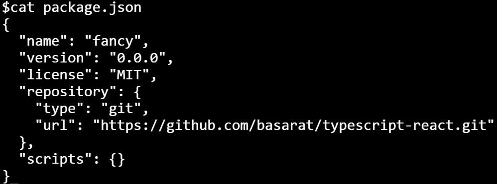

Instructor: [00:01] Here, we have a simple, barebones, `package.json` for a Node module, which we have named `"fancy"`.



[00:10] We start off by installing `typescript`, `react`, and the type definitions for React as dev dependencies. 

#### Terminal
```bash
$ npm install typescript react @types/react -D
```

We add these only as dev dependencies, as we want people that will use our package to bring in their own versions for these libraries.

[00:29] Next, we create a simple `tsconfig.json` file to specify the TypeScript options. Within our file, we specify the `compilerOptions` for `sourceMap`, `target`, `jsx`, along with `declarations` which we set to `true`, and most importantly, the output directory for the compiled JavaScript and declaration files using `outDir`. We also specify that our source TypeScript files will be in the `src` folder.

#### tsconfig.json
```javascript
{
"compilerOptions": {
    "sourceMap": true, 
    "target": "es5",
    "jsx": "react",
    "declearation": true,
    "outDir": "lib"
    },
    "include": [
    "src"
    ]
}
```

[01:00] Next, we simply create a route `src/index.tsx` file. Within the file, we bring in `React`. Next, we `export` a simple `fancy` component that takes a `text` prop as a `string`, and renders it into an `<h1>` tag.

#### index.tsx
```javascript
import * as React from 'react';

export const Fancy: React.SFC<{ text: string }> 
    = (props) => <h1>{props.text}</h1>;
```

[01:23] We wrap up our module by making the final set of changes in `package.json`. We add a hint for our users that they need to provide their own version of React, by adding it to our peer dependencies.

#### package.json
```javascript
"scripts": {},
"peerDependencies": {
    "react": ">=16.0.0"
},
```

[01:40] We set up `package.json` with the path to our output JavaScript files, along with the types for the output d.ds TypeScript declaration files, which in our case is specified by the `"outDir"`, and hence the `"lib"` folder.

#### package.json
```javascript
{
    "name": "fancy",
    "version": "0.0.0",
    "license": "MIT",
    "main": "lib",
    "types": "lib",
    "repository": {
        ...
    }
}
```

[01:58] We also set up a `build` script, which simply invokes `tsc`, the TypeScript compiler, on our `tsconfig.json`. Add a `start` script that runs `build -- -w` in watch mode for live development.

```javascript
"scripts": {
    "build": "tsc -p .", 
    "start": "npm run build -- -w"
}
```

[02:12] Let's go ahead and run build once on our console to compile our project. At this point, if you wanted, you could run npm publish to publish this library to npm, but we will just use it locally by running `npm link`.

[02:31] Let's jump back to our good, old "Hello, World!" React application and use this `fancy` package. If we had published our package to npm, we could use it with `npm install fancy`, but since we only linked it locally, we can bring it in by running `npm link fancy`. This `npm link` workflow is also a good tool to be aware of for local testing of packages before deploying them to npm.

[03:01] We start off with the simple, basic, TypeScript "Hello, World!" React app. We now `import` the `'fancy'` React component into our application. 

#### app.tsx
```javascript
import * as React from 'react';
import * as ReactDOM from 'react-dom';
import * as { Fancy } from 'fancy';

reactDOM.render(
    <Fancy text={"Hello world"} />,
    document.getElementById('root')
);
```

Of course, since our `Fancy` package was written with TypeScript, we get nice autocomplete error checking and all the other benefits we demonstrated in the first lesson. As you can see, our `Fancy` component works as expected.

