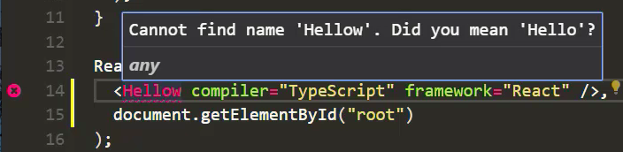
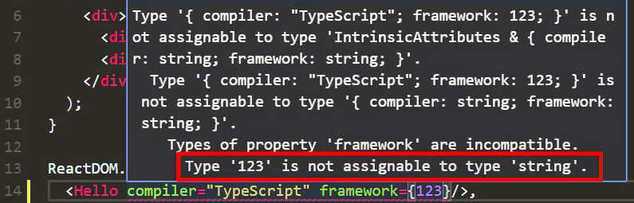
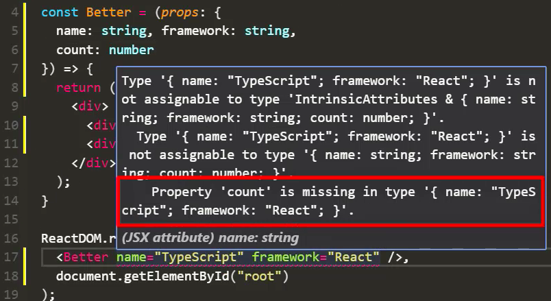

Instructor: [00:00] Here, we have a basic React.js application, and even in such a simple application, we can demonstrate a bit of the great developer experience offered to React development by using TypeScript. 

```javascript
import * as React from 'react';
import * as ReactDOM from 'react-dom';

const Hello = (props: { compiler: string, framework: string }) => {
    return (
        <div>
            <div>{props.compiler}</div>
            <div>{props.framework}</div>
        </div>
    )
}

ReactDOM.render(
    <Hello compiler="TypeScript" framework="React" />
    document.getElementById("root")
)
```

First up is 'Autocomplete'. TypeScript suggests and autocompletes the component name for us. It also autocompletes any component props.

[00:25] Next up is 'TypeChecking'. Misspell any component name, and TypeScript gives us a nice error. 



Misspelling any component prop also gives you an immediate error. Forget to provide a required prop, and you also get an error.

[00:56] Provide a value of the wrong type by mistake, and you get a nice error. 



With this active compile time error analysis, you get a lot less runtime error issues in your code base. As developers, we spend a large chunk of our time refactoring existing code.

[01:18] TypeScript is an ideal tool for refactoring. TypeScript makes it easy to rename a component to something that makes more sense as you understand more of your business requirements.

[01:31] This is not a dumb string search and replace. This is true semantic reading. You can also easily rename any prop in your component. As requirements change and you add new props, users of your components get nice errors.



[02:03] Later on, if you decide that you need to change the type of a prop, that is pointed out to your component users as well, thanks to TypeScript. These are just some of the refactoring advantages offered by TypeScript.

[02:22] TypeScript also enables excellent code navigation for your applications. With one simple command, I can find all the references to the Hello component. Similarly, I can easily see how any of the props for the component are used, for example, the compiler prop.

[02:44] TypeScript enables a whole new level of developer productivity for React developers, and in this course, we will explore this simple TypeScript/React combination.