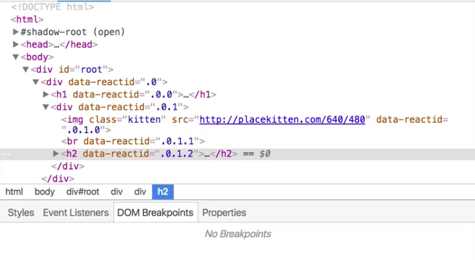
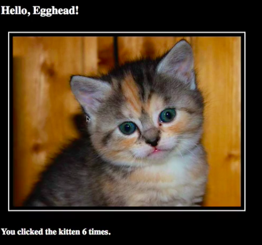
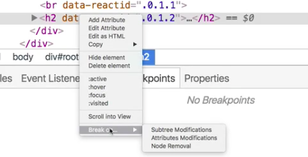
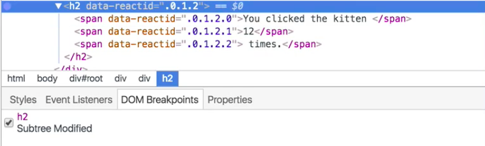
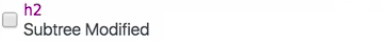
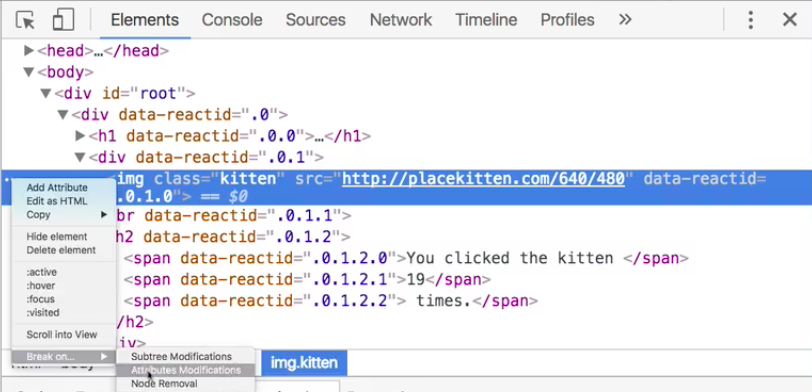
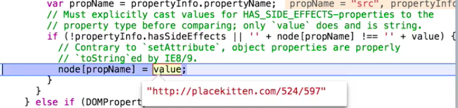
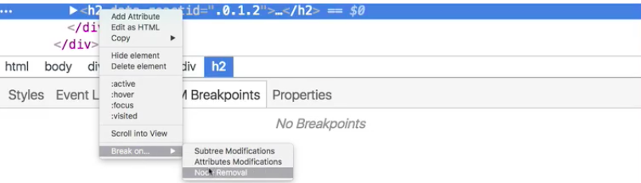

There comes a point in every programmer's career when they look at some problem and they say, "All right, I guess it's time to learn how to use the debugger, because there's no way in hell I'm going to get this figured out by logging stuff out to a console."

Some of you watching this are already familiar with how the debugger works. Some of you might not even know that there's such a thing as a debugger, but it probably sounds pretty useful, right? The bad news is that this lesson is not going to teach you how to use the debugger. Doing that in a separate lesson, coming very soon.

The good news is that this lesson is going to teach you how to trigger the debugger in a few interesting ways from the elements inspector. If you look, we're inspecting an element, let's say this `h2`. Again, down here we've got styles. We've got event listeners. Go over here to **DOM breakpoints**. Breakpoints are how the debugger gets triggered.



As we can see right now, there are currently no breakpoints selected on this thing. Let's look at how our application works. When we click the cat image, we see that this counter is incrementing.



Every time we click, the state here changes. What if we wanted to dig into our code base and understand what's happening every time that state changes? Well, that's where breakpoints get super useful.

If you look down here, when you right-click on this node, we can go to break on, subtree modifications.



Now we see a subtree modified breakpoint that's been set on this particular `h2`. What does this mean? This means that every time the subtree is modified, and the subtree is all of the nodes that are inside of it. Every time one of these nodes changes, our breakpoint is going to be triggered.



That's going to look like this. I click. You'll notice this didn't go over to 13 right away. Instead it sent me over here to my sources panel. This is debug stuff here that we're going to get too far into, but it shows me that this function was called `setTextContent`. It was called with the node as the `span`, and when I click that, it takes me right back to that `span`. It shows me that the `text` argument is the value 13.

**setTextContent.js**
```javascript
var setTextContent = function (node, text) { node = span, text = "13"
  node.textContent = text;
};
```

I can just proceed, and the whole thing updates. I can do that again and again, whatever. This breakpoint is now a part of this DOM node, just like when we subscribed to events. Those become a part of the DOM node. So do the breakpoints. As far as the browser is concerned, this is one of the many pieces of information it has available with respect to this given node.

If you remember when I clicked over here...By the way, I can then uncheck that box. It didn't remove the breakpoint, but it temporarily disabled it.



That's really useful. Let's clear it out. Let's go ahead and remove the subtree modification breakpoint, and what were the other two things here? Instead of breaking on subtree modifications, we can break on attribute modifications.

Rather than doing that here, let's go ahead and do that on the kitten itself. Let's go up to this image, and let's break on attribute modifications every time any attribute of this kitten image changes. We're going to hit a breakpoint. Right now, nothing's happening.



Let's go over to our source code, and we've got...Again, this isn't a React lesson, so don't worry too much about what's going on here, but every time we click, we're calling `incrementCount`. In `incrementCount`, I've got it pre-computed here, but commented out. It's going to change the URL. It's going to randomly generate a new kitten URL.

**index.js**
```javascript
count: this.state.count + 1, url: 'http://placekitten.com/${width}/${height}'
```

I'm going to save that. Pay attention to this `src` attribute of the image. I click. It triggers the breakpoint. It's setting, let's see, `propName` here is `src`. `value` here is `placekitten.com/524/597`. Now I've stepped into this, and I can do all sorts of stuff with the debugger.



When I'm done, I go ahead and continue, and I see that I got a new image loaded.

Again, I can disable this breakpoint without removing it, in case I just want to enjoy all these kittens. Let's go ahead and get rid of this. Remove it entirely, and then there's the third on there. Let's go back to our `h2`, and we want to break on node removal. Now, this breakpoint is going to fire whenever this node is removed from the DOM.



In order to demonstrate what that looks like, we're going to have to change our code base a little bit so that this node gets removed from the DOM when a certain condition is met. Let's just bring our code over here, and here's our `render` function. Here's our `image`. We've got our `br`, and then we have this `h2`. What we want to do is get rid of this `h2` or only show it conditionally.

Let's just say something like this. Let's say `var h2String =` and we'll just put this here. We're going to say if `this.state.count >= 10`, `h2String = ''`, right? Then we're going to drop this right in here like so. 

**index.js**
```javascript
render: function() {
  var h2String = <h2>You clicked the kitten {this.state.count} times.</h2>;

  if (this.state.count >= 10) {
    h2String = '';
  }

  return (<div>
    
    <br />"
    {h2String}
  </div>)
}
```

Look at what this is doing if you're not familiar with React. All we're doing is conditionally defining this thing. If the `count` is greater than 10, we're just going to put an empty string. Otherwise, we're going to put this nicely formed JSX element.

Let's refresh the page and see if this works. We've got our `h2`, 0 is so far less than 10. Let's go ahead and start clicking, 1, 2, 3, 4, 5, 6, 7, 8, 9, 10. Oh, our breakpoint. Look at this. `parentNode.removeChild`.

All of this, by the way, this is React framework code. Who knows what's going on in here. This is a great way to learn how the industry standard frameworks work, but the important point is that it was paused in the debugger. Right before this thing goes off the screen, we have a chance to understand how and why that's happened. We run the breakpoint, and now we see that it's gone.