We've seen how by right-clicking and clicking `inspect` we can open the elements inspector to let us examine the structure of our page, and even to make changes to that structure. But there's another really important component of the elements panel, and that has to do with style.

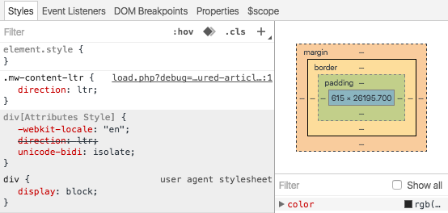

By looking at any element here **when you select something you see all of the currently applied style rules for that particular element**, and these all map back to, assuming you have either direct links or source map set up for your CSS, they'll map back to the CSS files and selectors that are currently being applied. So if we click here, that shows us in style.css we have this ruleset for `body` where `background` is set to `black` and `color` is set to `white`, and that's why this page looks like that.

You can see here I've got another rule that is currently commented out, and I'm going to switch back to my source real quick and bring it in. We can refresh. You can see that we've added `margin`, `padding`, and `border` to our kitten image.

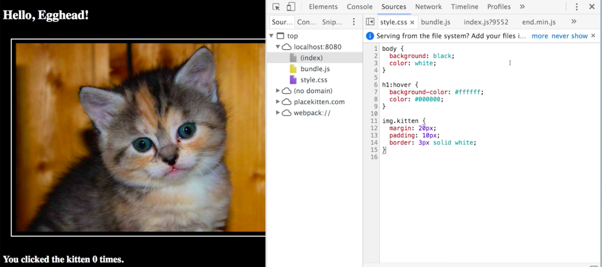

Let's go back to our elements panel and inspect that kitten image, and now you can see here that first of all we have each of those options set, you can see that they're set using this selector, again specified and styled that CSS, `img.kitten`.

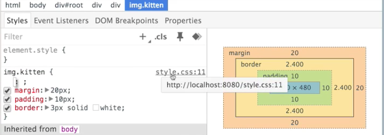

Then you can go over here and you can look at this little visualization which is incredibly useful. This is a nested hierarchy of all the different things that are contributing dimensions to whatever element that you have selected. I don't know if you've ever been in the situation where you're trying to tweak CSS to make sure everything shows up correctly. If you have you know how frustrating it can be to be like, "Oh my god, where the hell did that extra three pixels come from?" This is where this is a total lifesaver.

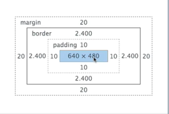

As you can see as you step through in the center here is the actual element, and it's 640x480 pixels. You come out and you see green, this is the `padding`, and you can see that we have 10 pixels on every side. Step out again, and you get the `border`, step out again and you get the `margin`. Now notice as I hover over these different elements, inside of the browser window over here, you're actually going to see those pixels highlighted in that color. First blue, and then green, then this kind of light yellow, and then orange.

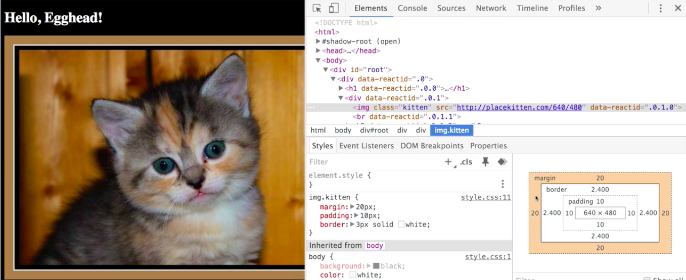

Just like with the elements, the structural HTML elements above, we can add and remove style rules here. We can disable these margins, or we can disable the `padding`, we can also click in here and we can say instead of 10 pixels all around, let's do 10 pixels on the top and bottom, and 30 pixels on the left and right. We'll see that that's immediately reflected. Again, just like the element stuff above, none of this is persisted, so all your changes go away when you refresh the page.

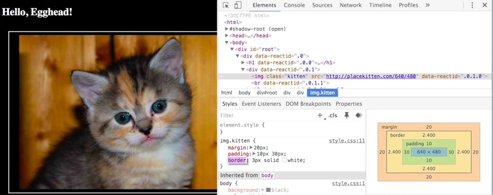

This makes this a very useful tool for exploration because you can make whatever changes you want, see what they're going to look like, and then decide later if you want to port them back over. Now when we select this `h1` here, there's something a little bit weird going on, because if you remember from our `style.css` we have a ruleset for hover on `h1` where it changes the background color to white and the color to black, which is what we see here.

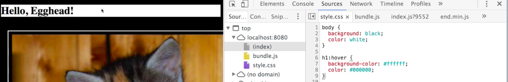

But if we switch over to elements and we have our `h1` selected here, it's not showing us that rule. The reason for that is that what's in the DOM right now is just the `h1`. If we want to see it with the `hover` state selected, there's this little pin that you can click it, click hover, and look at that. Now we have our rule showing up, and over here it has shown up that way. You can do that from here, you can do that for all of the different pseudo-selectors, and you see browser level stuff.

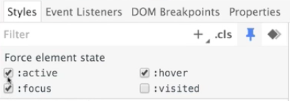

Not only can you do that from here, you can also right click here and select. So we can right click on that element in the elements panel, and select `hover`,

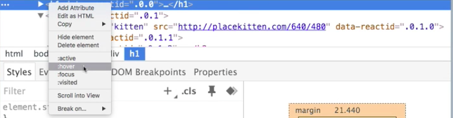

and it's going to have the same effect. We'll see it rendered as though I was hovering over it, and we'll see the style rule that sets that property. The last thing we want to take a look at then, is over here underneath where you have the space visualization is the set of all computed properties.

Here on the left it is showing all of the properties that got set, and where they got set. If we click over into here, we select the image, and you can see `margin` and `padding` is set here, but `color` is inherited from the `body`, whatever. What we really care about is all of the different properties that are currently populated,

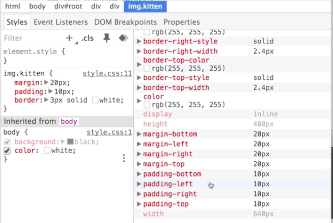

and we don't care where they got set. Let's say somewhere in our CSS we said that all images have a border of, I don't know, 10 pixels, but only images of class `.kitten` have a border of 3 pixels.

You see here on the left this visualizer says look, the more general rule for image specified 10 pixels, the more specific rule for `img.kitten`specified only 3, so this is crossed out.

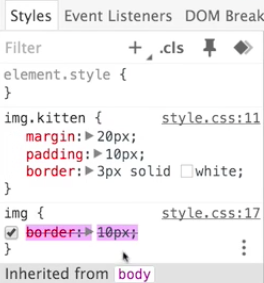

But maybe we're working on a large website and we forgot that the `.kitten` rule is going to override that, so this is a very helpful thing to show us. Finally, maybe we've got a ton of different rules, so let's step through here and see all of the rules that are currently active for borders on this image.

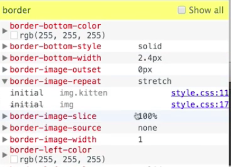

This doesn't care where the rule is set, this is just showing us what it's currently set to and that can be tremendously helpful. This is every CSS rule, you can even see all the ones that are just set to their default values, so every rule that applies, even though we're looking at an image here, we can see the `font`, and the `kerning`, and all of that. So if you want to know what exactly is going on with an element and why it looks the way it does, looking at this computed styles down here in the bottom right of the styles panel in the elements panel of the dev tools is a great way to do that.