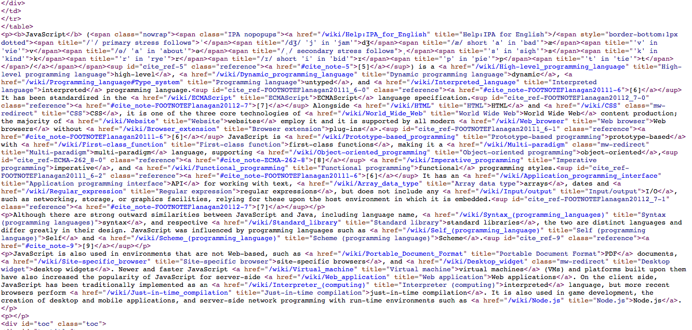
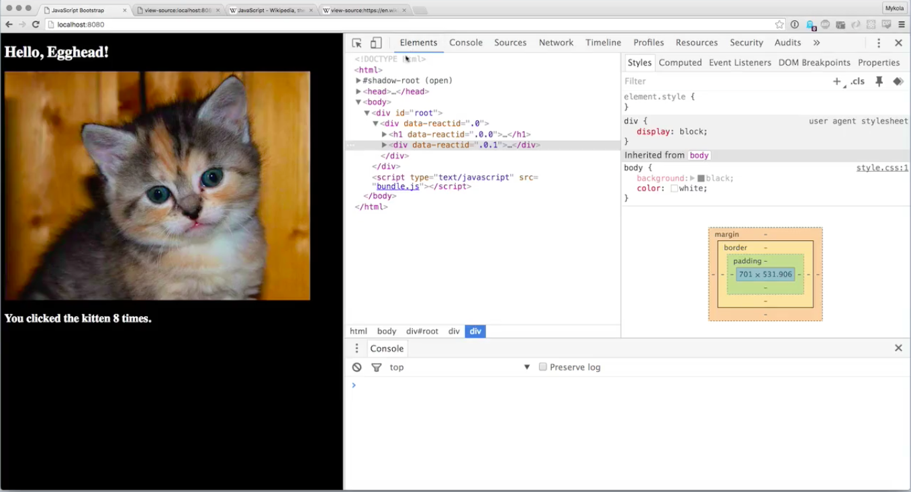
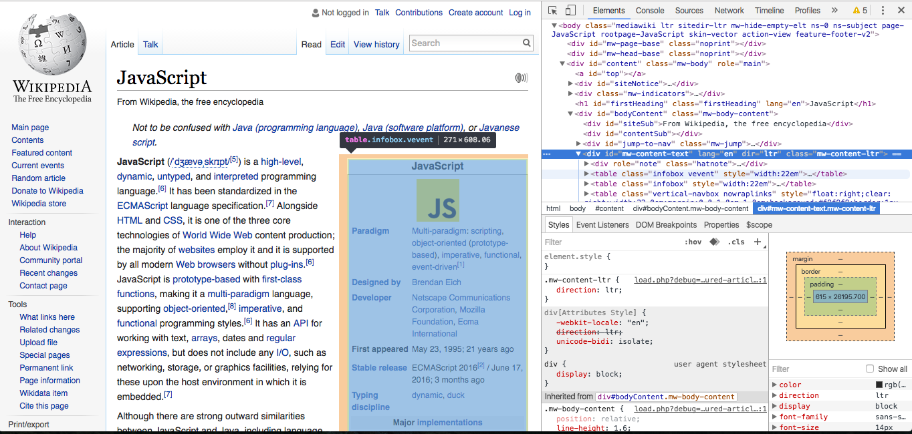

Anyone who remembers poking around in HTML in the '90s or even in the early '00s might be remember that the was this amazing thing that you could do that made Web development different from other software. You could ask the browser to show you the source of the HTML that you're looking at. What that does is spit out everything that is in the HTML file that the server sent your browser, and it's going to show you the content of that file without rendering it.

So you could look and you could see, "Oh, look, here's a `button`, here's a `div`, here's a paragraph tag. At some point the things that we started doing started getting so complex that view source became a little bit less useful. Here's the Wikipedia page for JavaScript, and if you view the source, and this is just what came down from the server, you're going to find so much crap, a lot of vendor-specific stuff, you're going to find a ton of inline JavaScript and CSS, you're going to find all of these spans, there's just a ton of crap that isn't actually helpful to you.



At the other end of the spectrum, if you go to something like a **React** application, here's a very simple React application. When you click the kitten, the counter increments. When you hover of this, whatever, it's a simple React application. But, if we go to view the page source, you're going to see that this isn't very useful either, but for the opposite reason. We have here an empty `div` and a `script` tag, and that's it, this is all that the server rendered. What happens here is that React is actually mutating the DOM for us.

**Page Source**
```html
<html>
<head>
    <title>Javascript Bootstrap</title>
    <link rel="stylesheet" href="style.css" />
</head>
<body>
  <div id="root"></div>
  <script type="test/javascript" src="bundle.js"></script>
</body>
</html>
```


What gets served down by the server is actually very different from what is actually in the DOM by the time we're viewing it. So instead of viewing source, what we all do now is, you know this trick, right? You can inspect element. This brings up the dev tools panel with the elements tab selected.



Now instead of showing us only the empty root `div`, we actually have all of the content that React has put into the DOM.

If we do things that mutate things, if we click this image we see that this value here is actually changing, and it gives us that nice little highlight. 

**Inspected Source**
```html
<span data-reactid=".0.1.2.1">15</span>
```

Similarly, if you go over to something fairly complex like the JavaScript Wikipedia page and you inspect, you see the source here. It's still a lot of crap, but now you at least can figure out what you're looking at. If I'm hovering over this, OK, it's highlighting it, I can tell this table is that inset, here's that caption.



It allows you to explore it in a structured way and collapse what you're not looking it. **So inspecting elements is now what view source was to us back in the day**, and it's a really useful tool to get familiar with.