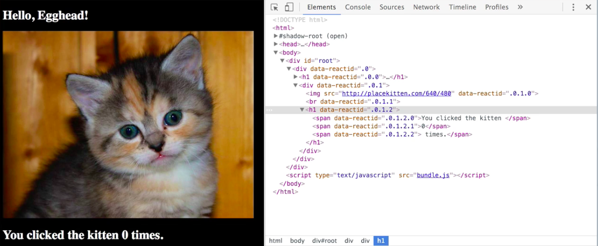
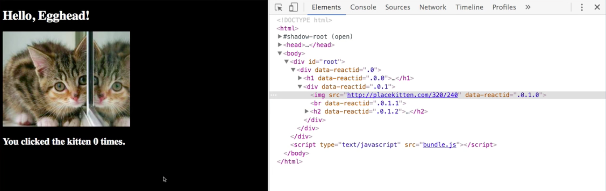
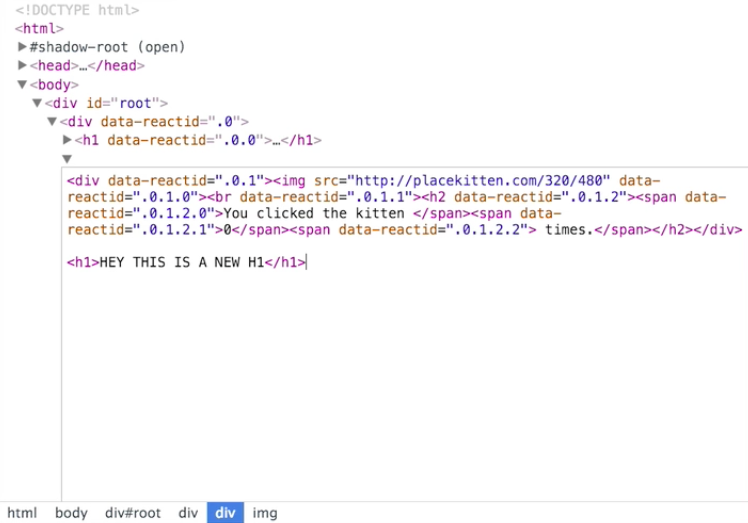

If you right click on anything in your browser and go down to inspect, it's going to open the **Chrome dev tools**, it' going to have that element selected within the elements tab.

As we've seen, this can be great for exploring and reading all of the different stuff on the website, and looking and seeing how it's represented, but this is not a read-only tool. **This is giving you an up to date, immediate, real-time snapshot of the state of your DOM**, and it's going to allow you to edit it as well. That takes various forms.

We can, for instance, we can take any given element like here's this `h2` that we have, and you can see that we have some rules for `h1` on hover it will have a different color, and `h2` doesn't have that rule. But maybe as we're developing our website we're thinking wouldn't it be neat if we rendered this as an `h1` as well, instead of as an `h2`? Just double click on that `h2`, type `h1`, and hey look, you've just changed it. Now you'll notice that this change is persisted in memory in the state of the DOM as you're looking at it.

If you refresh the page, this has not gone into your source code, right? The same is true for all of these changes that we're making here. Let's take a look at this image here again, and in addition to changing the tag itself, you can click through and you can change any of the attributes on this tag. Maybe instead of a 640x480 kitten we want a 320x240 kitten. That will just immediately update there for us. Again, that's not going to change, it's not going to persist that change.

If you want to do something a little bit more comprehensive you can right-click any of these elements in the elements panel and you can select edit as HTML. That's going to open this nice little text editor for you. You can make a bunch of changes, we can do this, we can go back to 320, let's try 320x480, let's see what that looks like. Let's also add an `h1` down here.

We make all the changes we want to make, we'll click out of this, and look. All of that stuff gets put in here, and our kitten service was even able to accommodate our new vertical, portrait mode representation.