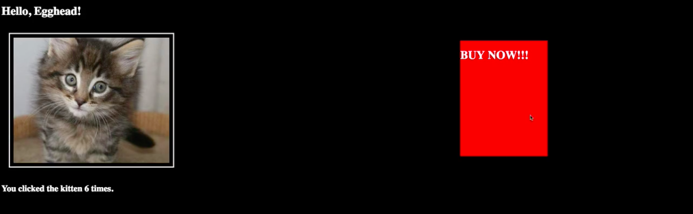
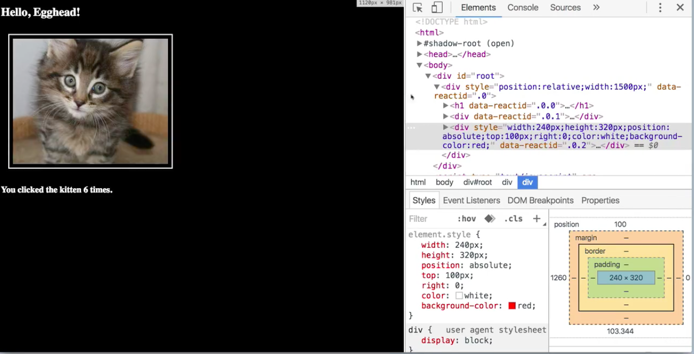
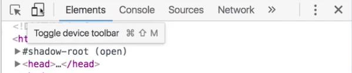
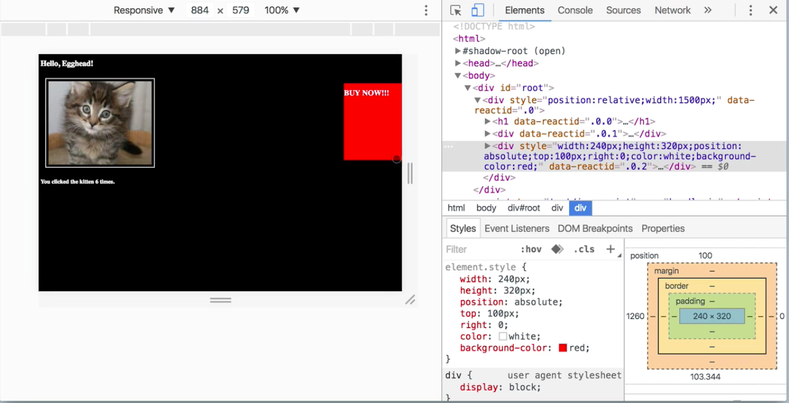
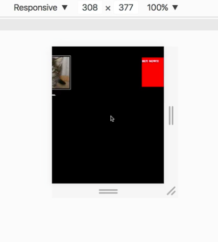
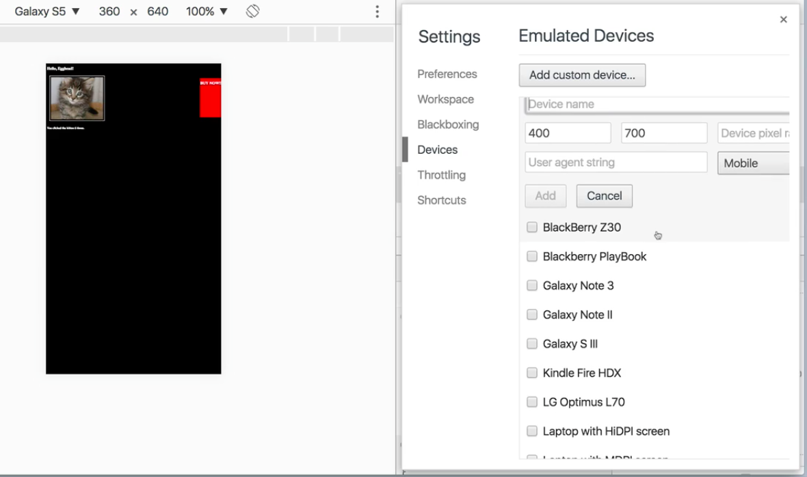

Everything is going great with our kitten picture startup. The website's so popular that we've decided to monetize. We've added this big Buy Now button. It doesn't actually do anything.

We went out for a celebratory dinner, and everybody went home for the weekend. We come in on Monday and the analytics department's like, "Hey, whoa. We've got a huge problem. We're seeing sales on large screens, but certain users are just not buying anything at all. Is there any kind of insight that you can give us to help us understand why we're getting poor sales across smaller screen sizes, and what we can do to fix that?"

Because you're a good developer, you say, "Sure, let me take a look." You're going to right-click, you're going to inspect. Right here already, this should give us a clue. That image is right there, but look what happened when our screen resolution shrank.

I had to jump through quite a few hoops to create a dummy scenario where this made sense. This is absolutely positioned all the way over to the right, and it doesn't scroll into view. If you've worked on production code, even for a few months, you're going to find situations like this constantly.

We live in a world where not only are there different browsers, but there are different devices, and **we need to be responsible for making sure that our websites look correct, even in devices that we don't even own.** How can we do that?

Chrome has offered us this really useful tool. In the element inspector, over here in the upper left, you can toggle the device toolbar.

What this is going to do is show you what your website would look like in all sorts of different resolutions.

You can start by looking at it responsively. What this means is this should scale, no matter how you drag this out. Do your style sheets work, and is all the spacing correct so that if somebody shrinks their browser window, everything's fine?

It looks from here if somebody's browsing with only a 300-width screen, that Buy button isn't even going to be visible unless they scroll over to make it visible. This veers into the realm of UX problem, but it's the sort of thing that you need to be able to represent and you need to be able to account for.

In addition, while you're checking that, you might as well also see if this renders correctly on an iPhone 6 or on an iPhone 6 plus. How does it look on a Galaxy S5? You can edit and add all the different devices that you want. These are the ones that are baked in there to start, but you can add custom devices. There's a lot of features in here to play with.

You can also orient this into landscape mode, and you can capture a screen shot. Now I know this is what my website looks like on a landscape-oriented Galaxy S5. Tools like this are going to be tremendously helpful when trying to put ourselves into the shoes of our users, which as good developers, one of the important core skills we need to be building is empathy.

It's very important that we be able to look at this and not go, "Oh, it works on my machine," but rather, try to understand why the people that are struggling with it are having problems.

With this tool, you can happily report back to your analytics team and say, "Oh, I see what the problem is. It's not rendering correctly on a narrow device, we need to go back and make sure that our responsive CSS is properly tested according to all the resolutions, and we'll have a fix for you out by this afternoon."

That's providing value, and that is using the tools at your disposal to make yourself the best member of the team that you can be.