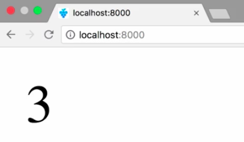
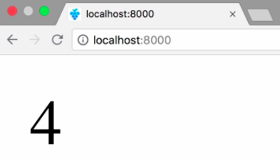

Instructor: 00:00 We use `cargo new` to create a new project called `utils`. Use `--lib` to declare that it's going to be a library. 

#### Terminal
```bash
$ cargo new --lib utils
```

This is needed, because WebAssembly doesn't have the concept of a runnable executable. We only can import a WebAssembly module and invoke exported functions.

00:18 Next, we need to change the create type to CDI lib in `Cargo.toml`. This has an impact on how things are linked together during compilation. 

#### Cargo.toml
```toml
[package]
name = "utils"
version = "0.1.0"
authors = ["Nik Graf ,nik@nikgraf.com>"]

[dependencies]

[lib]
create-type = ["cdylib"]
```

We are now ready to write the first lines of Rust code. Let's get right into it, and create a public functions, `add_one`.

00:36 The `extern` keyword is needed to create an interface, so that this function can be invoked from other languages. The function accepts a value `x`, which is an unsigned integer, which is incremented by one and returned. In addition, we need to add a `no-mangle` annotation to tell the Rust compiler not to mangle the name of this function.

#### lib.rs
```rs
#[no_mangle]
pub extern fn add_one(x: u32) -> u32 {
  x + 1
}
```

00:59 Next up, we can use `cargo build` to compile our utils library, targeting WebAssembly. After that, we can run `wasm-gc`, and output it to `utils.gc.wasm` in the current directory. Now, we have a working WebAssembly module.

#### Terminal
```bash
$ cd utils
$ cargo build --target wasm32-unknown-unknown --release
$ wasm-gc target/wasm32-unknown-unknown/release/utils.wasm -o utils.gc.wasm
```

01:16 Next up, we need to load it somehow. Therefore, we're going to create an index.html file and open a script tag. To load a WebAssembly module, we can `fetch` it, convert the `response` to an `arrayBuffer`, instantiate the `result`, and `then` use the `wasmModule`.

01:43 It has an instance with `exports`, including our `add-one` function. We can invoke the function and append the `result` to the DOM.

#### index.html
```html
<!DOCTYPE html>
<html>
  <head>
    <script> 
      fetch("utils.gc.wasm")
        .then(response => response.arrayBuffer())
        .then(result => WebAssembly.instantiate(result))
        .then(wasmModule => {
          const result = wasmModeult.instance.exports.add_one(2);
          const text = document.createTextNode(result);
          document.body.appendChild(text);
        });
    </script>
  <head>
  <body></body>
<html>
```

02:00 Let's give this a try. We start our web server running `http`. 

#### Termial
```bash
$ http
```

Once we open the site in the browser, we can see the result. 



Awesome. Here, you can see that our `addOne` function printed out the result of adding two plus one.

02:16 There is one more improvement, though. In the current implementation, we fetch the entire WASM file before we instantiate it. Using `instantiateStreaming` instead, we can stream, compile, and instantiate a WebAssembly module in one go.

#### index.html
```html
<!DOCTYPE html>
<html>
  <head>
    <script> 
      WebAssembly.instantiateStreaming(fetch("utils.gc.wasm"))
        .then(response => response.arrayBuffer())
        .then(result => WebAssembly.instantiate(result))
        .then(wasmModule => {
          const result = wasmModeult.instance.exports.add_one(3);
          const text = document.createTextNode(result);
          document.body.appendChild(text);
        });
    </script>
  <head>
  <body></body>
<html>
```

02:31 Especially on slow connections, this can speed up the time to execution a lot. We reload and review the result. Worked like a charm. 



Be aware, instantiate streaming requires that our WASM file must be served with a content type, application/wasm. Fortunately, our HTTP server already does so.