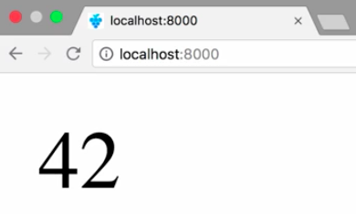
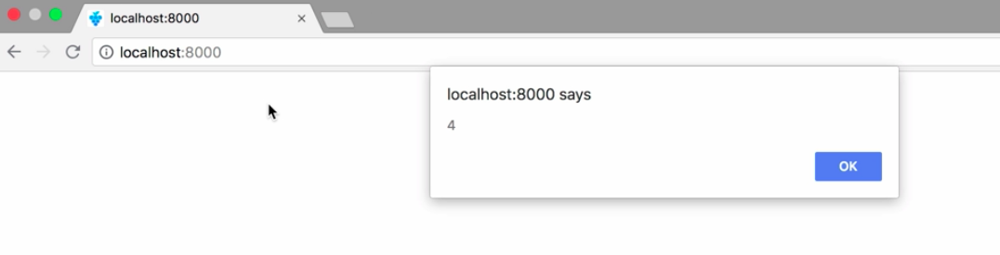

Instructor: 00:00 In this lesson, we want to invoke a JavaScript function from our Rust code. First, create the function `appendNumberToBody`. It accepts a `number`, creates a `text` node with the number as its content, and appends the text node to the DOM.

#### index.html
```html
<!DOCTYPE html>
<html>
  <head>
    <script> 
      const appendNumberToBody = (number) => {
        const text = document.createTextNode(number);
        document.body.appendChild(text;)
      }

      WebAssembly.instantiateStreaming(fetch("utils.gc.wasm"))
    </script>
  <head>
  <body></body>
<html>
```

00:15 When instantiating your WebAssembly module, we can pass along an object which contains the functions to be passed to the module inside the end property. We leverage this to provide our function to the WebAssembly module.

```html
<!DOCTYPE html>
<html>
  <head>
    <script> 
      const appendNumberToBody = (number) => {
        const text = document.createTextNode(number);
        document.body.appendChild(text;)
      }

      const importObject = {
        env: {
          appendNumberToBody: appendNumberTobody,
        }
      };

      WebAssembly.instantiateStreaming(fetch("utils.gc.wasm"), importObject)
    </script>
  <head>
  <body></body>
<html>
```

00:30 Then we switch over to our Rust code. There, we also have to declare which function we want to use. In our case, that's `appendNumberToBody`. The parameter of the function should be an unsigned integer.

00:45 Now we need to use `appendNumberToBody`. Therefore, we export the function `run`. Inside run, we invoke `appendNumberToBody`. Note that we have to wrap it with an `unsafe` block, since the Rust compiler can't provide memory safety guarantees for external functions.

#### lib.rs
```rs
extern {
  fn appendNumberToBody(x: u32);
}

#[no_mangle]
pub extern fn run() {
  unsafe {
    appendNumberToBody(42);
  }
}
```

01:03 Now that we implemented the run function, we also need to invoke it from JavaScript. 

#### index.html
```html
<!DOCTYPE html>
<html>
  <head>
    <script> 
      const appendNumberToBody = (number) => {
        const text = document.createTextNode(number);
        document.body.appendChild(text;)
      }

      const importObject = {
        env: {
          appendNumberToBody: appendNumberTobody,
        }
      };

      WebAssembly.instantiateStreaming(fetch("utils.gc.wasm"), importObject)
        .then(wasmModule => {
          wasmModule.instance.exports.run();
        })
    </script>
  <head>
  <body></body>
<html>
```

Then we compile the Rust code, run the HTTP server, 

#### Terminal
```bash
$ cargo build --target wasm32-unknown-unknown --release
$ wasm-gc target/wasm32-unknown-unknown/release/utils.wasm -o utils.gc.wasm
$ http
```

and visit our `index.html`. Fantastic. 



As you can see, the number 42 was added to our document. Our function to add the number to the DOM came from JavaScript, but it was invoked with the value 42 inside Rust.

01:32 Let's add one more. In this case, we'll pass the native function `alert` to our module. 

#### index.html
```javascript
const importObject = {
  env: {
    appendNumberToBody: appendNumberTobody,
    alert: alert,
  }
};
```

We import the function into `lib.rs`, invoke it inside of our unsafe block. 

#### lib.rs
```rs
extern {
  fn appendNumberToBody(x: u32);
  fn alert(x: u32);
}

#[no_mangle]
pub extern fn run() {
  unsafe {
    appendNumberToBody(42);
    alert(4);
  }
}
```

Then we recompile and reload the page in our browser. 



Great. This even works with native browser functions, since we can see the inaudible dialogue.