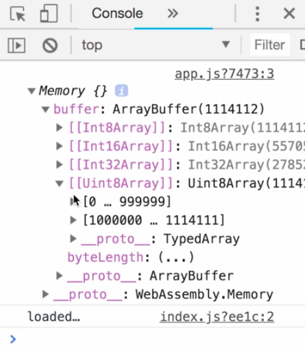
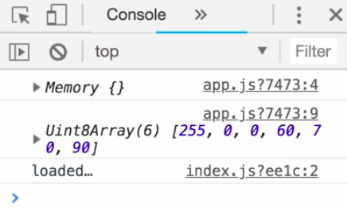
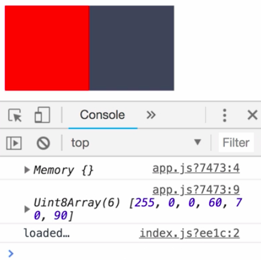

Instructor: 00:00 Here, we start with a little refactoring for easier use of importing modules later in the lesson. We'll introduce an `app.js` file, and make sure our `index.js` file only takes care of loading the app module dynamically.

#### index.js
```js
import("./app").then(() => {
  console.log("loaded...");
})
```

00:18 We did this change to make sure we can use the static import statements inside `app.js`. Now, we can focus on the actual goal, accessing memory of a WebAssembly module from Javascript.

00:32 Each WebAssembly module has a linear memory. From Javascript, we can freely read and write to it. To do so, we can directly `import` a variable `memory` from the WASM module. Let's log out the memory. 

#### app.js
```js
import { memory } from "../crate/pkg/rust_webpack_bg";

console.log(memory);
```

It contains a buffer matching the linear memory of the WebAssembly module.



01:03 How can we leverage this now? Let's write a small image library in `lib.rs`. We define a `struct Color`, containing `red`, `green`, and `blue` and unsigned integers. Next up, we implement the image. Our image contains `pixels`, which is a vector of colors.

#### lib.rs
```rs
#[wasm_bindgen]
pub struct Color {
  red: u8,
  green: u8,
  blue: u8,
}

#[wasm_bindgen]
pub struct Image {
  pixels: Vec<Color>,
}
```

01:23 We create the function new, and inside it, add two different pixels, one pure red, with the `red` value `255`, `green` and `blue` being 0. The second one is a dark gray, with a `red` part of `60`, `green: 70`, and `blue: 90`. Then we store the two `pixels` in the vector and return the `image`. Finally, we add a function `pixel_ptr`, returning the pointer to the `pixels` vector.

```rs
#[wasm_bindgen]
impl Image {
  pub fn new() -> Image {
    let color1 = Color {
      red: 255,
      green: 0, 
      blue: 0,
    };
    let color2 = Color {
      red: 60,
      green: 70,
      blue: 90,
    };
    let pixels = vec![color1, color2];
    Image {
      pixels
    }
  }

  pub fn pixels_ptr(&self) -> *const Color {
    self.pixels.as_ptr()
  }
}
```

01:56 Let's move on with `app.js`. There, we instantiate a new `Image` and retrieve our `pixelPointer`. 

#### app.js
```js
import { memory } from "../crate/pkg/rust_webpack_bg";
import { Image } from "../crate/pkg/rust_webpack";

console.log(memory);

const image = Image.new();
const pixelsPointer = image.pixels_ptr();
```

We know all our `pixels` are unsigned integers with eight bits. In our `pixels` vector, we store the two `pixels`. This means we stored six color values.

02:20 We leverage this information by only accessing the first six values out of our buffer, and store them in a typed array representing eight-bit unsigned integers. 

```js
const pixels = new Unit8Array(memory.buffer, pixelsPointer, 6);
console.log(pixels);
```

Here is the amazing part. These six values match exactly the color parts of our two pixels.



02:39 This means we can extract the color of the two pixels directly from the memory, without any serialization or deserialization overhead. This is super useful in case serialization and deserialization is your performance bottleneck.

02:55 In this example, we leverage this functionality to draw pixels to a canvas. Therefore, we create the helper `function drawPixel`, accepting an `x` and `y` position, and an array for the `color`, red, green, and blue. Using context field style, we can convert the numbers to a hex code and draw the pixel.

```js
funciton numToHex(value) {
  const hex - value.toString(16);
  return hex.length === 1 ? `0${hex}` : hex;
}

function drawPixel(x, y, color) {
  const ctx = canvas.getContext("2d");
  ctx.fillStyle = `#${numToHex(color[0])}${numToHex(color[1])}${numToHex(color[2])}`;
  ctx.fillRect(x, y, 100, 100);
}
```

03:33 Be aware, instead of drawing just one pixel, we're drawing a larger rectangle in this case, so we can actually see the result. Finally, we can create our `canvas`, and use our `drawPixel` function to actually draw the pixels. We slice the array to retrieve the correct pixel colors.

```js
const canvas = document.createElement("canvas");
document.body.appendChild(canvas);
drawPixel(0, 0, pixels.slice(0, 3));
drawPixel(100, 0, pixels.slice(3, 6));
```

03:54 Voila. This works like a charm. 



We access the linear memory of our WebAssembly module directly from Javascript. While we won't do it in this lesson, you can imagine that this can be used to draw a canvas from the game loop managed from our Rust code.

04:11 Be aware that WebAssembly's memory can be accessed from Javascript, but not the other way around. WebAssembly doesn't have direct access to Javascript values. That said, we can work around this by storing a Javascript value inside the WebAssembly memory, and then use it inside our Rust code.