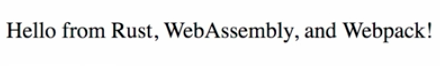

Instructor: 00:00 While we set up our own webpack project, for the sake of going through it step-by-step, the Rust WebAssembly team also ships a template. We start by creating a new directory, `myApp`. Inside it, we run `npm init rust -webpack`.

#### Terminal
```bash
$ mkir my-app
$ cd my-app
$ npm init rust-webpack
```

00:18 This will copy the template into the current directory. Once that's done, we can run `npm install` to install our JavaScript dependencies. Be aware that this template relies on you having wasm-pack installed. In case you haven't done this, just run `cargo install wasm-pack`.

00:37 Now, we've got everything set up, and start using `npm start`. If you visit [localhost:8080](http://localhost:8080), we can see hello from Rust, WebAssembly, and webpack.



00:49 How is this different from our webpack setup? For once, in our `Cargo.toml`, this setup defines custom Rust features, `console_error_panic_hook`, and we add log. In our entry file, these features also need to be configured.

01:09 In addition, this setup ships with the `wasm-pack` webpack plugin that builds our library with `wasm-pack` on every file change. Let's change the greeting to verify that this works. 

#### lib.rs
```rs
#[wasm_bindgen]
pub fn run() {
  let val = document.createElemnt("p");
  val.set_inner_html("Hello World!");
  document.body().append_child(val);
}
```

As expected, you can see the updated output, `Hello World!`.

01:28 In general, I recommend you do start off with this template, since it will always contain the recommended structure and features by the Rust WASM team.