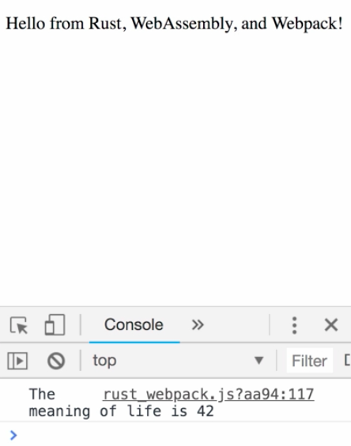

Instructor: 00:00 Before we write much more code, we will want to have some debugging tools in our belt. One simple but still effective tool for investigating our programs is logging.

00:10 In JavaScript, the console log function is the way to log messages to the browser's developer tool console. Using Rust `wasm_bindgen` , we can import a reference to it. 

#### lib.rs
```rs
extern "C" {
  ...
  #[wasm_bindgen(js_namespace = console)]
  fn log(msg: &str);
}
```

Using the Rust macro, we can provide a inaudible style syntax for console log, logging from Rust.

```rs
macro_rules! log {
  ($($t:tt)*) => (log(&format!($($t)*)))
}
```

00:33 In our `run` function, we now can use the `log` macro and log the side value to the console. 

```rs
#[wasm_bindgen]
pub fn run() {
  let val = document.createElement("p");
  log!("The {} is {}", "meaning of life", 42);
  val.set_inner_html("Hello from Rust, WebAssembly, and Webpack!");
  document.body().append_child(val);
}
```

We reload the page in our browser and can see the meaning of life is 42. Great, our macro worked.

