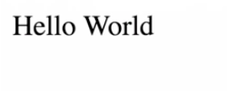

Instructor: 00:00 WebAssembly programs operate on a limited set of value types. Due to this, the functions bridging between JavaScript and Rust only allow for primitive numeric types, like integer or float. Let me demonstrate this to you.

00:15 Here, we have a function, `appendStringToBody`, that accepts a text and adds it to the body. 

#### index.html
```html
<!DOCTYPE html>
<html>
  <head>
    <script> 
      const appendStringToBody = (value) => {
        const text = document.createTextNode(value);
        document.body.appendChild(text;)
      }

      const importObject = { env: { appendNumberToBody: appendNumberTobody }};

      WebAssembly.instantiateStreaming(fetch("utils.gc.wasm"), importObject)
        .then(wasmModule => {
          wasmModule.instance.exports.run();
        })
    </script>
  <head>
  <body></body>
<html>
```

In our `utils` library, we import the function and invoke it with a string. 

#### lib.rs
```rs
extern {
  fn appendStringToBody(s: &str);
}

#[no_mangle]
pub extern fn run() {
  unsafe {
    appendStringToBody("Hello World");
  }
}
```

If we run our example, we will see only a number being appended to the document.

00:31 This is not what we wanted to achieve here. Fortunately, we can work around this by directly reading or writing to WebAssembly's memory using JavaScript. Each WASM module has a linear memory, which is initialized during instantiation.

00:46 While sometimes accessing memory directly can be useful, in most cases, it's quite cumbersome. That's why the generic bindgen-style framework, wasm-bindgen, was created. The framework makes it possible to write idiomatic Rust function signatures that map to idiomatic JavaScript functions automatically.

01:07 To get started, we add `wasm-bindgen` as a dependency to our Cargo configuration. 

#### Cargo.toml
```toml
[package]
name = "utils"
version = "0.1.0"
authors = ["Nik Graf <nik@nikgraf.com>"]

[dependencies]
wasm-bindgen = "0.2"

[lib]
crate-type = ["cdylib"]
```

Then we use the extern create declaration to link the `wasm-bindgen` create to this new library. After that, we use the `use` declaration to make all functions from `wasm-bindgen` preload.

01:29 Now, our setup is complete, and we can use the `wasm-bindgen` annotation to inform the compiler that the following construct needs to be interoperable between Rust and JavaScript. 

#### lib.rs
```rs
#![feature(use_extern_macros)]

extern crate wasm_bindgen;

use wasm_bindgen::prelude::*;

#[wasm_bindgen]
extern {
  fn appendStringToBody(s: &str);
}

#[wasm_bindgen]
pub extern fn run() {
  appendStringToBody("Hello World");
}
```

We compile our Rust library using `wasm-pack build`.

#### Terminal
```bash
$ wasm-pack build
```

01:45 This generates a package directory, containing a WASM file and the matching JavaScript module, for putting the necessary abstractions in-place to interact with our WebAssembly code. This way, we can pass types, like strings, into our Rust code without manually having to take care of the conversion.

02:08 We can see our run as well as our `appendStringToBody` function are in `utils.js`. This is great, because now, we can import this module, use it, and work with other than just primitive numeric types. The generated code will take care of the proper serialization.

02:26 There is one gotcha, though. Currently, this file includes some import features not yet implemented in our modern browsers. Using a JavaScript bundler, we can set up a project that bundles our code to one JavaScript file.

02:41 In this example, we're going to use webpack. 

```bash
$ npm init
```

We start out by creating a `package.json`, and then installing `webpack`, the `webpack-cli`, and the `webpack-dev-server`. 

```bash
$ npm install -D webpack webpack-cli webpack-dev-server
```

Then we create a `webpack.config.js` file, and fill it with the minimal configuration.

#### webpack.config.js
```js
const path = require("path");

module.exports = {
  entry: "./index.js",
  output: {
    path: path.resolve(__dirname, "dist"),
    filename: "index.js",
  },
  mode: "development"
};
```

03:13 Now, we create our `index.js` file, where we import our utils module dynamically, and wait for the promise to resolve to then invoke run. Currently, this dynamic import is necessary to load a WASM module. It is a known limitation in webpack, and hopefully will be resolved soon.

#### index.js
```js
import("./pkg/utils").then(wasmModule => {
  wasmModule.run();
});
```

03:33 Next, we need to update our `index.html` file to only load the `index.js` script. 

#### index.html
```html
<!DOCTYPE html>
<html>
  <head>
    <script src="./index.js"></script>
  <head>
  <body></body>
<html>
```

This leads to an interesting factor. We can't provide our `appendStringToBody` manually anymore, since loading the WebAssembly file is done inside our generated `utils.js` file.

03:55 What can we do instead is create a new module and export our function. 

#### domUtils.js
```js
export const appendStringtoBody = (value) => {
  const text = document.createTextNode(value);
  document.body.appendChild(text);
}
```

When using `wasm-bindgen`, we then can declare that the `module` should be imported. 

#### lib.rs
```rs
#![feature(use_extern_macros)]

extern crate wasm_bindgen;

use wasm_bindgen::prelude::*;

#[wasm_bindgen(module = "../domUtils")]
extern {
  fn appendStringToBody(s: &str);
}

#[wasm_bindgen]
pub extern fn run() {
  appendStringToBody("Hello World");
}
```

We rebuild our project using `wasm-pack build` again, 

#### Terminal
```bash
$ wasm-pack build
```

and then we review the new `utils.js` file.

04:15 Here, we can see the function import from DOM utils. At last, we can start the webpack dev server using `npx webpack-dev-server`, 

```bash
$ npx webpack-dev-server
```

and verify that, indeed, you could pass a string between Rust and JavaScript.

04:33 As expected, it shows hello world instead of 1024. wasm-bindgen took care of passing the string from Rust to JavaScript. 



While we only demonstrated passing a string from Rust to JavaScript, it also works the other way around.