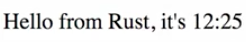

Instructor: 00:00 In this lesson, we start out with a fresh Rust webpack template. Then we add the `js-sys` dependency to our `Cargo.toml`. 

#### Cargo.toml
```toml
[dependencies]
cfg-if = "0.1.5"
wasm-bindgen = "0.2.19"
js-sys = "0.2"
```

In our `lib.rs` file, we declare that we use js-sys, and now, this allows us to use Javascript APIs inside Rust.

#### lib.rs
```rs
extern crate wasm_bindgen;
extern crate js_sys;
```

00:19 The example I want to show is updating the welcome message by displaying the current time at the end. We first create a new timestamp, represented as a float using Javascript `Date.now` function. Next up, we create the `now_date` based on this float value.

00:42 This data object has multiple methods that we label, like getHours and getMinutes. That's great, because we can leverage them to do some string interpolation, and generate our welcome message. 

```rs
#[wasm_bindgen]
pub fn run() {
  let now = js_sys::Date::now();
  let now_date = js_sys::Date::new(&JsValue::from_f64(now));
  let val = document.createElement("p");
  val.set_inner_html(&format!(
    "Hello from Rust, it's {}:{}",
    now_date.get_hours(),
    now_date.get_minutes()
  ));
  document.body().append_child(val);
}
```

We switch over to the browser and check our results.



01:01 As expected, we see "Hello from Rust," including the current time. Isn't it amazing, with almost no effort, we can access Javascript APIs from Rust? This not only works in the browser, but also in Node.