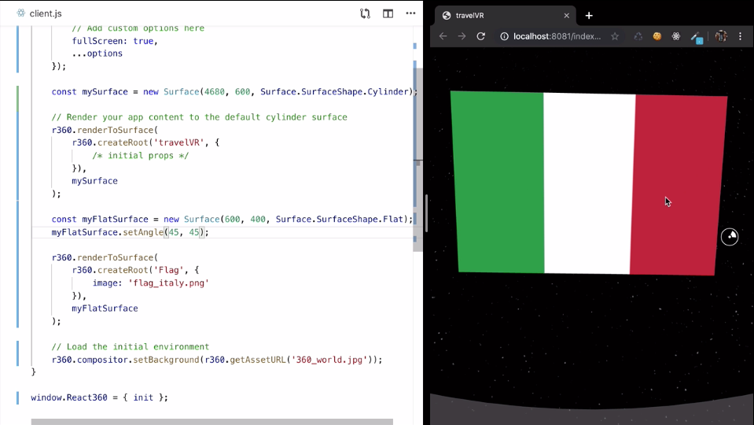

Instructor: [0:00] The second type of a surface available in React 360 is the flat surface. We're going to use it to create a `Flag` component, and we're going to display this component on a flat surface somewhere over here.

[0:09] First up, create a `components` directory, and inside of it, create a `flag.js`. Next, import `React` from `react`, as well as import `asset`, `Stylesheet`, and `Image` from `react-360`. We're going to create a new class, we're going to call it flag, and we're going to extend it from react.component.

[0:27] We're going to `render` a `flag` component, so we're going to destructure `flag` from `styles`, and we're going to `render` an `Image`. We're going to set the `style` to `flag`, and we're going to set the `source` to whatever was provided in the props.

#### Flag.js

```js
import React from "react"
import { asset, StyleSheet, Image } from "react-360"

export default class Flag extends React.Component {
  render() {
    const { flag } = styles

    return <Image style={flag} source={asset(this.props.image)} />
  }
}
```

[0:41] Let me just create a `StyleSheet` object. We're going to have a `StyleSheet`, and the `flag` is going to have a `height` of `400` and a `width` of `600`. In order to use this component inside of the runtime, we need to first register it.

```js
const styles = StyleSheet.create({
  flag: {
    height: 400,
    width: 600
  }
})
```

[0:53] We need to go to `index.js`, and here, we are registering the `travelVR` component. Because this component has been registered, it's available to be used in client.js. This is where our runtime lives. What we need to do is we have to register a `Flag` component, and we need to import it as well.

[1:10] I'm going to import `Flag` from `./componenets/Flag`.

```js
import React from "react"
import { AppRegistry, asset, StyleSheet, View, Image } from "react-360"
import Flag from "./components/Flag"

export default class travelVR extends React.Component {
  render() {
    const { mainView } = styles

    return <View style={mainView} />
  }
}

const styles = StyleSheet.create({
  mainView: {
    width: 4680,
    height: 600,
    opacity: 0.3,
    backgroundColor: "#eee",
    alignItems: "center"
  }
})

AppRegistry.registerComponent("travelVR", () => travelVR)
AppRegistry.registerComponent("Flag", () => Flag)
```

Let me save that, and we're going to jump into `client.js`. Over here, create a new flat surface. I'm going to do `const` `myFlatSurface`, and it's going to be a `new Surface` of `600` by `400`.

[1:29] I'm going to set the `Surface.SurfaceShape.Flat`.

#### client.js

```js
const mySurface = new Surface(4680, 600, Surface.SurfaceShape.Cylinder)
```

Now, I need to render a component to it. I'm just going to copy and paste this bit. Let me just do it like this. I don't want to render a travel VR component. I want to render the `Flag` component, and I would like to render it to `myFlatSurface`.

```js
const myFlatSurface = new Surface(600, 400, Surface.SurfaceShape.Flat)
r360.renderToSurface(
  r360.createRoot("Flag", {
    /* initial props */
  }),
  myFlatSurface
)
```

[1:47] Over here, we can provide the props that we would like to pass into the `Flag` component. I'm going to pass in an `image` prop, and I'm going to set it to `flag_italy.png`.

```js
const myFlatSurface = new Surface(600, 400, Surface.SurfaceShape.Flat)
r360.renderToSurface(
  r360.createRoot("Flag", {
    image: "flag_italy.png"
  }),
  myFlatSurface
)
```

Now, and if I save and refresh that, we are not going to see the flag.

`See 1:58 in lesson`


[1:59] The reason it happens is that we haven't specified where exactly we want to display this flat surface. Both flat and cylinder surfaces are displayed four meters away from the user, but in the case of the flat surface, we need to specify at which angle we want to display this flat surface.

[2:14] What we're going to do is that we're going to do `myFlatSurface.setAngle`.

```js
const myFlatSurface = new Surface(600, 400, Surface.SurfaceShape.Flat)
myFlatSurface.setAngle()
```

This function takes two arguments, how much we want to rotate our flat surface left and right, and how much we want to rotate it up and down.

[2:25] We can specify it in both radians and in degrees. I'm going to start with radians. I would rotate this by `Math` by `four`. The second number, the pitch angle, is going to be equal to `zero`.

```js
const myFlatSurface = new Surface(600, 400, Surface.SurfaceShape.Flat)
myFlatSurface.setAngle(Math.PI / 4, 0)
```

There you go. We can see the flat surface over here.


[2:39] If I wanted to, I can get rid of radians, because those are not intuitive. I can change it to `45` degrees, and I have exactly the same effect.

```js
const myFlatSurface = new Surface(600, 400, Surface.SurfaceShape.Flat)
myFlatSurface.setAngle(45 / 0)
```

If I were to modify the pitch angle to be also equal to `45`, I would get the result of this flag of Italy displayed over here.

```js
const myFlatSurface = new Surface(600, 400, Surface.SurfaceShape.Flat)
myFlatSurface.setAngle(45 / 45)
```

`See 2:54 in the lesson`


[2:55] The main difference between a flat surface and a cylinder surface is that a flat surface is not curved. If I were to look at this flat at an angle, what I'm going to see is that there's a slight distortion over here. Whereas with a cylinder surface, no matter which way I look, I am going to see this component in exactly the same way.
