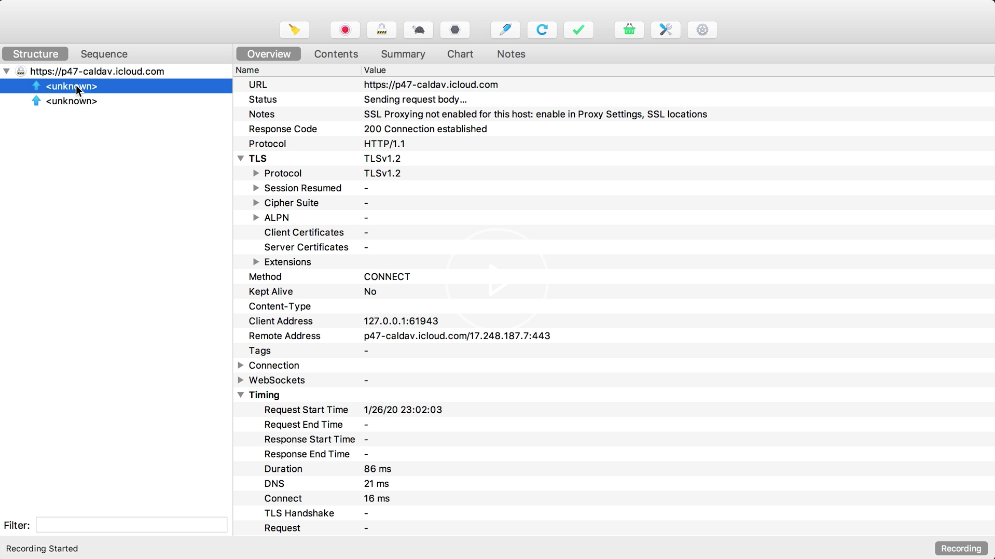

Mike Sharav: [0:00] Security is important and is often overlooked and forgotten. Part of the reason for this is that security seems hard to get right. One of the best ways to protect your application from attack is to first understand how attacks are carried out and then learn how to mitigate them. Application security doesn't need to be overwhelming.

[0:18] In this course, we'll cover session hijacking and how to prevent it, secure cookie configuration and making them hard to steal. Using chralesproxy to simulate a man-in-the-middle attack, using HTTPS and HSTS to mitigate man-in-the-middle attacks. Using CSRF tokens in SameSite cookies to mitigate CSRF attacks. Using the CSP to mitigate XSS attacks. You'll learn security rules of thumb such as defense in-depth and principle of list power.

[0:48] We'll learn all this by finding and exploiting vulnerabilities and then patching them on our target website in a game of security cat and mouse. To get our target website running and to perform our attacks, we'll need a bit of a setup. Note that these instructions are for macOS or Linux. You could find instructions for Windows in the README section of the source code for this course.

[1:08] First, download [charlesproxy](charlesproxy.com/download). When you open it, after a splash screen, it should look like this, the list of URLs your computer is making a request to. 



You'll also need some command line utilities.

[1:25] First you'll need Git, which you can check to see if you have by running `git --version` in the terminal. Next, you'll need node JS, which you can check by running `node --version`. You'll need a version higher than `version 8.9.3`. If you don't have node yet, you could download it from [nodejs.org](nodejs.org). Node comes with npm, which you can check by running `npm --version`.

[1:49] Finally, you need a curl which also you can check with `curl --version`. If you don't have it, you can get it at [curl.haxx.se](curl.haxx.se). Next, you'll need to make sure that you have sudo privileges or that you can run a command line as an administrator if you're using Windows.

[2:06] We'll modify our host file which is located at etc/host. 

#### Terminal
```bash
$ code /etc/hosts
```

We'll look for the `localhost` entry, which is that IP address 127.0.0.1. To this, we'll add `evil.com` and hit save. Because this is a protected file, we'll have to see it again as sudo.

#### hosts
```
127.0.0.1   localhost evil.com
```

[2:29] I'll enter my password. This makes it so that when I visit evil.com, which will be our fake attacker website, it will resolve to my local computer.

[2:40] Next, run `sudo npm install` from the root of the repository. This will prompt you for your password. For this course, you'll only ever have to npm install this one time. All dependencies for all the lessons are installed upfront.

[2:58] Now go to the first lesson by cd-ing into `exercises/01`, and run `sudo npm start`. You should get a messages saying to visit http://localhost.charlesproxy.com. If you open that URL, you should see a username and password prompt.

[3:21] Next, we'll want to start our evil.com attacker website. For this, we'll run `sudo npm run start:evil.com`. This should start a server on https://evil.com:666/index.html. If you see "Thanks for visiting," it worked.

[3:42] Our application doesn't have much to it. It has a log in form. Once logged in, it has a message form that either allows you to send a specific message or send a hello message via one button. It also displays our username and our fake Social Security number, the perfect type of information suitable for a hacker to steal.

[4:03] If you visit `login.js`, you'll notice that we have a database of users here. This is the username and password for our site. You'll be logging in with the username `mikesherov`, and a `password: "1"`. Let's get started.

#### login.js
```js
const users = {
  mikesherov: {
    password: "1",
    SSN: "123-45-6789"
  }
};
```