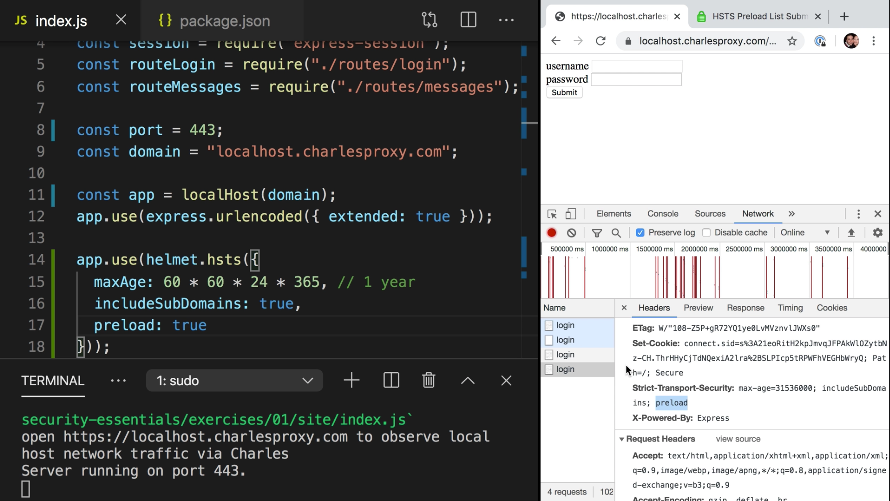

Instructor: 0:00 With our application, we've made sure to redirect HTTP to HTTPS. We've also made sure that our cookies only get sent over HTTPS.

0:09 While this is an effective mitigation for sending your session ID cookie over HTTPS, it isn't a general solution for avoiding sending things over HTTP in general. That is, while we may have protected the cookie for now, nothing is preventing us from removing this mitigation, `secure`, and accidentally reintroduce the vulnerability.

0:34 In the security world, if there are two ways of mitigating an issue, the best practice is to implement both. This is known as the Defense in Depth strategy, otherwise known as taking a belt-and-suspenders approach. That is, to guarantee your pants stay up, you have to wear both a belt and suspenders.

0:52 If we look closer at the problem, it all stems from the fact that a browser will still make an HTTP request. It's the server that tells the browser to make a second request to HTTPS. What if we could tell the browser that when it sees an HTTP URL to fill it in and actually treat it as an HTTPS URL.

1:12 Thankfully, there is a request header that does just that. It's called `HSTS`, otherwise known as HTTPS Strict Transport Security.

1:22 Express has a package called `helmet`, which we'll add into our `package.json`. That provides a set of utilities including the ability to add HSTS headers. First, we'll add the helmet package to our dependencies and then import it in our application.

#### package.json
```json
"dependencies": {
    "express": "^4.17.1",
    "express-session": "^1.16.2",
    "helmet": "^3.21.1",
    "https-localhost": "^4.4.0"
}
```

1:39 In `index.js`, I'll say `const helmet = require("helmet");` and helmet provides middleware. We could say `app.use`. Inside it we'll say `helmet.hsts`. HSTS takes a couple of parameters, which will map back to properties of the header.

2:01 First, it takes the `maxAge` parameter which tells the browser how long HSTS should apply for. In this case, we'll use `60` seconds `60` minutes `24` hours * `365`, which is one year.

2:17 It includes the property `includeSubDomains`, which tells HSTS whether this should cover all subdomains or just the specific subdomain we're on. We'll include the `preload` parameter which we'll explain in just a moment.

#### index.js
```js
app.use(helmet.hsts({
    maxAge: 60 * 60 * 24 * 365,
    includeSubDomains: true,
    preload: true
}));
```

2:34 I have to install the dependencies. `npm i`, start our app back up again. If we refresh the page, we'll see that it adds an additional header called a header of Strict-Transport-Security with a max-age of one year, including SubDomains, including preload.



2:53 If I now enter in an HTTP or protocol less URL, you could see that there is now a 307. All this may appear that it comes from my server and in fact comes from the browser itself. It says redirect to the HTTPS version of the site using the `Non-Authoritative-Reason: HSTS`. No request was ever made to my server.

3:19 Only the first visit on the HTTP URL will ever succeed to my site. All subsequent requests will be over HTTPS. If I try to enter an HTTP again, once again, I get the 307 again. This doesn't protect the very, very, very first hit I make to the site. That's where the `preload` parameter comes in.

3:40 If you include preload in your header and you have a max-age of a minimum one year and you say `includeSubDomains: true`, there is a thing called the HSTS preload list, which you could access at [hstspreload.org](https://hstspreload.org) and enter in your domain name and submit it to the registry.

3:59 What this will do is populate Chrome's list of sites that have HSTS turned on before visiting your site, so that even the very, very first hit of your site will be over HTTPS. This effectively changes the default protocol from your site from HTTP to HTTPS.