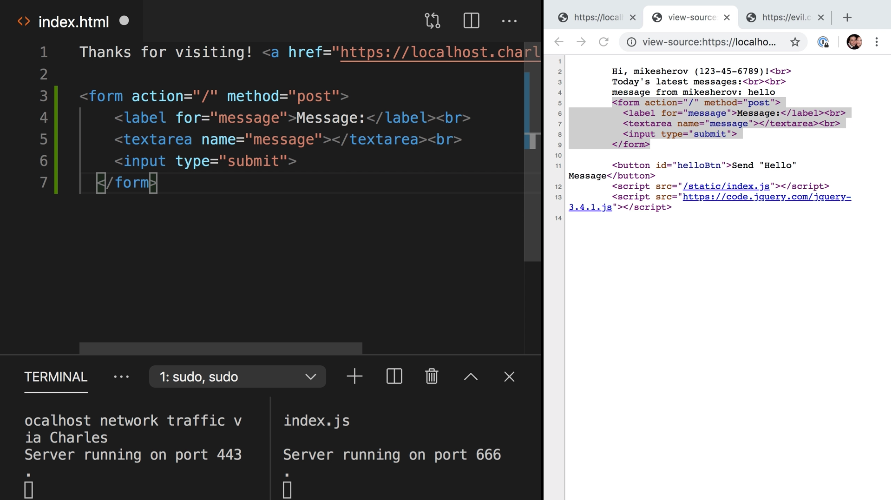
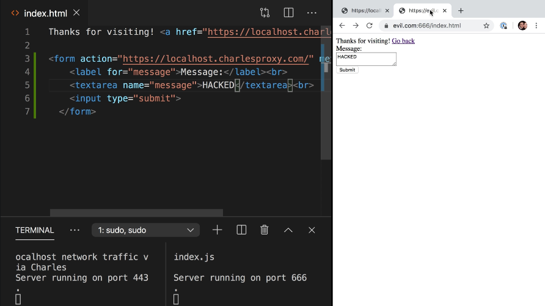
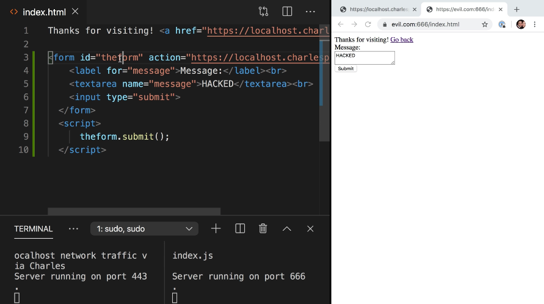
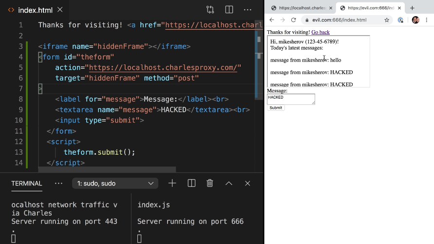

Instructor: [00:00] Now that our target site is protected against man in the middle attacks, let's put our attacker hat back on and move on to our next attack, cross-site request forgery, otherwise known as CSRF.

[00:10] A CSRF attack is a form of social engineering in which an attacker tricks the user into visiting the attackers website, which is pretending to be the target site which then submits a malicious request on behalf of the user to the target website.

[00:23] First, let's open another terminal. We can run `pseudo npm run start: evil.com`, enter. This will start a web server at `evil.com:666/index.html`, which is our attackers website. For now, old hassles are linked back to the target website but we want to submit a form.

[00:48] Let's log back in to our target website, putting in our username and password. Our goal is to submit the message, "hacked" instead of the message, "hello." If we view the source of this page, we can see that it contains a form and this form will serve the basis of our attack.



[01:07] I'll copy the form and paste it into the hacker's website and change the action of the form from a relative URL to an absolute URL, localhost.charlesproxy.com, and save. I will also automatically fill in the text area to have the message "hacked."

[01:25] If I visit evil.com again and refresh, you can see that I have copied the form and if I now submit it, it will submit the message "hacked" back to localhost.charlesproxy.com. 



What we've just witnessed is a form on the evil.com website submitting a form to localhost.charlesproxy.com, and because the user was logged into localhost.charlesproxy.com, the request succeeded.

[01:51] That is, a request from the attacker's website still transmitted the cookies for the target website even though the request originated from the hacker's website. Our attack isn't very good yet because we have to make the user hit the "submit" button, but we can make the form submit itself.

[02:08] We can give the `form` an `id` of `"theform"`, then add a `script` tag that will select the form and submit it. 



This is a neat trick. If an element has an ID, the browser will automatically create a global variable of the same name that references that element. Our script can just say `theform.submit()` and this should submit the form. If I refresh the page, we can see that it worked.

[02:43] As soon as the page loaded, it submitted the form to charlesproxy.com. As an attacker, we still have a problem because the user can now see that we've submitted the form.

[02:52] So let's make the form submit to a hidden `iframe` on the page. That way, when the user visits evil.com, they won't get redirected to the target website and they may not even notice that they were hacked. First I'll make an `iframe` and give it a `name`, and then I'll give a `target` to our form and point it to that hidden frame and save.



[03:19] What this will do when I go back to evil.com is it now no longer redirects the top frame, but now has an iframe embedded inside of it with a posted message. Let's hide this whole thing. We can come back here and we'll wrap it in a `div` with the `hidden` attribute and we'll save that.

#### index.html
```html
<div hidden>
    ...
</div>
```

[03:41] We'll refresh our page one last time and now it should be submitting to a hidden iframe via hidden form. If we go back to charlesproxy.com after refreshing about a dozen times on evil.com, we can see that each time it's submitting our hacked message, thereby completing our CSRF attack.
