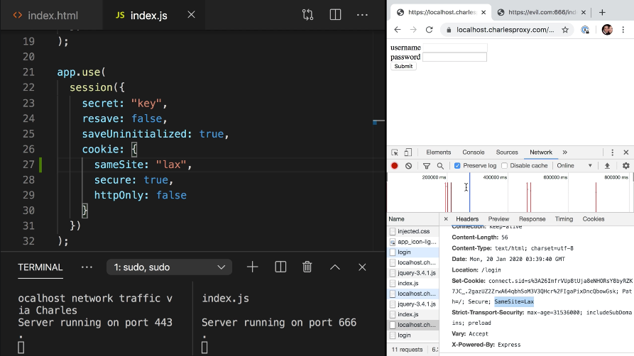

Instructor: 00:00 We discovered our site is vulnerable to CSRF attacks. If we log in to our site and then visit our evil.com site, which attempts to hack us, it can submit a message on our behalf. The reason this happens is because requests to our domain still include the session ID cookie even though they originate from the attacker's website.

00:23 Fortunately, cookies now have a new property known as the `sameSite` property. The sameSite property determines whether a cookie will be allowed to be sent cross-site or not. The default value is `"none"`, which allows cross-site cookies, but now, we can switch the value to `"lax"`.

#### index.js
```js
app.use(
    session({
        secret: "key",
        resave: false,
        saveUninitialized: true,
        cookie: {
            sameSite: "lax,
            secure: true,
            httpOnly: false
        }
    })
)
```

00:43 What lax does is it says as long as the request method is GET, as opposed to POST or PUT or PATCH, and as long as the GET request is a top-level navigation, like following a link, then cookies will be sent. Otherwise, they won't.

01:02 To see this in action, we'll restart our server, `sudo npm start`, we'll clear our cookies for localhost.charlesproxy.com, and we'll switch back over to the network tab. When we refresh our site and inspect our request, we can see that the setcookie call is called with the `SameSite=lax`.



01:30 If we log back into our site and visit evil.com again and attempt to run our hack, we can see that the request was sent without our cookie. If we go back to localhost.charlesproxy.com and refresh, we see that we weren't hacked.

01:55 Because our cookie is lax, if we click the Go Back button, we see that we go back logged in. This is a top-level navigation using the GET method and works with sameSite lax. If we change `sameSite` to `strict` and clear our cookies again, log back in again, we see that not only does our hack not work, but also, if you click a link to go back to charlesproxy.com from evil.com, we'll land logged out.

02:30 This is an effective CSRF mitigation with a good default of `lax`. In fact, lax is such a good default, it will become the default setting in Chrome 80, set to be released on February 4th, with Edge and Firefox following soon thereafter.