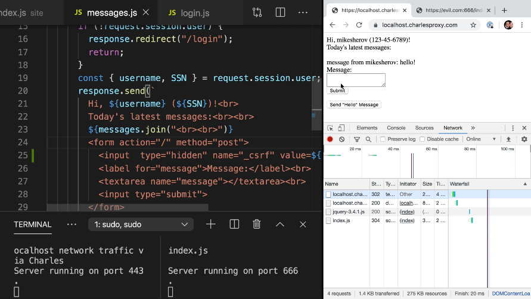
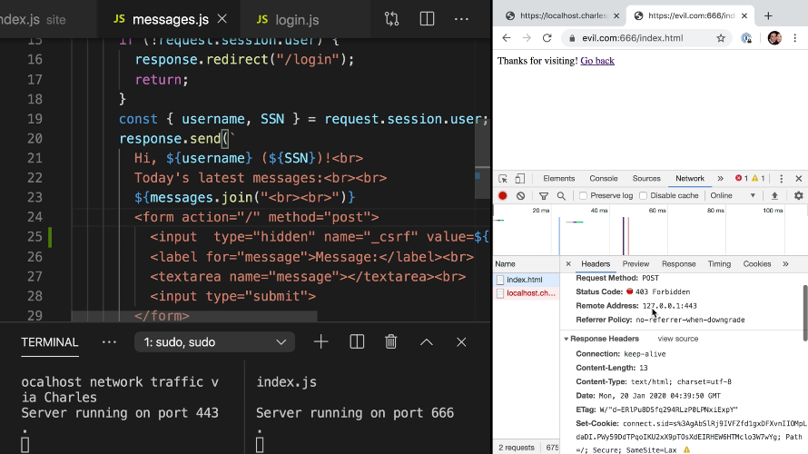
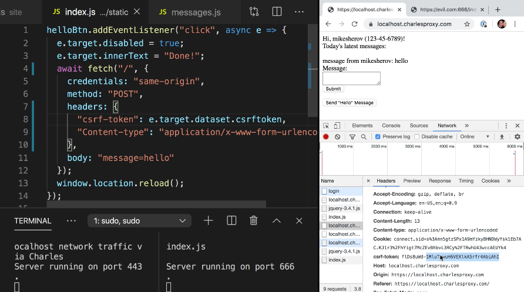

Instructor: [0:00] Even though we've mitigated our csurf vulnerabilities using same site cookies, some users are on old browsers like old IE 11 on old Windows that don't have same site cookies enabled.

[0:12] We'll have to employ an older strategy and run csurf tokens in order to employ a defense in-depth strategy to csurf mitigation.

[0:20] We can start by installing the csurf package in our package json file. 

#### package.json
```json
"dependencies": {
  "csurf": "^1.10.0",
  "express": "^4.17.1",
  "express-session": "^1.16.2",
  "helmet": "^3.21.1",
  "https-localhost": "^4.4.0"
}
```

We then `npm install` and can restart our server. Moving over to our `index.js` file we can import the csurf package saying `const csurf = require("csurf");`.

#### index.js
```js
const csurf = require("csurf");
```

[0:46] Then add additional middleware, and say `app.use(csurf());`. Now what this essentially will do is add a piece of middleware that takes in the `request` object and checks to see if there's a `session`.

[1:05] If there is but there is no csurf token attached to the session, it will create a csurf token that is `request.session.csrfToken = require("crypto").randomBytes(16).toString(hex)`, which is a 16 byte random string. Then, attach a method `request.csrfToken` which can be called that will return this random number.

[1:39] This random number lives for the lifetime of the session. 

```js
app.use(csurf());
app.use(function(request) {
  if (request.session && !request.session.csrftoken) {
    request.session.csrfToken = require("crypto").randomBytes(16).toString(hex)
  }
  request.csrfToken = () => request.session.csrfToken;
})
```

However, the csurf package takes care of that for us. We don't need to write our own middleware here.

```js
app.use(csurf());

/*  delete this
app.use(function(request) {
  if (request.session && !request.session.csrftoken) {
    request.session.csrfToken = require("crypto").randomBytes(16).toString(hex)
  }
  request.csrfToken = () => request.session.csrfToken;
})
*/
```

[1:51] If we go to the `login.js` route, we see that there's a get route which contains our form. It also contains the request object and the response object as two parameters to its callback function. We can add an `input` that is `hidden` with a name of `"_csrf"` and a `value=${request.csrfToken()}`.

#### login.js
```js
<input type="hidden" name="_csrf" value=${request.csrfToken()}>
```

[2:22] What this will do is when this form is submitted, csrf will be passed along as a value. Because of the middleware, we added the index.js,  value, `_csurf`, will be compared to the random number we attach to the user's session.

[2:37] If the two values match, the request succeeds. If the the two values don't match, we have to add additional middleware. We'll say `app.use`, `function`, and function takes in an `error` followed by the `request` object, followed by the `response` object, followed by the `next` middleware run.

#### index.js
```js
app.use(function(err, req, res, next) {})
```

[2:55] Now, if the `error` that happens doesn't have a code that is equal to `EBADCSRFTOKEN`, then we can assume that some other middleware may handle that error.

```js
app.use(function(err, req, res, next) {
  if (err.code !== "EBADCSRFTOKEN") return next(err);
})
```

[3:15] However, if it is `EBADCSRFTOKEN` which means it comes from our csurf middleware, we can `respond` with a status of `403` and a message of `"csurf detected"`. It still works.

```js
app.use(function(err, req, res, next) {
  if (err.code !== "EBADCSRFTOKEN") return next(err);

  res.status(403).send("csrf detected");
})
```

[3:33] Because our attacker attacked our message form, we need to add the same csurf protection to that form as well. We'll copy this same and hidden input, go over to `messages.js` and in our `form`, do the same thing, paste in the hidden input and save it again.

#### messages.js
```js
<form action-"/" method="post">
  <input type="hidden" name="_csrf" value=${request.csrfToken()}>
  ...
</form>
```

[3:56] Let's refresh our page, log back in, post our message, we see that it works. 



If we head over to evil.com and submit our hidden form, you'll notice the request now fails with a 403 forbidden and a response of csurf detected.



[4:22] You'll also notice that we have this send hello message button. If this doesn't work off of a sworn submission, it works via using an Ajax request via fetch. Rather than attaching a hidden input, we could also add a request header.

[4:38] If we head over to our `index.js` in our static directory, we see that we have a click handler for our hello button. We already have headers being passed back to our server, so how do we get the csurf token down to this fetch call?

[4:53] We'll open back up `messages.js`, we'll scroll down to where our button is and we'll add a `data` attribute, `data-csurfToken=${request.csurfToken()}`. 

#### messages.js
```js
<button id="helloBtn" data-csurfToken=${request.csurfToken()}>Send "Hello" Message</button>
```

We'll save that and we'll head back over our click handler in `index.js`.

[5:15] Our click handler takes in an object called `e`, which is the click event itself. Every event has a property called `target`, which is the DOM element that was the recipient of this action.

[5:27] In this case, it's the button being clicked. Because the button has a data attribute we can access it with `.dataset` and the name of the attribute, in this case `csrftoken`.

[5:38] We now add a new header called `csrf-token`, whose value is the csurf token data attribute. 

#### index.js
```js
helloBtn.addEventListener("click", async e -> {
  e.target.disabled = true;
  e.target.innerText = "Done!";
  await fetch("/", {
    credentials: "same-origin",
    method: "POST",
    headers: {
      "csrf-token": e.target.dataset.csrftoken
      "Content-type": "..."
    },
    body: "message=hello"
  });
  window.location.reload();
})
```

If we save this, refresh our site, log back in, enter in our password, preserve log then send our hello message, we'll see that our request was submitted with a csrf token header.



[6:05] This will effectively mitigate csurf vulnerabilities in the case you're using a browser that doesn't yet support same site cookies.