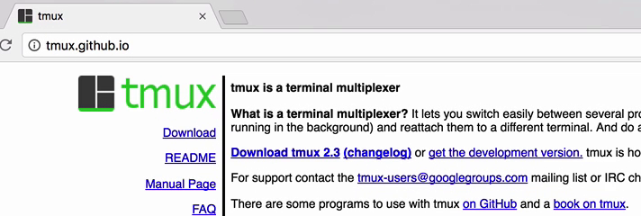
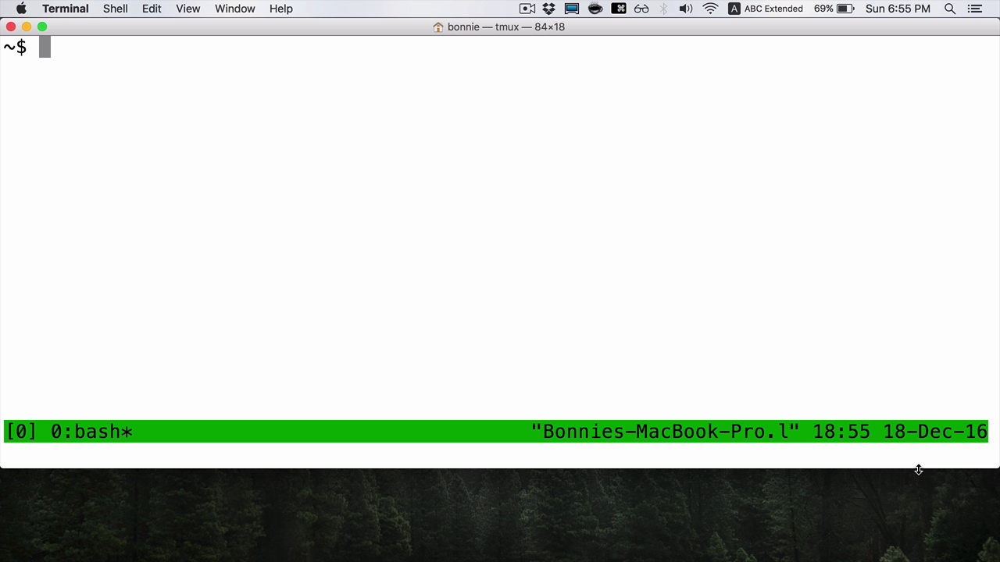
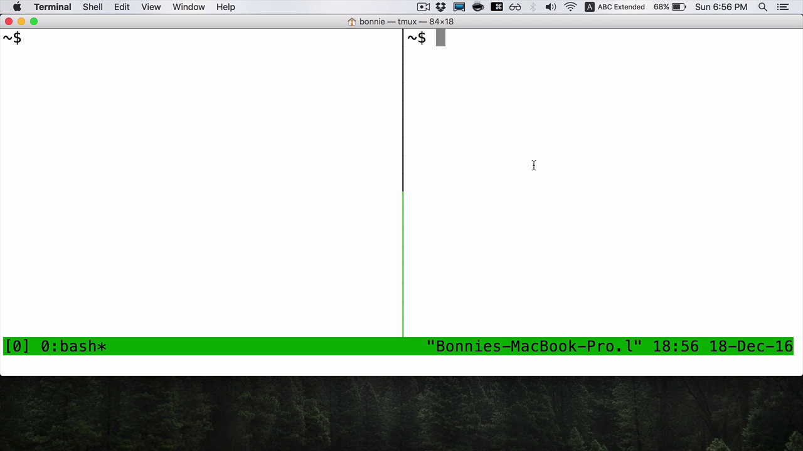
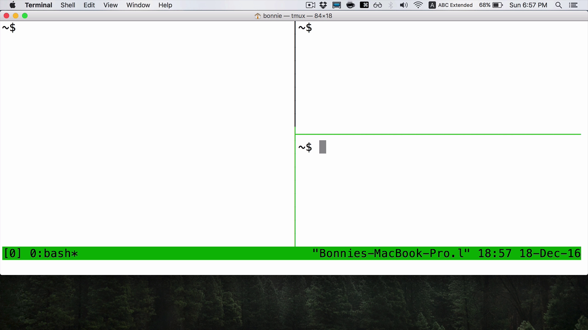
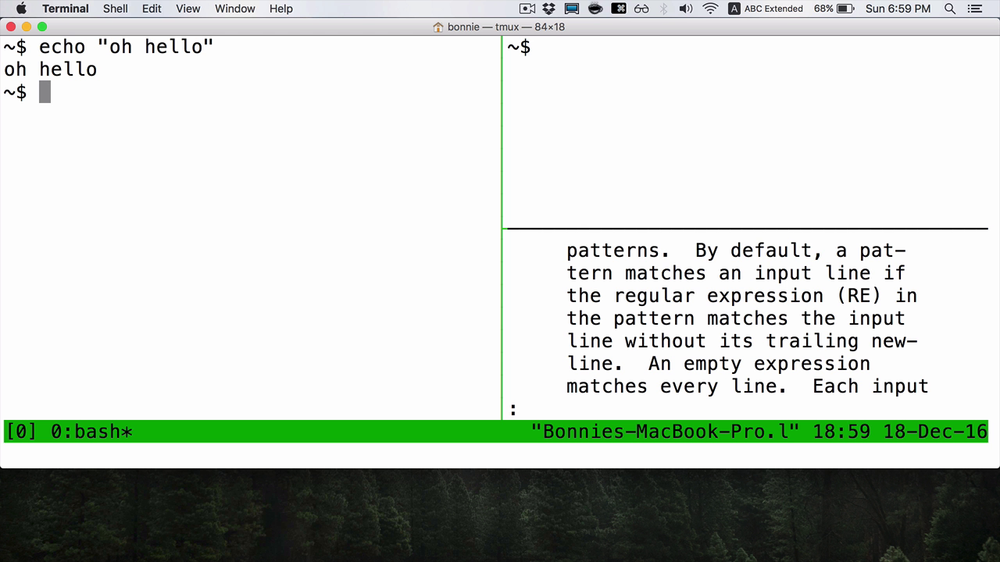
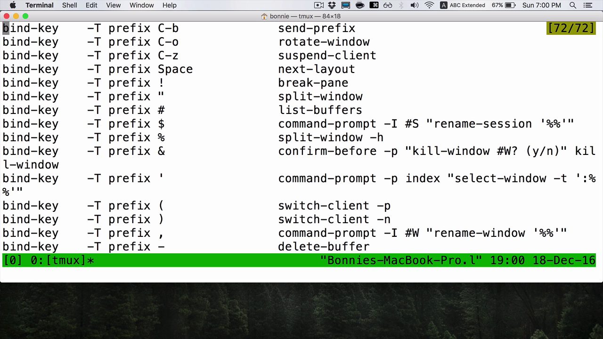

You can either install tmux from the project's website at tmux.github.io or you can use your package manager of choice.

I'm on Mac OS X, so I installed tmux with `brew install tmux`. To start tmux, we type `tmux`. Now you'll notice while I'm recording my screen that I have a keystroke logger active on the bottom left-hand corner of my screen to mirror whatever it is I'm typing.

I'm going to type tmux and then return. Now I'm in a tmux session. You can see that we have what looks like a normal terminal window as well as the screen status bar on the bottom. It tells me what number session I'm in, that I'm running Bash. It also gives me some extra information here, like the date and the time.

tmux is really useful for organizing your workspace. One of the most common ways of doing that is with panes. I'm going to create a new pane by pressing `Control+B` and then `%`. As you can see, now I have a split screen. I have a left pane and a right pane.

In order to navigate between these two panes, I can type `Control+B` and then an arrow key. You can see that which pane is highlighted changes. I use Control+B because it's my prefix key. Every tmux command is going to be prefixed with Control+B.

If I want to make a split in the other direction, I do `Control+B` and then the `"`. Now you can see that I have yet another pane here.

Each of these terminal windows works independently. Let's say that I want to look up `man grep` page in the third window. I can do that. Then I can switch over to one of the other windows. Now I can work in the first pane and use it as a completely separate working area. This way, I can organize my thoughts and have multiple things running all at once.

In order to remove a pane, I can either type `exit`, which closes it, or I can also type `Control+D`. If I type Control+D from the last pane, then tmux will exit. That's all that you need to know in order to use tmux in its basic form.

It's `tmux` to start it, and then `Control+B "` or `Control+B %` in order to create your panes. Then to close them, you just need to close all the panes. If you ever have questions about tmux usage, remember you can always do `Control+B` and then `?` key to bring up a list of all of the different key shortcuts.

