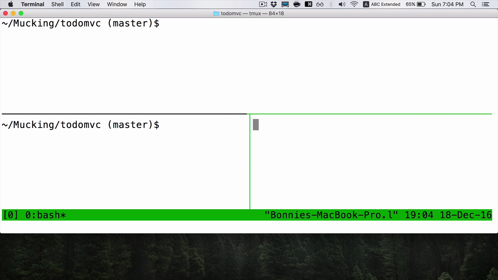
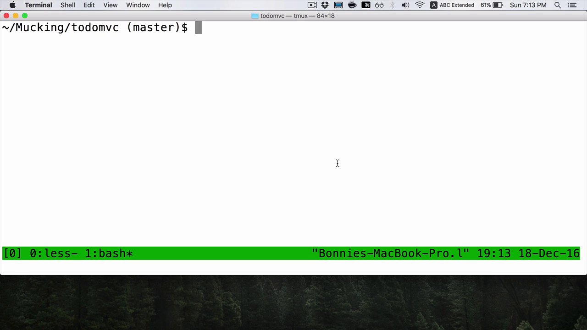
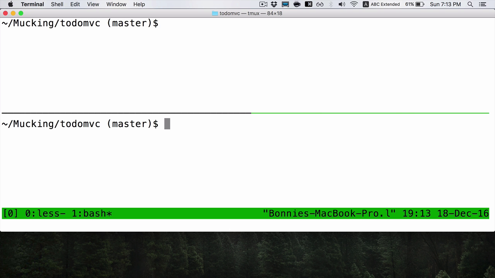
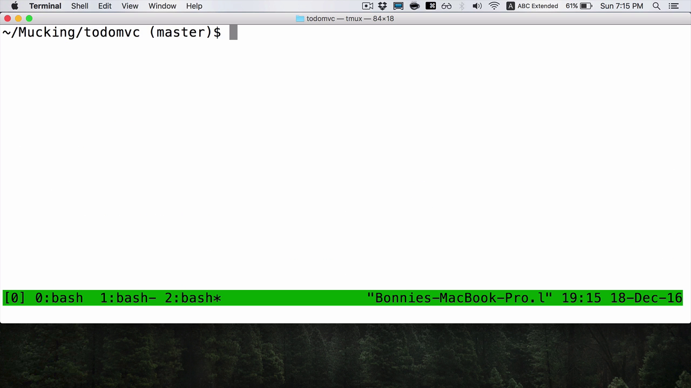

Let's start a new tmux session by typing `tmux`. Next, we'll open up a couple of panes with `Control+B "` and `Control+B %`.

I'm using the todomvc JavaScript project as my example here. This is great. I'm set up, and I'm thinking about this Vue example. Now I want to context switch. I want to work on a different project.

Instead of having to close my panes or rearrange them, using tmux I can create a new window, which is a collection of panes. I do that with `Control+B C`.

`C` stands for create. My status bar changes to reflect the fact that I'm currently in window number one. I had been in window zero, which is currently active in the last program. Number one is currently using Bash. The asterisk indicates that this is the current window.

Now, I can get to work in this window. If I want I can also divide it into panes.

Then to switch back to the other window, I use `Control+B` and then `N`. `Control+B N` takes me to the next window. `Control+B P` will take me to the previous window. You can see that I now I can flip between window zero and window one.

To make this a little bit clearer, we can open another window with `Control+B C` for create. Now we have windows zero, windows one, and windows two. I can cycle through them with `Control+B N`. It goes back to zero. `Control+B N`, goes back to one. A third time bring us back to right where we started.

